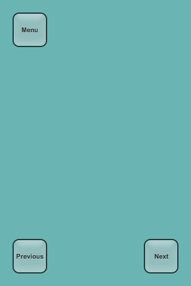
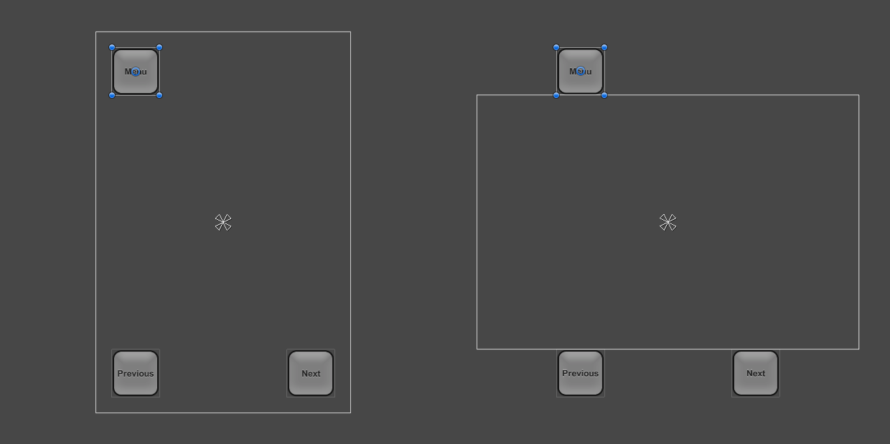
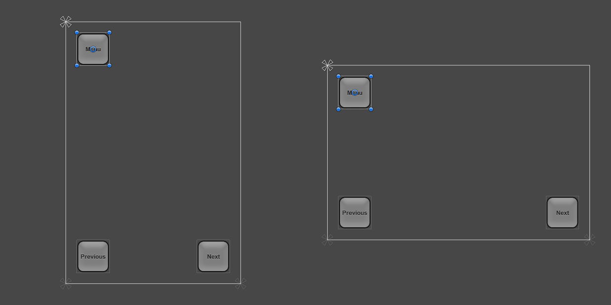
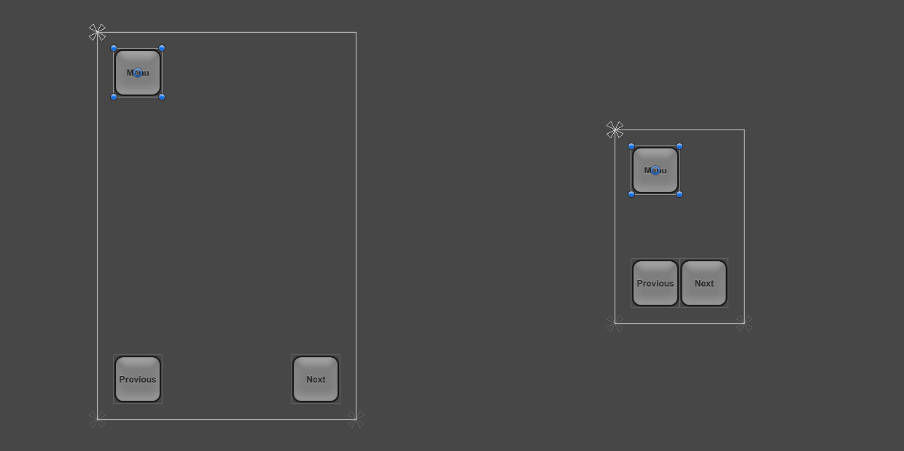
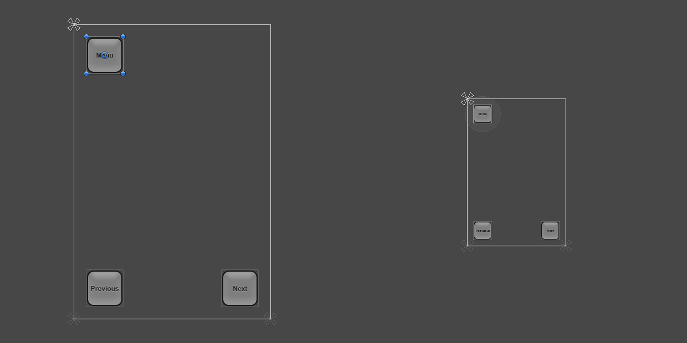
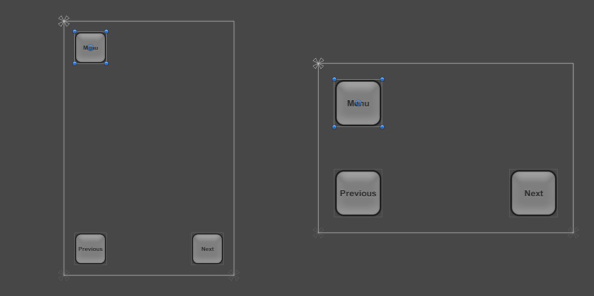

# Designing UI for Multiple Resolutions

Modern games and applications often need to support a wide variety of different screen resolutions and particularly UI layouts need to be able to adapt to that. The UI System in Unity includes a variety of tools for this purpose that can be combined in various ways.

In this how-to we're going to use a simple case study and look at and compare the different tools in the context of that. In our case study we have three buttons in the corners of the screen as shown below, and the goal is to adapt this layout to various resolutions.

For this how-to we're going to consider four screen resolutions: Phone HD in portrait (640 x 960) and landscape (960 x 640) and Phone SD in portrait (320 x 480) and landscape (480 x 320). The layout is initially setup in the Phone HD Portrait resolution.

## Using anchors to adapt to different aspect ratios

UI elements are by default anchored to the center of the parent rectangle. This means that they keep a constant offset from the center.

If the resolution is changed to a landscape aspect ratio with this setup, the buttons may not even be inside the rectangle of the screen anymore.

One way to keep the buttons inside the screen is to change the layout such that the locations of the buttons are tied to their respective corners of the screen. The anchors of the top left button can be set to the upper left corner using the Anchors Preset drop down in the Inspector, or by dragging the triangular anchor handles in the Scene View. It's best to do this while the current screen resolution set in the Game View is the one the layout is initially designed for, where the button placement looks correct. (See the [UI Basic Layout](UIBasicLayout.md) page for more information on anchors.) Similarly, the anchors for the lower left and lower right buttons can be set to the lower left corner and lower right corner, respectively.

Once the buttons have been anchored to their respective corners, they stick to them when changing the resolution to a different aspect ratio.

When the screen size is changed to a larger or smaller resolution, the buttons will also remain anchored to their respective corners. However, since they keep their original size as specified in pixels, they may take up a larger or smaller proportion of the screen. This may or may not be desirable, depending on how you would like your layout to behave on screens of different resolutions.

In this how-to, we know that the smaller resolutions of Phone SD Portrait and Landscape don't correspond to screens that are physically smaller, but rather just screens with a lower pixel density. On these lower-density screens the buttons shouldn't appear larger than on the high-density screens - they should instead appear with the same size.

This means that the buttons should become smaller by the same percentage as the screen is smaller. In other words, the scale of the buttons should follow the screen size. This is where the **Canvas Scaler** component can help.

## Scaling with Screen Size

The **Canvas Scaler** component can be added to a root **Canvas** - a Game Object with a Canvas component on it, which all the UI elements are children of. It is also added by default when creating a new Canvas through the **GameObject** menu.

In the Canvas Scaler component, you can set its **UI Scale Mode** to **Scale With Screen Size**. With this scale mode you can specify a resolution to use as reference. If the current screen resolution is smaller or larger than this reference resolution, the scale factor of the Canvas is set accordingly, so all the UI elements are scaled up or down together with the screen resolution.

In our case, we set the **Canvas Scaler** to be the Phone HD portrait resolution of 640 x 960. Now, when setting the screen resolution to the Phone SD portrait resolution of 320 x 480, the entire layout is scaled down so it appears proportionally the same as in full resolution. Everything is scaled down: The button sizes, their distances to the edges of the screen, the button graphics, and the text elements. This means that the layout will appear the same in the Phone SD portrait resolution as in Phone HD portrait; only with a lower pixel density.

One thing to be aware of: After adding a Canvas Scaler component, it's important to also check how the layout looks at other aspect ratios. By setting the resolution back to Phone HD landscape, we can see that the buttons now appear bigger than they should (and used to).

The reason for the larger buttons in landscape aspect ratio comes down to how the Canvas Scaler setting works. By default it compares the width or the current resolution with the width of the Canvas Scaler and the result is used as the scale factor to scale everything with. Since the current landscape resolution of 960 x 640 has a 1.5 times larger width than the portrait Canvas Scaler of 640 x 960, the layout is scaled up by 1.5.

The component has a property called **Match** which can be 0 (Width), 1 (Height) or a value in between. By default it's set to 0, which compares the current screen width with the Canvas Scaler width as described.

If the **Match** property is set to 0.5 instead, it will compare both the current width to the reference width and the current height to the reference height, and choose a scale factor that's in between the two. Since in this case the landscape resolution is 1.5 times wider but also 1.5 times shorter, those two factor even out and produce a final scale factor of 1, which means the buttons keep their original size.

At this point the layout supports all the four screen resolutions using a combination of appropriate anchoring and the Canvas Scaler component on the Canvas.

See the [Canvas Scaler](script-CanvasScaler.md) reference page for more information on different ways to scale UI elements in relation to different screen sizes.
