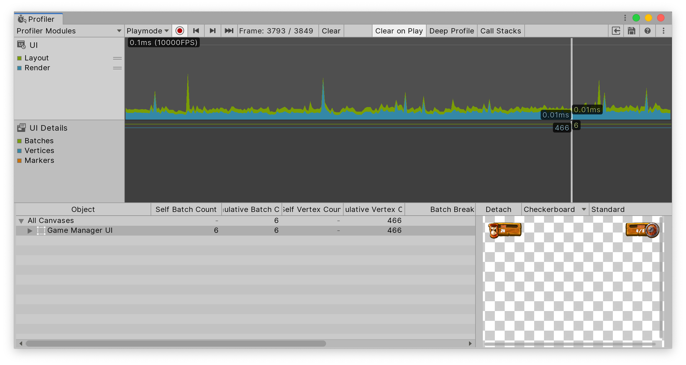

# UI (Canvas) and UI Details (Canvas) Profiler module reference

>[!NOTE]
> The UI (Canvas) and UI Details (Canvas) Profiler module collects Editor-only data, and doesn't work in development builds.

The UI (Canvas) and UI Details (Canvas) Profiler modules provide information on how much time and resources uGUI (Unity UI) spends laying out and rendering the user interface within your application. You can use this module to understand how uGUI handles UI batching for your application, including why and how it batches objects. You can also use this module to find out which part of the uGUI's UI has slow performance, or to preview the UI while you scrub the timeline.

To open the Profiler window, go to **Window &gt; Analysis &gt; Profiler**. For more information on how to use the Profiler window, refer to [The Profiler window](xref:um-profiler-window).

## Chart categories
The UI (Canvas) and UI Details (Canvas) Profiler modules' charts contain the following categories. To change the order of the categories in the chart, you can drag and drop them in the chart's legend. You can also click a category's colored legend to toggle its display.

### UI (Canvas) Profiler module

|**Chart**|**Description**|
|---|---|
|**Layout**|How much time uGUI spent performing the layout pass for the UI. This includes calculations done by [`HorizontalLayoutGroup`](https://docs.unity3d.com/Packages/com.unity.ugui@latest/index.html?subfolder=/api/UnityEngine.UI.HorizontalLayoutGroup.html), [`VerticalLayoutGroup`](https://docs.unity3d.com/Packages/com.unity.ugui@latest/index.html?subfolder=/api/UnityEngine.UI.VerticalLayoutGroup.html), and [`GridLayoutGroup`](https://docs.unity3d.com/Packages/com.unity.ugui@latest/index.html?subfolder=/api/UnityEngine.UI.GridLayoutGroup.html).|
|**Render**|How much time uGUI has spent doing its portion of rendering. This is either the time spent rendering directly to the graphics device or rendering to the main render queue.|

### UI Details (Canvas) Profile module

|**Chart**|**Description**|
|---|---|
|**Batches**|Displays the total number of draw calls that are batched together. |
|**Vertices**|The total number of vertices that are used to render a section of UI. |
|**Markers**|Displays event markers. Unity records markers when the user interacts with the UI (for example, a button click, or a slider value change) and then draws them as vertical lines and labels on the chart.|

## Module details pane
When you select the UI (Canvas) or the UI Details (Canvas) Profiler module, the module details pane at the bottom of the Profiler window displays more details on the uGUI's UI in your application. You can use it to inspect the profiling information about the UI objects in your application. The pane is divided into the following columns:

|**Column**|**Description**|
|---|---|
|**Object**|A list of UI canvases your application used during the period profiled. Double click on a row to highlight the matching object in the scene.|
|**Self Batch Count**|How many batches uGUI generated for the canvas.|
|**Cumulative Batch Count**|How many batches uGUI generated for the canvas and all its nested canvases.|
|**Self Vertex Count**|How many vertices this canvas is rendering.|
|**Cumulative Vertex Count**|How many vertices this canvas and nested canvases are rendering.|
|**Batch Breaking Reason**|Why uGUI split the batch. Sometimes uGUI might not be able to batch objects together. Common reasons include: <ul><li>**Not Coplanar With Canvas**: The batching needs the object's rect transform to be coplanar (unrotated) with the canvas. </li><li>**CanvasInjectionIndex**: A CanvasGroup component is present and forces a new batch, such as when it displays the drop down list of a combo box on top of the rest.</li><li>**Different Material Instance, Rect clipping, Texture, or A8TextureUsage**: Unity can only batch together objects with identical materials, masking, textures, and texture alpha channel usage.</li></ul>|
|**GameObject Count**|How many GameObjects are part of this batch.|
|**GameObjects**|The list of GameObjects in the batch.|

When you select a uGUI's UI object from the list, a preview of it appears on the right hand side of the pane. Above the preview there are the following options in the toolbar:

* **Detach:** Select this button to open the UI canvas in a separate window. To reattach the window, close it.
* **Preview background:** Use the dropdown to change the color of the preview background. You can choose from **Checkerboard**, **Black**, or **White**. This is useful if your UI has a particularly light or dark color scheme.
* **Preview type:** Use the dropdown to select from **Standard**, **Overdraw**, or **Composite Overdraw**.

## Additional resources

* [Profiler window introduction](xref:um-profiler-window)
* [Profiling your application](xref:um-profiler-profiling-applications)

