# Rich Text

The text for UI elements and text meshes can incorporate multiple font styles and sizes. Rich text is supported both for the UI System and the legacy GUI system. The Text, GUIStyle, GUIText and TextMesh classes have a __Rich Text__ setting which instructs Unity to look for markup tags within the text. The [Debug.Log](ScriptRef:Debug.Log.html) function can also use these markup tags to enhance error reports from code. The tags are not displayed but indicate style changes to be applied to the text.

## Markup format

The markup system is inspired by HTML but isn't intended to be strictly compatible with standard HTML. The basic idea is that a section of text can be enclosed inside a pair of matching tags:-

`We are <b>not</b> amused.`

As the example shows, the tags are just pieces of text inside the "angle bracket" characters, `<` and `>`.

You place the _opening_ tag at the beginning of the section. The text inside the tag denotes its name (which in this case is just **b**).

You place another tag at the end of the section. This is the _closing_ tag. It has the same name as the opening tag, but the name is prefixed with a slash `/` character.  Every opening tag must have a corresponding closing tag. If you don't _close_ an opening tag, it is rendered as regular text.

The tags are not displayed to the user directly but are interpreted as instructions for styling the text they enclose. The `b` tag used in the example above applies boldface to the word "not", so the text appears ons creen as:-

We are **not** amused


A marked up section of text (including the tags that enclose it) is referred to as an **element**.


### Nested elements

It is possible to apply more than one style to a section of text by "nesting" one element inside another

`We are <b><i>definitely not</i></b> amused`

The `<i>` tag applies italic style, so this would be presented onscreen as

We are **_definitely not_** amused

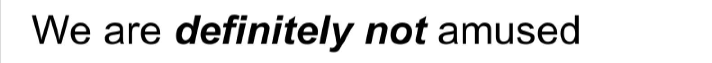

Note the ordering of the closing tags, which is in reverse to that of the opening tags. The reason for this is perhaps clearer when you consider that the inner tags need not span the whole text of the outermost element

`We are <b>absolutely <i>definitely</i> not</b> amused`

which gives

We are **absolutely _definitely_ not** amused

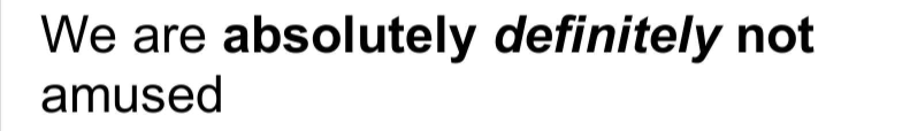


### Tag parameters

Some tags have a simple all-or-nothing effect on the text but others might allow for variations. For example, the **color** tag needs to know which color to apply. Information like this is added to tags by the use of **parameters**:-

`We are <color=green>green</color> with envy`

Which produces this result:

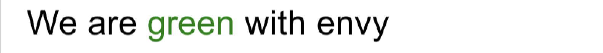

Note that the ending tag doesn't include the parameter value. Optionally, the value can be surrounded by quotation marks but this isn't required.

Tag parameters cannot include blank spaces. For example:

 `We are <color = green>green</color> with envy`

 does not work because of the spaces to either side of the `=` character.

## Supported tags

The following list describes all the styling tags supported by Unity.

|**_Tag_** |**_Description_** |**_Example_** |**_Notes_** |
|:---|:---|:---|:---|
| **b**| Renders the text in boldface.| `We are <b>not</b> amused.`| |
| **i**| Renders the text in italics.| `We are <i>usually</i> not amused.`| |
| **size**| Sets the size of the text according to the parameter value, given in pixels.| `We are <size=50>largely</size> unaffected.`| Although this tag is available for Debug.Log, you will find that the line spacing in the window bar and Console looks strange if the size is set too large.|
| <a name="ColorTag"></a>**color**| Sets the color of the text according to the parameter value. The color can be specified in the traditional HTML format. `#rrggbbaa` ...where the letters correspond to pairs of hexadecimal digits denoting the red, green, blue and alpha (transparency) values for the color. For example, cyan at full opacity would be specified by  `color=#00ffffff`...<br/><br/>You can specify hexadecimal values in uppercase or lowercase; `#FF0000` is equivalent to `#ff0000`.| `We are <color=#ff0000ff>colorfully</color> amused`|Another option is to use the name of the color. This is easier to understand but naturally, the range of colors is limited and full opacity is always assumed. `<color=cyan>some text</color>`  The available color names are given in the [table below](#ColorNames).|
| **material**  | This is only useful for text meshes and renders a section of text with a material specified by the parameter. The value is an index into the text mesh's array of materials as shown by the inspector.|  `We are <material=2>texturally</material> amused`   |   |
|  **quad** | This is only useful for text meshes and renders an image inline with the text. It takes parameters that specify the material to use for the image, the image height in pixels, and a further four that denote a rectangular area of the image to display. Unlike the other tags, quad does not surround a piece of text and so there is no ending tag - the slash character is placed at the end of the initial tag to indicate that it is "self-closing".  |  `<quad material=1 size=20 x=0.1 y=0.1 width=0.5 height=0.5>` |  This selects the material at position in the renderer's material array and sets the height of the image to 20 pixels. The rectangular area of image starts at given by the x, y, width and height values, which are all given as a fraction of the unscaled width and height of the texture.|

<a name="ColorNames"></a>
### Supported colors

The following table lists colors for which you can use a name instead of a hexadecimal tag in the [`<color>`](#ColorTag) rich text tag.

|**_Color name_** |**_Hex value_** |**_Swatch_** |
|:---|:---|:--|
|aqua (same as cyan)|`#00ffffff`|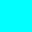|
|black|`#000000ff`||
|blue|`#0000ffff`|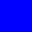|
|brown|`#a52a2aff`||
|cyan (same as aqua)|`#00ffffff`||
|darkblue|`#0000a0ff`|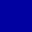|
|fuchsia (same as magenta)|`#ff00ffff`|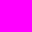|
|green|`#008000ff`|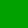|
|grey|`#808080ff`||
|lightblue|`#add8e6ff`||
|lime|`#00ff00ff`|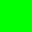|
|magenta (same as fuchsia)|`#ff00ffff`||
|maroon|`#800000ff`||
|navy|`#000080ff`|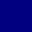|
|olive|`#808000ff`|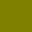|
|orange|`#ffa500ff`||
|purple|`#800080ff`|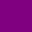|
|red|`#ff0000ff`|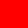|
|silver|`#c0c0c0ff`||
|teal|`#008080ff`||
|white|`#ffffffff`||
|yellow|`#ffff00ff`|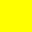|


## Editor GUI

Rich text is disabled by default in the editor GUI system but it can be enabled explicitly using a custom [GUIStyle](ScriptRef:GUIStyle.html). The `richText` property should be set to true and the style passed to the GUI function in question:

````
GUIStyle style = new GUIStyle ();
style.richText = true;
GUILayout.Label("<size=30>Some <color=yellow>RICH</color> text</size>",style);
````
