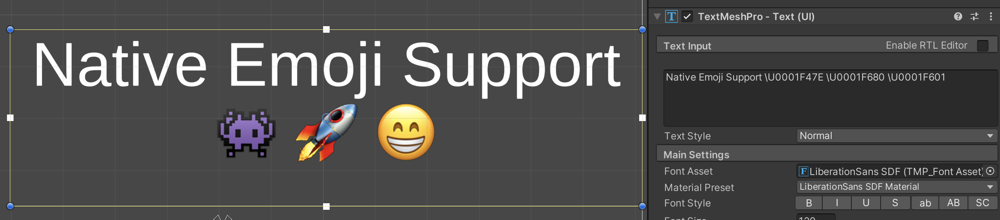
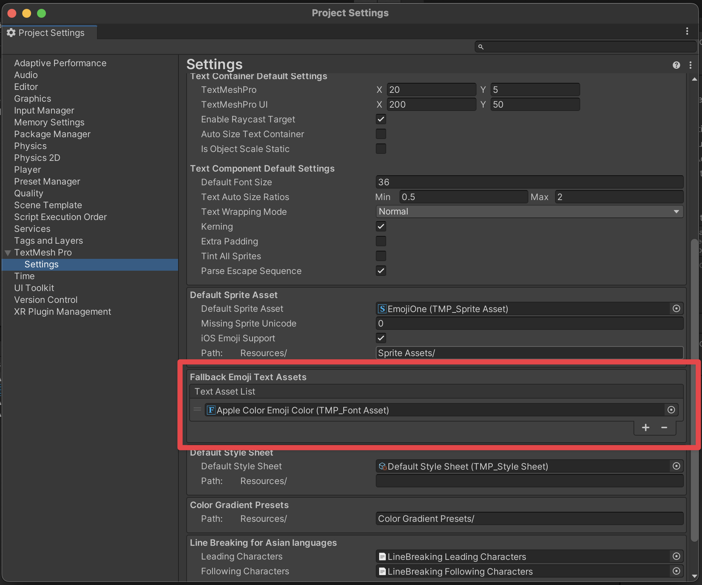
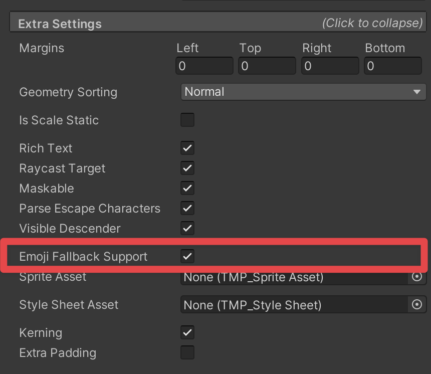

# Color emojis

You can include color glyphs and emojis in text. To do so, import a font file that has color emojis in it and set it as the fallback emojis text assets.

## Set up color emojis

Create a color font asset and add it to the TMP Settings Fallback. Note this is the same as the Project Settings/TextMeshPro/Settings as depicted in the image.

1. In your project, import a font file that has color emojis in it.
2. Right-click in the `Asset` folder, and then select **Create > TextMeshPro > FontAsset > Color**. This ensures that you create the font asset with the right shader (Sprite) and the right atlas rendering mode (Color).
3. Open the TMP Settings asset or alternatively via the **Edit > ProjectSettings > TextMesh Pro > Settings**.
4. Add the emoji font asset to the **Fallback Emoji Text Assets** section.

Alternatively, assigning a color font asset to the text object will work fine provided that the [Emoji Fallback Support](ColorEmojis) option in the Extra Settings of the text component is disabled.

## Include emojis in text

To include emojis in text, do the following:

- Include emojis in text through their Unicode. For example, enter `\U00001f60` to represent a smile.
- Use OS Virtual Keyboard.
- Copy the emojis from an external Text Editing tool and paste them in your text field.

To find more information about the Unicode Emojis Standard, see this [link](http://unicode.org/Public/emoji/14.0/).

## Control Emoji Fallback Search

The "Emoji Fallback Support" option controls where we search for characters defined in the Unicode Standards as Emojis.

When this option is enabled (default), the "Fallback Emoji Text Assets" list will be search first for any characters defined as Emojis.

When this option is disabled, the Primary font asset assigned to the text component will be searched first.

Basically, this option overrides the character search to prioritize searching thru the "Fallback Emoji Text Assets" list first when the character is an emoji.

This option is also useful when a font contains black-and-white emojis as it allows the user to control if the emojis contained in the primary will be used or those from the "Fallback Emoji Text Assets" list.

To update the `Emoji Fallback Support`:
1. Select the **Text (TMP)** field in the hierarchy.
2. In the Inspector window, under the `Extra Settings` foldout of the **Text (TMP)** field, select the **Emoji Fallback Support** toggle. 
   

## Limitations

The color emojis feature has the following limitations:

- It doesn't support some OpenType font features, such as chain context and single substitution.
- It doesn't support Apple fonts that use the AAT format. It's a predecessor to OpenType.
- It doesn't support SVG color glyphs.
- Dynamic OS FontAsset has limited support on some iOS devices. The `Apple Color Emoji` font file found on OSX and several iOS devices works fine. However, the `Apple Color Emoji-160px` found on newer iOS devices is not support as the emoji's are encoded in JPEG format which is not supported by FreeType.
- Prior to Unity 2023.1, adding a UTF-32 through the inspector sends an error. The emojis won't display in the inspector.