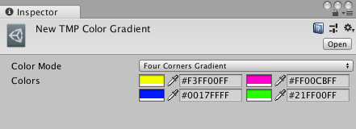

# Gradient Presets

Use gradient presets to reuse the same color gradients across text objects. A gradient preset overrides the text’s local gradient type and colors.

You have to store Gradient presets in a specific folder so TextMesh Pro can find them and include them in builds. You can change the folder from the [TextMesh Pro settings](Settings.md#color-gradient-presets).

## Creating gradient presets

To create a gradient preset, choose **Assets > Create  > TextMesh Pro > Color Gradient** from the menu.

This adds a new TextMesh Pro Color Gradient Asset to the Scene, and opens it in the Inspector.

You can then select a [gradient type](ColorGradientTypes.md) from the **Color Mode** dropdown, and set the gradient **Colors**.

## Applying gradient presets

You apply a gradient preset to text from the TextMesh Pro Inspector.

**To apply a gradient preset:**

1. Enable the **Main Settings > Color Gradient** property.

1. Open the Object Picker (circle icon) for **Main Settings > Color Preset**, and choose choose a preset

When you apply a gradient preset, the Inspector overrides the text's gradient type and colors with the values from the preset.

> [!CAUTION]
> If you modify the gradient settings in the TextMesh Pro Inspector after you apply a preset, it affects the preset itself. Changes affect every object that uses the same preset.

## Removing gradient presets

To remove a gradient preset, open the Object Picker (circle icon) for **Main Settings > Color Preset**, and choose **None**.

When you remove the preset, the text reverts to its local gradient properties.
