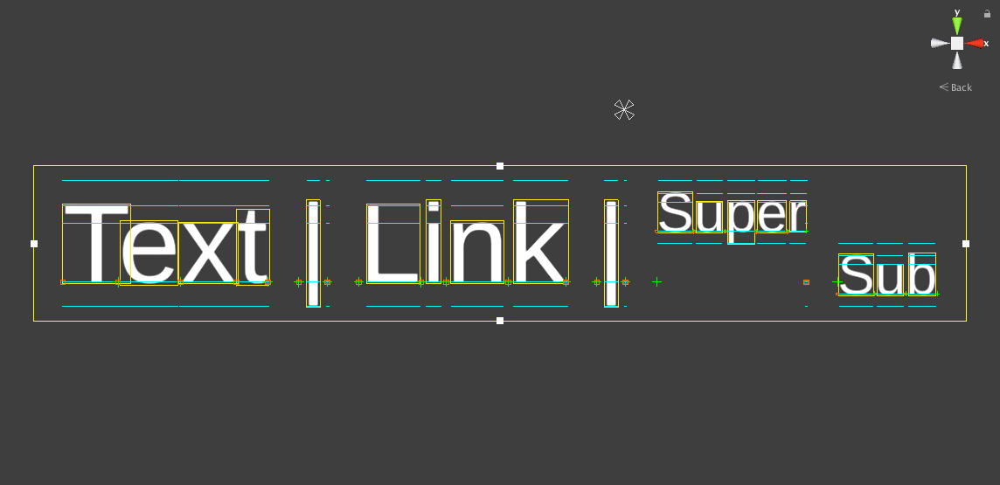
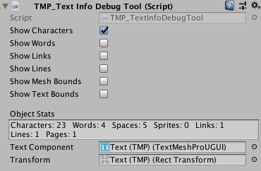

# Debugging TextMesh Pro text

Use the Text Info Debug Tool to display diagnostic information about a TextMesh Pro GameObject in the Scene view and the Inspector.

For example, you can display lines that indicate font metrics such as the line height, or the offset for superscript and subscript text. This can help you diagnose problems with fonts you import.

_The TextMesh Pro debug tool set to show character bounding boxes and font metrics_

>[NOTE!]
>The debug tool is part of the TextMesh Pro Examples & Extras package. You can install the package from the menu (select **Window > TextMesh Pro > Import TMP Examples and Extras**) or the [TextMesh Pro settings](Settings.md).

To use the debug tool:

1. Open a TextMesh Pro GameObject in the Inspector.

2. [Add](https://docs.unity3d.com/Manual/UsingComponents.html) a **TMP_TextInfoDebugTool** component.

3. From the **TMP_Text Info Debug Tool** section, turn debug [settings](#text-info-debug-tool-properties) on and off. You can see the results in the Scene view.

## Text Info Debug Tool properties

|Property:|Function:|
|-|-|
|**Show Characters**   | Displays each character's bounding box, as well as reference lines for font metrics, in the Scene view.  |
|**Show Words**    | Displays the bounding box for each word in the Scene view.  |
|**Show Links**    | Displays the bounding box for each link in the Scene view.  |
|**Show Lines**    | Displays the bounding box for line of text word in the Scene view.  |
|**Show Mesh Bounds**    | Displays the bounding box for the entire block of text in the Scene view.  |
|**Show Text Bounds**    | Displays the boundary of the area that text can occupy, as defined by the font metrics, in the Scene view.  |
|**Object Stats**   | Shows statistics about the TextMesh Pro GameObject, such as the number of characters, words, lines, and spaces.   |
|**Text Component**   | Links to the TextMesh Pro GameObject's Text component.  |
|**Transform**   | Links to the TextMesh Pro GameObject's RectTransform component.  |
