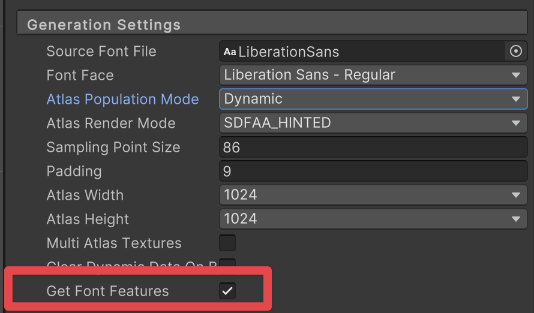
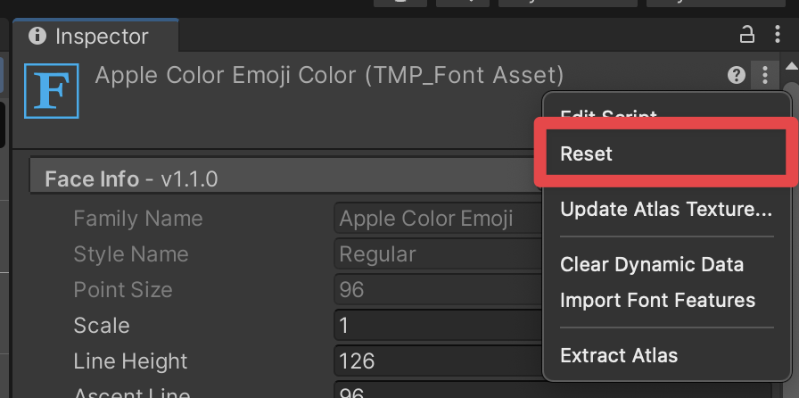
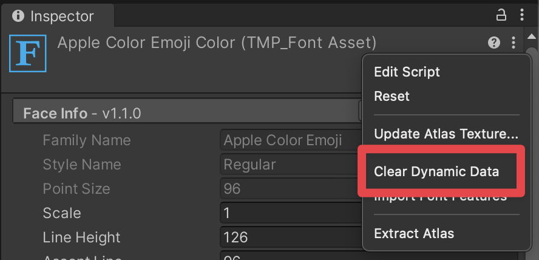
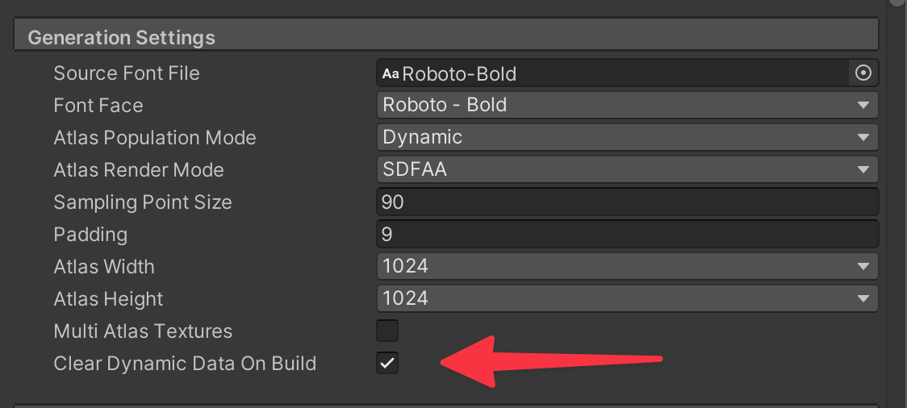

# Font Assets

To use different fonts with TextMesh Pro, you need to create font assets. TextMesh Pro has its own font Asset format that is distinct from, but related to, [Unity's regular font Asset format](https://docs.unity3d.com/2019.1/Documentation/Manual/class-Font.html). You create TextMesh Pro font assets _from_ Unity font assets.

Every TextMesh Pro font Asset has two sub-Assets:

* **Font atlas:** a black and white or grayscale texture file that contains all of the characters included in the font Asset.   _Example of a font atlas_
* **Font material:** a material that controls the appearance of TextMesh Pro text using one of the [TextMesh Pro shaders](Shaders.md).

Font assets must be in a specific folder so TextMesh Pro can find them and include them in builds. To change the default folder for font assets, got to the [TextMesh Pro settings](Settings.md) and set the **Default Font Asset > Path** option.

## Creating Font Assets

To create a TextMesh Pro font Asset, use the TexMesh Pro [Font Asset Creator](FontAssetsCreator.md).

You can also create an empty TextMesh Pro font Asset from the Unity main menu. An empty font asset does not contain any characters by default, you must add them later. To create an empty TextMesh Pro font asset, select a Unity font Asset and then select **Asset > Create > TextMeshPro > Font Asset** from the menu.

## Types of font atlas

Font Assets can have the following types of font atlas:

* **Distance Field:** This type of atlas contains [signed distance field (SDF)](FontAssetsSDF.md) information.  This is the recommended Font Asset type for most applications because SDF atlases produce text that is smooth when transformed.

* **Smooth/Hinted Smooth:** This type of atlas is an antialiased bitmap texture. A Hinted smooth atlas aligns glyph pixels with texture pixels to produce a smoother result.  Smooth atlases work well for static text that is viewed head on, in situations where there is a good correspondence between texture pixels and screen pixels. Transforming text generated from a smooth atlas blurs the text edges.

* **Raster/Raster Hinted:** Raster atlases are un-smoothed bitmap textures. They almost always produce text with jagged, pixellated edges. The Hinted rater atlases align glyph pixels with texture pixels to produce a smoother result.

## Get Font Features

This option determines if OpenType font features should be retrieved from the source font file as new characters and glyphs are added to the font asset. Disabling this option will prevent extracting font features.

To update the Get Font Features option on a FontAsset:
1. Select the FontAsset
2. In the FontAsset inspector, navigate to the Generation Settings section.
3. Select **Get Font Features**. 

## Reset
The `Reset` context menu option clears all tables which includes the Character and Glyph tables along with all font features tables such as the Ligature, Glyph Adjustment, Mark to Base, Mark to Mark tables. This option also clears the font asset's atlas texture and resets it back to size zero.

To reset a FontAsset: 
1. Select the FontAsset
2. Expand the top right menu in the FontAsset Inspector. 
3. Select **Reset**. 

## Clear Dynamic Data
The `Clear Dynamic Data` context menu option clears the character and glyph tables as well as the font asset's atlas texture which is also resized back to size zero. This option preserves all font feature table data such as Ligatures, Glyph Adjustment, Mark to Base, Mark to Mark, etc.

To clear a FontAsset:
1. Select the FontAsset
2. Expand the top right menu in the FontAsset Inspector. 
3. Select **Clear Dynamic Data**. 

This preserves the custom ligatures, kernings, and diacritical marks you added to the font asset when clearing the atlas.

## Clear Dynamic Data on Build

The "Clear Dynamic Data on Build" option works like the "Clear Dynamic Data" context menu option but also clears data when building the project or closing the Editor.

When enabled, this option resizes the texture to 0 (empty) during the build process.

For dynamic FontAssets, it resets the glyph atlas, character table, and glyph table to their initial states. This feature helps reduce build size by minimizing the FontAsset's data footprint.

To update the Clear Dynamic Data on Build option:

1. Select the FontAsset
2. In the FontAsset inspector, navigate to the Generation Settings section.
3. Select **Clear Dynamic Data on Build**. 

