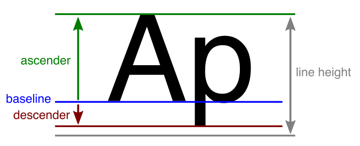

# Line metrics.

TextMesh Pro sets line metrics automatically when you generate a font Asset.

If the generated values produce strange or incorrect results, you can tweak the line metrics settings to fine-tune the font.

Most line metric values are relative to the **Baseline**, which is the horizontal line that characters sit on.

- Values for above-the-baseline metrics, such as the **Ascender** height, are greater that the **Baseline** value.
- Values for below-the-baseline metrics, such as the **Descender** height, are less than **Baseline** value.

|Metric:|Function:|
|-|-|
|**Line Height**|The distance between the tops of consecutive lines.  If you set the line height to a value greater than the combined size of the **Ascender** and **Descender**, it creates a gap between lines.  If you set a line height to a value less than the combined size of the ascender and descender results in potential overlap between characters on different lines.|
|**Ascender**|The ascender height, which  specifies how far characters can extend above the baseline. It corresponds to the top of a line.|
|**Cap Height**|The height of capital letters from the baseline.|
|**Baseline**|The baseline height.  The baseline is the horizontal line that characters sit on.|
|**Descender**|The descender height, which specifies how far characters can extend below the baseline.|
|**Underline Offset**|The position of underlines relative to the baseline.|
|**Strikethrough Offset**|The position of strikethrough lines relative to the baseline.|
|**Superscript/ Subscript Offset**|Adjust the baseline for superscript and subscript text.|
|**Super/ Subscript Size**|The scale of superscript and subscript text relative to the normal font size.|
|**Padding**|The amount of padding between characters in the font atlas texture.  TextMesh Pro sets this value when you generate the font Asset. It is not editable.|
|**Width/Height**|The font atlas texture's width and height, in pixels.  TextMesh Pro sets these values when you generate the font Asset. They are not editable.|