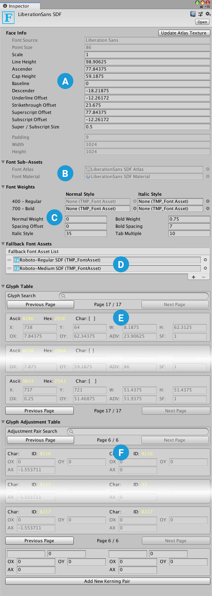

# Font Asset Properties

## Properties

Properties are divided into the following sections:

||||
|-|-|-|
|**A**   | **[Face Info](#face-info)**  ||
|**B**   | **[Generation Settings](#generation-settings)**  ||
|**C**   | **[Atlas & Material](#atlas-material)**  ||
|**D**   | **[Font Weights](#font-weights)**  ||
|**E**   | **[Fallback Font Assets](#fallback-font-assets)**  ||
|**F**   | **[Character Table](#character-table)**  |   |
|**G**   | **[Glyph Table](#glyph-table)**  ||
|**H**   | **[Glyph Adjustment Table](#glyph-adjustment-table)**  ||

### Face Info

The Face Info properties control the font's line metrics. They also include read-only properties that the [Font Asset Creator](FontAssetsCreator.md) generates when you create the Asset.  

_Line metrics_

|Property:|Function:|
|-|-|
|**Update Texture Atlas**|Open the [Font Asset Creator](FontAssetsCreator.md) pre-configured to modify and regenerate this font Asset.|
|**Family Name**|The name of the font used to create this font Asset.  TextMesh Pro sets this value when you generate the font Asset. You cannot change it manually.|
|**Style Name**|The style of the font used to create this font Asset. For example, **Regular**, **Bold**, **Italic**, and so on.  TextMesh Pro sets this value when you generate the font Asset. You cannot change it manually.|
|**Point Size**|The font size in points.  TextMesh Pro bakes this value into the atlas texture when you generate the font Asset. You cannot change it manually.|
|**Scale**|Scales the font by this amount. For example, a value of **1.5** scales glyphs to 150% of their normal size.|
|**Line Height**|Controls the distance between the tops of consecutive lines.  If you set a line height greater than the sum of the **Ascent Line** and **Descent Line** values, it creates in a gap between lines.  If you set a line height greater than the sum of the **Ascent Line** and **Descent Line** values, characters on different lines might overlap.|
|**Ascent Line**|Controls the maximum distance that glyphs can extend above the baseline. It corresponds to the top of a line.|
|**Cap Line**|Controls the distance between the base line and the tops of uppercase glyphs.|
|**Mean Line**|Controls the maximum height for non-ascending lowercase glyphs (for example. "a" and "c", but not "b" and "d," which have ascenders).  The tops of rounded glyphs sometimes extend a slightly above the mean line.|
|**Baseline**|Controls the height of the baseline.  The baseline is the horizontal line that characters sit on.|
|**Descent Line**|Controls the maximum distance that glyphs can extend below the baseline.|
|**Underline Offset**|Controls the position of underlines relative to the baseline.|
|**Underline Thickness**   | Controls the thickness of underlines.  |
|**Strikethrough Offset**|Controls the position of strikethrough lines relative to the baseline.|
|**Superscript Offset**| Offsets superscript text from the baseline.|
|**Superscript Size**|Scales superscript text relative to the normal font size.|
|**Subscript Offset**| Offsets subscript text from the baseline.|
|**Subscript Size**|Scales subscript text relative to the normal font size.|
| **Tab Width**   | Specifies the width of a TAB character.  |

### Generation Settings

The [Font Asset Creator](FontAssetsCreator.md) generates these values when you generate the Font Asset.

> [!NOTE]
> When the **Atlas Population Mode** is set to **Dynamic**, you can change the atlas size without regenerating the atlas.

|Property:||Function:|
|-|-|-|
|**Source Font File**   ||   |
|**Atlas Population Mode**   ||   |
|   |Dynamic|   |
|   |Static|   |
|**Atlas Render Mode**   ||   |
||SMOOTH|Renders the atlas to an antialiased bitmap.|
||RASTER|Renders the atlas to a non-antialiased bitmap.|
||SMOOTH_HINTED|Renders the atlas to an antialiased bitmap, and aligns character pixels with texture pixels for a crisper result.|
||RASTER_HINTED|Renders the atlas to a non-antialiased bitmap and aligns character pixels with texture pixels for a crisper result.|
|   |SDF| Renders the atlas using a slower, but more accurate SDF generation mode, and  no oversampling.   |
|   |SDFAA| Renders the atlas using a faster, but less accurate SDF generation mode. It produces font atlases that are sufficient for most situations.|
|   |SDFAA_HINTED| Renders the atlas using a faster, but less accurate SDF generation mode, and aligns character pixels with texture pixels for a crisper result.. It produces font atlases that are sufficient for most situations  |
|   |SDF8|  Renders the atlas using a slower, but more accurate SDF generation mode, and  8x oversampling. |
|   |SDF16| Renders the atlas using a slower, but more accurate SDF generation mode, and  16x oversampling.  |
|   |SDF32|  Renders the atlas using a slower, but more accurate SDF generation mode, and  32x oversampling. Use this setting for fonts with complex or small characters. |
|**Sampling Point Size**   || The size, in points, of characters in the font texture.  |
|**Padding**||The amount of padding between characters in the font atlas texture.  This value is set when you generate the font Asset, and is not editable.|
|**Atlas Width/Height**||The width and height the font atlas texture.  Choose for each dimension, choose one of the available values from the drop-down menu.|
|**Multi Atlas Textures**   |   |   |

### Atlas & Material

This section lists the sub-assets that the [Font Asset Creator](FontAssetsCreator.md) creates when you generate the Asset. Do not edit these directly.

|Property:|Function:|
|-|-|
|Font Atlas|The font texture atlas created when you generated the font Asset.|
|Font Material|The font material created when you generated the font Asset.|

### Font Weights

The Font Weights options control the appearance of bold and italicized text. There are two ways of doing this:

1. Create different bold and italic variants of the font Asset, and add them to the **Font Table**.  You can specify regular and italic fonts for weights ranging from 100 (Thin) to 900 (Black).

1. Define "fake" bolding and italicization by setting the **Font Weight > Italic Style** and **Bold Weight** properties.  These settings tell TextMesh Pro how to adjust characters in the current font Asset when you bold or italicize text.   

|Property:||Function:|
|-|-|-|
|**Font Table**||Specify font assets to use for the following font variants.  100 - Thin 200 - Extra-Light 300 - Light 400 - Regular (italic only) 500 - Medium 600 - Semi-Bold 700 - Bold 800 - Heavy 900 - Black    &ast; **400 - Regular > Regular Typeface** is the current font Asset. You cannot change it.   If you don't specify font assets, TextMesh Pro "fakes" bolding and italicization according to the rest of the the **Font Weights** settings. Using "faked" font weights limits you to regular and italic versions of normal and bold text (equivalent to weights of 400 and 700 respectively). |
|**Normal Weight**||Set the regular font weight to use when no font Asset is available.|
|**Bold Weight**||Set the bold font weight assumed when no font Asset is available.|
|**Spacing Offset**||Add space between characters when using the normal text style.|
|**Bold Spacing**||Add space between characters when using the fake bold text style (meaning you haven’t specified a Bold font Asset).|
|**Italic Style**||If you don’t specify a font Asset for **400 - Regular > Italic Style** variant, TextMeshPro slanting the character sprites in the Normal Style font Asset by an amount defined in the **Italic Style** setting.  Set this value to control the |
|**Tab Multiple**||Set the tab size. This value is multiplied by the width of the font's space character to calculate the tab size used.|

### Fallback Font Assets

Each font Asset contains a limited number of characters. When you use a character that the current Font Asset does not contain, TextMesh Pro searches the fallback font list until it finds a font Asset that includes it. The text object then uses that font to render the character.

You can use this feature to distribute fonts over multiple textures, or use different fonts for specific characters. Be aware that searching the list for missing characters requires extra computing resources, and that using additional fonts requires additional draw calls.

For more information about how fallback fonts work, see [The Fallback font chain](FontAssetsFallback.md).

|Property:|Function:|
|-|-|
|**Fallback Font Asset list**|Manage the fallback fonts for this font Asset.  Click **+** and **-** to add and remove font slots.  Click the circle icon next to a font to open an Object Picker where you can choose a font Asset.  Drag the handles on the left side of any font Asset to reorder the list.|

### Character Table

### Glyph Table

The glyph table contains information about each of the glyphs in the Font Asset. You can adjust the attributes of individual glyphs, which is useful when you need to correct problems that can occur when TextMesh Pro imports font data.

|Property:||Function:|
|-|-|-|
|**Glyph Search**||Search the character list by character, ASCII value, or Hex value.  Search results are ordered by ASCII value, lowest to highest.|
|**Previous Page/Next Page**||Long character lists are split into pages, which you can navigate using these buttons (also located at the bottom of the section).|
|**Glyph Properties**||Displays a single glyph’s properties. Each glyph has its own entry.  Click an entry to make it active. You can then edit the glyph, copy it, or remove it from the list.|
||Ascii|Displays the character’s ASCII decimal value.|
||Hex|Displays the character’s Unicode Hex value.|
||Char|Displays the character.|
||X, Y, W, H|Define the rectangular area the character occupies in the font atlas.|
||OX, OY|Control the placement of the character's sprite, defined at its top-left corner relative to its origin on the baseline.|
||ADV|Specify  how far to advance along the baseline before placing the next character.|
||SF|Change this scaling factor value to adjust the size of the character.|
|**Copy to**||Duplicate this glyph.  To make a copy, enter an unused Unicode (Hex) ID in the text field and click **Copy to**.|
|**Remove**||Remove this glyph from the list.|

### Glyph Adjustment Table

The glyph adjustment table controls spacing between specific pairs of characters. Some  fonts include kerning information, which is imported automatically. You can add kerning pairs for fonts that don’t include them.

|Property:||Function:|
|-|-|-|
|**Adjustment Pair Search**||Search the adjustment table by character or ASCII value.  Search results include entries where either the left or right character matches the search string.  Search results are ordered by the ASCII value of the left character, lowest to highest.|
|**Previous Page/Next Page**||Long adjustment tables are split into pages, which you can navigate using these buttons (also located at the bottom of the section).|
|**Glyph Properties**||Displays a single glyph’s properties. Each glyph has its own entry.  Click an entry to make it active. You can then edit the glyph, copy it, or remove it from the list.|
||Char (left and right)|Display the left and right characters for the kerning pair.  When you add anew kerning pair, you can specify the left and right characters to use by typing them in these fields.|
||ID (left and right)|Display the left and right characters’ ASCII decimal values.  When you add anew kerning pair, you can specify the left and right characters to use by typing their ASCII values in these fields.|
||OX, OY|For each character in the kerning pair, set the horizontal (**X**) and vertical (**Y**) offset relative to the character's initial position.|
||AX|For each character in the kerning pair, specify how far to advance along the baseline before placing the next character.  Practically speaking, the left **AX** value controls the distance between the characters in the kerning pair, while the right **AX** value controls the distance between the kerning pair and the next character.|
|**Add New Kerning Pair**||Add a new entry to the Glyph Adjustment Table.  You cannot duplicate an existing entry.|
