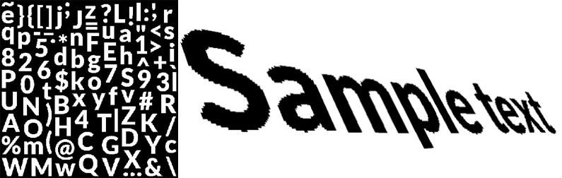
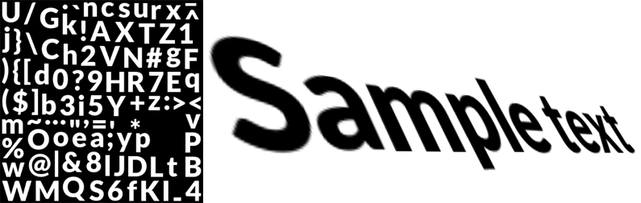
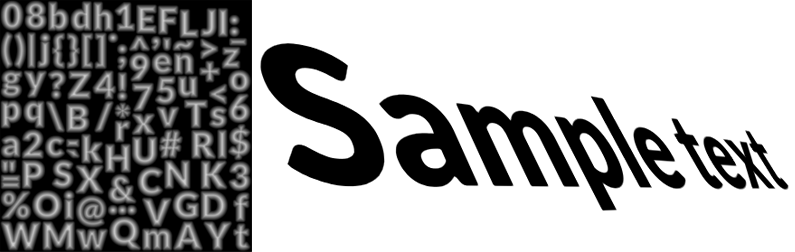

## About SDF fonts

TextMesh Pro takes advantage of Signed Distance Field (SDF) rendering to generate font assets that look crisp when you transform and magnify them, and support effects such as outlines and drop shadows.

Unlike black and white bitmap font textures, SDF font assets contain contour distance information. In font atlases, this information looks like grayscale gradients running from the middle of each glyph to a point past its edge. The gradient's mid-point corresponds to the edge of the glyph.

The images below show bitmap and SDF font assets and the rendered text they produce. Notice that the bitmap fonts produce text whose edges are more or less jagged/blurry, depending on how far the text is from the camera, and how it is transformed/distorted. The SDF font, on the other hand produces text with completely smooth edges regardless of the distance from the camera.

_A bitmap font, atlas texture and rendered result_

_A smoothed bitmap, atlas texture and rendered result_

_An SDF font, atlas texture and rendered result_