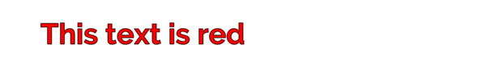

# Rich Text

Rich text tags alter the appearance and layout of text by supplementing or overriding TextMesh Pro GameObject properties. For example, you can use rich text tags to change the color or alignment of some, or all of your text without modifying its properties or material.

**To use rich text tags:**
* Enter any [supported rich text tags](RichTextSupportedTags.md) in the TextMeshPro [**Text** input field](TMPObjectUIText.md#text), inline with the text you want to display.

**To disable rich text for a TextMesh Pro object:**
* Open the TextMesh Pro GameObject in the Inspector, and disable the **Text Mesh Pro > Extra Settings > Rich Text** property.

## Rich Text Tags

Rich text tags are  similar to  HTML or XML tags, but have less strict syntax.

A simple tag consists of only the tag name, and looks like  this:

`<tag>`

For example, the `<b>` tag makes text bold, while the `<u>` tag underlines it.

### Tag attributes and values

Some tags have additional values or attributes, and look like this:

 `<tag="value">` or `<tag attribute="value">`

For example `<color=”red”>` makes text red. `Red` is the `color` tag’s value.

 Similarly `<sprite index=3>` inserts the fourth sprite from the default Sprite Asset. `index` is an attribute of the `sprite` tag, and its value is `3`.

A tag, including its attributes, can be up to 128 characters long.

The table below lists possible attribute/value types.

|Attribute/value type:|Example|
|-------------|-------------|
|Decimals|`0.5`|
|Percentages|`25%`|
|Pixel values|`5px`|
|Font units|`1.5em`|
|Hex color values|`#FFFFFF` (RGB)<br/>`#FFFFFFFF` (RGBA)<br/>`#FF` (A)|
|Names|Both `<link=”ID”>` and `<link=ID>` are valid.|

## Tag scope and nested tags

Tags have a scope that defines how much of the text they affect. Most of the time, a tag added to a given point in the text affects all of the text from that point forward.

For example, adding the tag `<color="red">` at the beginning of the text affects the entire text block:

`<color="red">This text is red`

<br/>
_Successive color tags_

Adding the same tag in the middle of the text block affects only the text between the tag and the end of the block :

`This text turns<color="red"> red`

<br/>
_Successive color tags_

If you use the same tag more than once in a text block, the last tag supersedes all previous tags of the same type.

`<color="red">This text goes from red<color="green"> to green`

<br/>
_Successive color tags_

You can also limit the scope of most tags using a closing tag. Closing tags contain only a forward slash and the tag name, like this: `</tag>`

Tags can also be _nested_ so one tag’s scope is within another tag’s scope. For example:

```
<color=red>This text is <color=green>mostly </color>red.
```

<br/>
_Successive color tags_

The first `<color>` tag’s scope is the entire text block. The the second `<color>` tag has a closing tag that limits its scope to one word.

When you nest tags, you don't have to close their scopes in the same order that you started them.

## Rich-text tags and right-to-left text

TextMesh Pro's right-to-left editor does not distinguish between regular text and rich text tags. Rich text tags that you enter in the right-to-left editor do not work unless you type them right-to-left as well.

The easiest way to apply rich text tags to right-to-left text is to type the text in the right-to-left editor, and then apply the tags in the regular editor.
