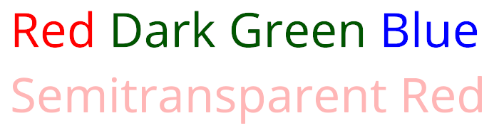

# Text Color

There are two ways to change text color with color tags:

* Use named colors, as in `<color="colorName">`<br/><br/>
  The following color names are supported: `black`, `blue`, `green`, `orange`, `purple`, `red`, `white`, and `yellow`.<br/><br/>
* Use hexadecimal values, as in `<color=#FFFFFF>` or `<color=#FFFFFFFF>` if you also want to define the alpha value.

If you apply successive `<color>` tags in the same text, the last one takes precedence over the others until you either add another `<color>`tage or use a closing `</color>` tag to end the current color's scope.

**Example:**

```
<color="red">Red <color=#005500>Dark Green <#0000FF>Blue <color=#FF000088>Semitransparent Red
```

<br/>
_Successive color tags_

```
<color="red">Red, <color="blue">Blue,</color> and red again.
```

<br/>
_Closing color tag_
