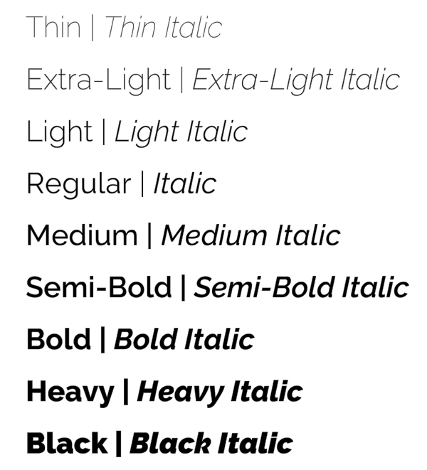

# Font weight

Use the `<font-weight>` tag to switch between the font weights available for the current [Font Asset](FontAssets.md).

You specify the weight using its numeric value, for example `400` for **normal**, `700` for **bold**, and so on.

You can only apply font weights defined in the [Font Asset properties](FontAssetsProperties.md#FontWeights). If you have not defined any font weights, you can still use values of **400** and **700** to apply the multipliers set in the **Normal Weight** and **Bold Weight** properties.

The closing `</font-weight>` tag reverts to the original font specified for the TextMesh Pro object.

**Example:**

```
<font-weight="100">Thin</font-weight>
<font-weight="200">Extra-Light</font-weight>
<font-weight="300">Light</font-weight>
<font-weight="400">Regular</font-weight>
<font-weight="500">Medium</font-weight>
<font-weight="600">Semi-Bold</font-weight>
<font-weight="700">Bold</font-weight>
<font-weight="800">Heavy</font-weight>
<font-weight="900">Black</font-weight>
```

<br/>
_Font weights_
