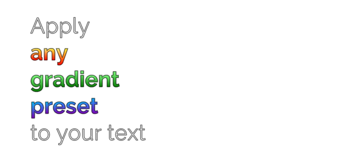
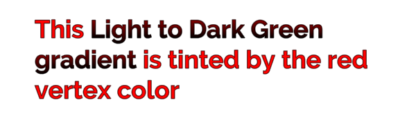
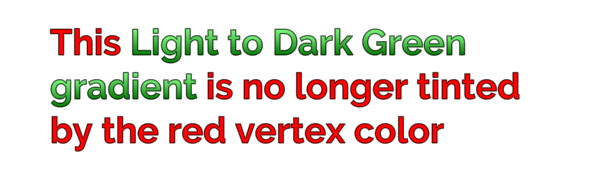

# Gradient

The `<gradient>` tag applies a pre-defined gradient preset to text.

For more information about creating gradient presets, see the documentation on [Gradient Presets](ColorGradientsPresets.md).

The closing `</gradient>` tag reverts to the TextMesh pro object's original color.

**Example:**

```
Apply<b>
<gradient="Yellow to Orange - Vertical">any
<gradient="Light to Dark Green - Vertical">gradient
<gradient="Blue to Purple - Vertical">preset</gradient>
</b>to your text
```

<br/>
_Successive gradient tags ended with a closing `</gradient>`_

**Note:** When you apply a gradient using this tag, it's multiplied by the TextMesh Pro object's current vertex colors.

```
This <gradient="Light to Dark Green - Vertical">Light to Dark Green gradient</gradient> is tinted by the red vertex color
```
<br/>
_Applying a green gradient to red text_

To apply the pure gradient to a selection of text, you can use a `<color>` tag to "reset" the color to white before applying the gradient.

```
This <color=#FFFFFFFF><gradient="Light to Dark Green - Vertical">Light to Dark Green gradient</gradient></color> is no longer tinted by the red vertex color
```
<br/>
_"Resetting" the text's vertex color before applying a gradient_
