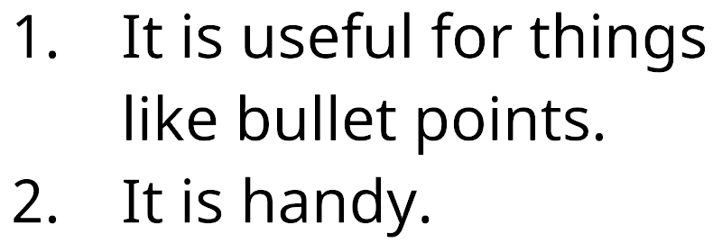

# Indentation

The `<indent>` tag controls  the horizontal caret position the same way the [`<pos>`](RichTextPos.md) tag does, but the effect persists across lines.

Use this tag to create text patterns, such as bullet points, that work with word-wrapping.

You specify indentation in pixels, font units, or percentages.

**Example:**

```
1. <indent=15%>It is useful for things like bullet points.</indent>
2. <indent=15%>It is handy.
```

<br/>
_Using indentation to make a list._
