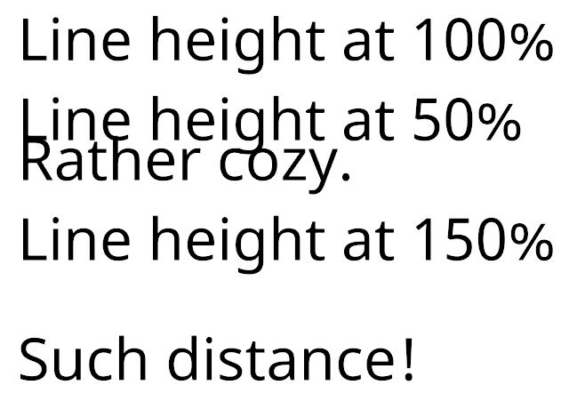

# Line Height

Use the `<line-height>` tag to manually control line height. The line-height controls how far down from the current line the next line starts. It does not change the current line.

Smaller values pull lines closer together. Larger values push them farther apart.

You can specify the line height in pixels, font units, or percentages.

Adjustments you make using this tag are relative to the line-height specified in the [Font Asset](FontAssetsProperties.md#FaceInfo). The `</line-height>` closing tag reverts to this height.

**Example:**

```
Line height at 100%
<line-height=50%>Line height at 50%
<line-height=100%>Rather cozy.
<line-height=150%>Line height at 150%
Such distance!
```

<br/>
_Different line heights_
