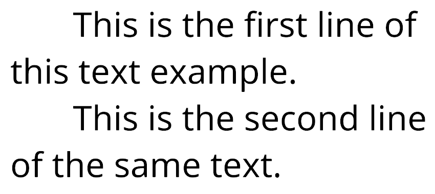

# Line Indentation

The `<line-indent>` tag inserts horizontal space directly after it, and before the start of each new line. It only affects manual line breaks (including line breaks created with the [`<br>` tag](RichTextLineBreak.md), not word-wrapped lines.

You can specify the indentation in pixels, font units, or percentages.

The `</line-indent>` closing tag ends the indentation of lines.

**Example:**

```
<line-indent=15%>This is the first line of this text example.
This is the second line of the same text.
```
<br/>
_Indent every new line, with one tag_
