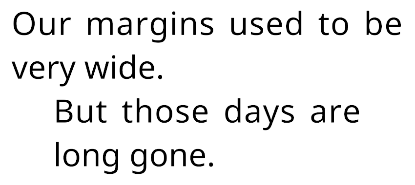

# Margin

You can increase the horizontal margins of the text with the `<margin>` tag.

If you only want to adjust the left or right margin, you can use the `<margin-left>` or `<margin-right>` tag.

You can specify the margins in pixels, font units, and percentages. Negative values have no effect.

Adjustments you make using this tag are relative to the margins specified in the [TexMesh Pro object](TMPObjectUIText.md#extra-settings). The `</margin>` closing tag reverts to this value.

**Example:**

```
Our margins used to be very wide.
<margin=5em>But those days are long gone.
```

<br/>
_Adjusting margins_
