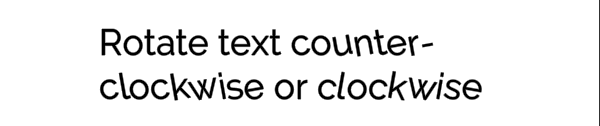
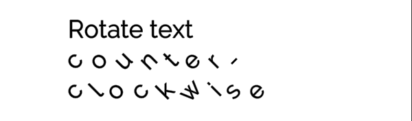

# Rotate

Use the `<rotate>` tag to rotate each character about its center. Specify the amount of rotation in degrees. Positive values rotate characters counter-clockwise. Negative values rotate them clockwise.

Rotation affects the spacing between characters, and may cause characters to overlap in some cases. Use the [`<cspace>`](RichTextCharacterSpacing) tag to correct character spacing as needed.

**Example:**

```
Rotate text <rotate="-10">counter-clockwise</rotate> or <rotate="10">clockwise</rotate>
```

<br/>
_Text rotated counter-clockwise (left) and clockwise (right)_

```
Rotate text <rotate="45">counter-clockwise</rotate>
```

<br/>
_More rotation makes it more likely that characters overlap_

```
Rotate text <cspace="15"><rotate="45">counter-clockwise</rotate></cspace>
```

<br/>
_The `<cspace>` tag adjusts character spacing, and can help correct overlap caused by rotation_
