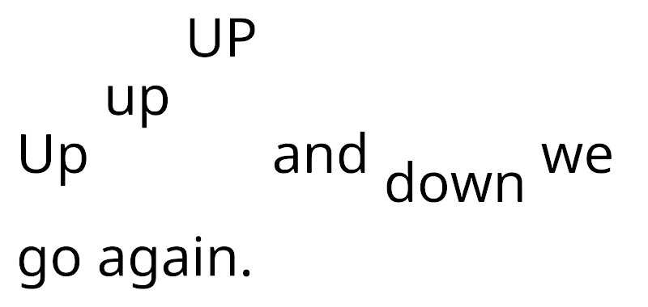

# Vertical Offset

Use the `<voffset>` tag to offset the text baseline vertically. This adjusts the line height accordingly to accommodate the text's offset position. You can compensate for that adjustment by manually adjusting the line height.

Specify the offset in pixels or font units. The offset is always relative to the original baseline.

The `</voffset>` closing tag resets the baseline back to its original position.

**Example:**

```
Up <voffset=1em>up <voffset=2em>UP</voffset> and <voffset=-0.5em>down</voffset> we go again.
```

<br/>
_Vertical offset_
