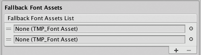
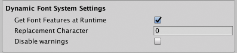
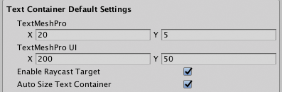
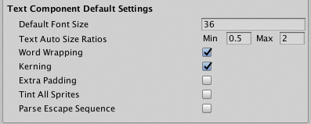
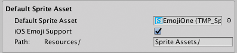
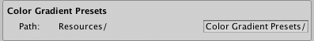
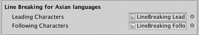

# Settings

TextMesh Pro’s project-wide settings are stored in a special Asset named TMP Settings. This Asset must be stored in a Resources folder. By default it’s in the `Assets/TextMesh` Pro folder.

To edit the settings, either select the Asset in the Project View or open the **Project Settings** window and choose **TextMesh Pro** from the category list.

 
_TextMesh Pro Settings_

The Settings are divided into the following groups:

|Group:|Function:|
|-|-|
|**A**   | **[Default Font Asset](#default-font-asset):** Set the default font for text objects.  |
|**B**   | **[Fallback Font Assets](#fallback-font-assets):** Choose font assets to search when TexMesh Pro can’t find a character in a text object’s main font Asset.  |
|**C**   | **[Fallback Material Settings](#fallback-material-settings):** Set style options for characters retrieved from fallback fonts.  |
|**D**   | **[Dynamic Font System Settings](#dynamic-font-system-settings):** Set options for handling missing characters.  |
|**E**   | **[Text Container Default Settings](#text-container-default-settings):** Control the size of the text container for new text objects.  |
|**F**   | **[Text Component Default Settings](#text-component-default-settings):** Set the basic text formatting options for new text objects.  |
|**G**   | **[Default Sprite Asset](#default-sprite-asset):** Choose a default Sprite Asset to use for for rich text sprite tags that do not specify an Asset, and set other sprite-related options.  |
|**H**   | **[Default Style Sheet](#default-style-sheet):** Choose a default style sheet.  |
|**I**   | **[Color Gradient Presets](#color-gradient-presets):** Choose a location to store color gradient presets.  |
|**J**   | **[Line Breaking for Asian Languages](#line-breaking-for-asian-languages):** Define leading and following characters in order to get proper line breaking when using Asian fonts.  |

## Default Font Asset

|Property:|Function:|
|---------|---------|
|**Default Font Asset**|Specify the default font used when you create a new text object.
|**Path**|Specify where to store font assets.  The **Path** must point to  a subfolder of a Resources folder.|

## Fallback Font Assets

When a text object contains a character that is not in its font Asset, TextMesh Pro searches these font assets for the glyph. If the object’s font assets has a local fallback font list, TextMesh Pro searches the fonts in that list first.

|Property:|Function:|
|-|-|
|**Fallback Font Assets List**|Manage the global fallback font assets.  Click **+** and **-** to add and remove font slots.  Click the circle icon next to a font to choose a font Asset using the Object Picker.  Drag the handles on the left side of any font Asset to reorder the list.|

## Fallback Material Settings

|Property:|Function:|
|-|-|
|**Match Material Presets**|Enable this setting to make glyphs from the fallback font match the style of the main font.  When TextMesh Pro uses a glyph from a fallback font, it creates a material with the same settings as the main font’s material.  This looks best when the main font and the fallback font are similar.|

## Dynamic Font System Settings

These are project-wide settings for handling missing glyphs.

|Property:|Function:|
|-|-|
|**Get Font Features at Runtime**   |   |
|**Replacement**|Specify the ID of the character to use when TextMesh Pro cannot find a missing glyph in any of the fallback fonts.  The default value of 0 produces the outline of a square.|
|**Disable Warnings**|Enable this setting to prevent Unity from logging a warning for every missing glyph.|

## Text Container Default Settings

These settings define the default size for text containers in new text objects.

|Property:|Function:|
|-|-|
|**TextMeshPro**|Set the default size of text containers for new TextMesh Pro 3D GameObjects, in Unity units.|
|**TextMeshPro UI**|Set the default size of text containers for new TextMesh Pro UI GameObjects, in Unity units.|
|**Enable Raycast Target**   | Enable this option to make TextMesh Pro GameObjects targets for raycasting by default.    When you disable this option, the UI ignores TextMesh Pro GameObjects by default when determining what the cursor interacts with.  |
|**Auto Size Text Container**|Enable this option to automatically size text containers to fit the text when creating new TextMesh Pro UI GameObjects.|

## Text Component Default Settings

These settings define default values for new text objects. After adding a text object to the Scene, you can adjust these settings in the object's TextMesh Pro Inspector.

|Property:|Function:|
|-|-|
|**Default Font Size**|Set the default font size, in points.|
|**Text Auto Size Ratios**|Set the default **Min** to **Max** size ratio TextMesh Pro uses when it [sets font size automatically](TMPObjectUIText.md#font).|
|**Word Wrapping**|Enable this option to turn word wrapping on for all new text objects.|
|**Kerning**|Enable this option to toggle kerning on for all new text objects.  If new objects use a font with no kerning data, enabling this setting has no effect.|
|**Extra Padding**|Enable this option to add extra padding to character sprites.  TextMesh Pro creates sprites to fit the visible text, but the results aren't always perfect. This setting reduces the chances that glyphs are cut off at the boundaries of their sprites.|
|**Tint All Sprites**|By default, sprites aren't affected by the text's vertex colors. Enable Tint All Sprites changes this.|
|**Parse Escape Sequence**|Enable this option to make TextMesh Pro interpret backslash-escaped characters as special characters.  For example `\n` is interpreted as a newline, `\t` as a tab, and so on.  **Note:** This applies to rendered text. In code, escaped characters are already parsed by the compiler.|

## Default Sprite Asset

|Property:|Function:|
|-|-|
|**Default Sprite Asset**   | Choose the [Sprite Asset](Sprites.md) for TextMesh Pro GameObjects to use by default. |
|**IOS Emoji Support**   | Toggle support for iOS emoji.  |
|**Path**  | Specify where to store Sprite Assets.  The **Path** must point to  a subfolder of a Resources folder.  |

## Default Style Sheet

|Property:|Function:|
|-|-|
|**Default Style Sheet**|You can choose a single [style sheet](StyleSheets.md) Asset, which is used by all text objects in the project.|

## Color Gradient Presets

|Property:|Function:|
|-|-|
|**Path**|Specify where to store Sprite Assets.  The **Path** must point to  a subfolder of a Resources folder.|

## Line Breaking for Asian Languages

To obtain correct line-breaking behavior for Asian languages, you must specify which characters behave as leading and following characters. This is done via two text assets.

|Property:|Function:|
|-|-|
|**Leading Characters**|Specify the text file that contains the list of leading characters.|
|**Following Characters**|Specify the text file that contains the list of following characters.|
