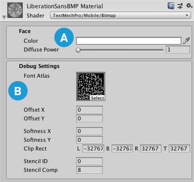

# Bitmap Mobile Shader

The mobile Bitmap shader is designed to use  bitmap-only fonts. It treats the font atlas like a regular texture, displaying it directly, and does not support any text effects. Bitmap-textured text becomes blocky when you zoom in on it.

Unlike the regular Bitmap shader, the mobile Bitmap shader does not support textures for the text face.

## Properties

 **[Face](#Face):** Controls the text's overall appearance.

 **[Debug Settings](#DebugSettings):** Exposes internal shader properties that are sometimes useful for troubleshooting.

### Face

The Face properties control the overall appearance of the text.

| Property:    | Description |
|--------------|-------------|
| **Color**    |Adjust the face color of the text.  The value you set here is multiplied with the vertex **Colors** you set in the TextMeshPro component.  Set this to white to use the original vertex colors.  Set this to black to cancel out the vertex colors.  Similarly, setting the Alpha to **1** uses the original vertex-color alpha, while setting it to **0** removes any alpha set in the original vertex colors.|
| **Diffuse Power**  |Increase this value to multiply the text **Color**, which brightens the text.  |

### Debug Settings

The debug section exposes some of the shader’s internal properties. They can be helpful for troubleshooting problems you encounter with the shader.

| Property:                        | Description |
|----------------------------------|-----------------------|
| **Font Atlas**                   | Points to the atlas texture used by the font Asset. |
| **Offset X/Offset Y**            | Offset the vertex positions of each character in X and Y.  You can change these values using a script to create simulated crawl or scrolling FX. |
| **Softness X/Softness Y**        | When **Mask** is set to **Soft**, set these to adjust the softness of the edge of the text. |
| **Clip Rect**                    | Clip Rect defines the Left (**L**), Bottom (**B**), Right (**R**) and Top (**T**) world space coordinates of the masking rectangle.   This is normally set automatically by the **2D RectMask**. However when using a normal **TextMeshPro** component, this allows you to set / control the masking region. |
