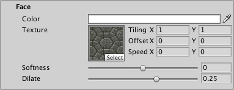
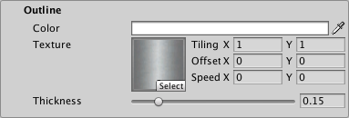
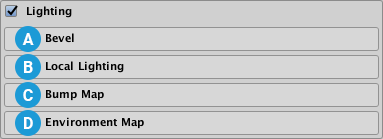
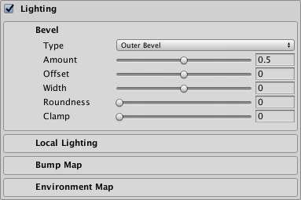
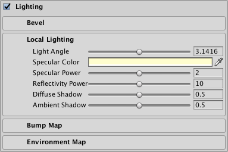
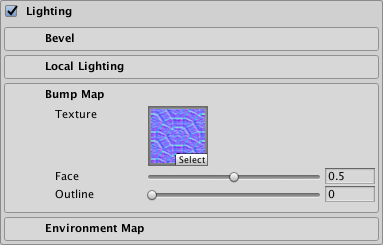
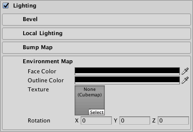

# Distance Field / Distance Field Overlay Shaders

The Distance Field and Distance Field Overlay shaders are two nearly-identical variants of the TextMesh Pro signed distance field (SDF)shader. The difference between the two is that the Distance Field Overlay variant always renders the TextMesh Pro object on top of everything else in the Scene, while the Distance Field variant renders the Scene normally—objects in front of the TextMesh Pro object are rendered on top of the text.

Both of these variants are unlit, meaning they do not interact with Scene lighting. Instead, they can simulate local directional lighting effects.

## Properties

The Distance Field and Distance Field Overlay shaders have identical properties, which you can edit in the TextMesh Pro object Inspector.

Properties are divided into several sections, some of which you must enable in order to activate the property group.

 **[Face](#Face):** Controls the text's overall appearance.

 **[Outline](#Outline):** Adds a colored and/or textured outline to the text.

 **[Underlay](#Underlay):** Adds a second rendering of the text underneath the original rendering, for example to add a drop shadow.

 **[Lighting](#Lighting):** Simulates local directional lighting on the text.

 **[Glow](#Glow):** Adds a smooth outline to the text in order to simulate glow.

 **[Debug Settings](#DebugSettings):** Exposes internal shader properties that are sometimes useful for troubleshooting.

### Face

The Face properties control the overall appearance of the text.

| Property:    || Description |
|--------------|---|-------------|
| **Color**    ||Adjust the face color of the text.  The value you set here is multiplied with the vertex **Colors** you set in the TextMeshPro component.  Set this to white to use the original vertex colors.  Set this to black to cancel out the vertex colors.  Similarly, setting the Alpha to **1** uses the original vertex-color alpha, while setting it to **0** removes any alpha set in the original vertex colors.|
| **Texture**  ||Apply a texture to the text face.  The texture is multiplied with the face **Color** and the vertex colors in the TextMesh Pro component to produce the final face color.  The **Horizontal Mapping** and **Vertical Mapping** properties in the TextMesh Pro component determine how TextMesh Pro fits the texture to the text face.|
| **Tiling X/Y**   ||Increase these values to repeat the texture across the text surface, in accordance with the TextMesh Pro object's **Horizontal Mapping** and **Vertical Mapping** properties.|
| **Offset X/Y**   ||Adjust these values to change the texture's relative position, horizontally or vertically, on the text surface.             |
| **Speed X/Y**    ||Animate the face texture by setting a value greater than **0**.  The resulting animation is a scrolling effect as the texture’s UV coordinates change over time.  **Note:** To see this effect in the Scene view, you must enable **Animated Materials** from the Effects menu in the [Scene view control bar](https://docs.unity3d.com/Manual/ViewModes.html).|
| **Softness** ||Adjust the softness of the text edges.  A value of **0** produces  crisp, anti-aliased edges.  Values greater than **0** produce increasingly soft/blurry edges.  This setting applies to both the text face and the outline.|
| **Dilate**   ||Adjust the position of the text contour in the font [distance field](FontAssetsSDF.md).  A value of **0** places the contour halfway, which corresponds to the contour of the original font.  Negative values thin the characters, while positive values thicken them.|

### Outline

The outline properties allow you to add an outline to the text and control its appearance. The outline is not visible unless you set a **Thickness** value greater than **0**.

| Property:    |Description |
|--------------|------------|
| **Color** |Adjust the color for the text outline.|
| **Texture** |Apply a texture to the text outline.  The texture is multiplied with the outline **Color** to produce the final outline color.  The **Horizontal Mapping** and **Vertical Mapping** properties in the TextMesh Pro component determine how TextMesh Pro fits the texture to the text outline.|
| **Tiling** |            |
| **Offset** |            |
| **Speed** |Animate the outline texture by setting a value greater than 0.  The resulting animation is a scrolling effect as the texture’s UV coordinates change over time.  **Note:** To see this effect in the Scene view, you must enable **Animated Materials** from the Effects menu in the [Scene view control bar](https://docs.unity3d.com/Manual/ViewModes.html).|
| **Thickness** |Adjust the thickness of the outline. The higher the value, the thicker the line.  The outline is drawn on the text contour, with half its thickness inside the contour and half of it outside the contour.  You can pull it farther in or push it farther out  by adjusting the **Face > Dilate** property.|

### Underlay

Underlay adds an additional rendering of the text underneath the original rendering. You can use it to add a drop-shadow effect.

| Property:    |   | Description |
|--------------|---|-------------|
| **Underlay Type** |   |Choose the type of underlay to render.|
| | None  |No underlay.             |
| | Normal  |Renders the underlay underneath the original text.  This creates a standard drop-shadow style effect.|
| | Inner  |Inverts the underlay and masks it with the original text so it is only visible inside the outline of the original letters.  This creates the type of drop shadow you would see through a cutout of the text.  To see an **Inner** underlay, you must make the text face transparent by setting its Alpha to **0**.|
| **Color** |   |Set the color of the underlay text. The default is a semi-transparent black.|
| **Offset X/Offset Y** |   |Offset the underlay text horizontally and vertically  from the original text.  For example, if you’re using the underlay to create a drop shadow, you can position it to suggest a specific lighting direction.|
| **Dilate** |   |Adjust the position of the underlay text contour in the font's [distance field](FontAssetsSDF.md).  A value of **0** places the contour halfway, which corresponds to the contour of the original font.  Negative values thin the characters, while positive values thicken them.|
| **Softness** |   |Adjust the softness of the underlay text edges.  A value of **0** produces  crisp, anti-aliased edges.  Values greater than **0** produce increasingly soft/blurry edges.  When using the underlay to create a drop-shadow, you can use this setting to make the shadows harder or softer.|

### Lighting

The Distance Field shader does not react to Scene lighting. Instead, it uses the settings in this group to simulate local directional lighting, and light effects.

If you want your text to react to Scene lighting, use the [Distance Field Surface](ShaderDistanceFieldSurface.md) shader.

The Lighting properties are grouped into the following sections

 **[Bevel](#Bevel):**

 **[Local Lighting](#LocalLighting):**

 **[Bump Map](#BumpMap):**

 **[Environment Map](#EnvironmentMap):**

#### Bevel

A bevel adds the illusion of depth to your text. It works like a normal map, except that the shader calculates the bevel using the font’s signed distance field.

Bevels are prone to showing artifacts, especially when they are too pronounced. These artifacts are more obvious on some materials than on others. Sometimes, artifacts that are more obvious on a simple material are hardly noticeable on a more complex material.

Although bevels work best with text that has an outline, you can apply them to text with no outline. In that case, you must set a positive **Width**, and should set a negative **Offset** to ensure that the whole bevel is visible.

| Property:    |             | Description |
|--------------|-------------|-------------|
| **Type** |             | Choose the type of bevel to apply            |
|              | Outer Bevel | Produces raised lettering with sloped sides.  The bevel starts at the outside of the outline and increases in height until it reaches the inside of the outline. |
|              | Inner Bevel | Produces text with a raised outline.  The bevel starts at the outside of the outline, increases in height until it reaches the middle of the outline, and decreases in height until it reaches the inside of the outline. |
| **Amount** |             | Adjust the steepness of the bevel.  This setting defines the apparent difference in height between low and high regions of the bevel. |
| **Offset** |             | Offset the bevel from its usual position so it no longer matches the outline.  Different offsets produce very different bevels.  This is especially useful when you apply a bevel to text with no outline. |
| **Width** |             | Adjust the bevel size.  Set a value of **0** to make the bevel fill the full thickness of the outline.  Set a positive value to make the bevel extend beyond both sides of the outline.  Set a negative value to shrink the bevel toward the middle of the outline.|
| **Roundness** |             | Increase this value to smooth out more angular regions of the bevel. The effect is often quite subtle. |
| **Clamp** |             | Set this value to limit the maximum height of the bevel.  Higher values mean the bevel reaches its maximum height sooner.  Clamped outer bevels end before reaching the inside edge of the outline.  Clamped inner bevels have a larger flat region in the middle of the outline. |

#### Local Lighting

These settings control simulated local directional lighting. They work in combination with the Bevel, Bump Map, and Environment Map settings.

| Property:    |Description |
|--------------|------------|
| **Light Angle** | Adjust the angle, in radians, of the simulated local light illuminating the text.  The default angle is approximately π (pi) radians, which positions the light above the text.|
| **Specular Color** | Set the tint for specular highlights.  These are the highlights you see when the text directly reflects the simulated local light source. |
| **Specular Power** | Adjust the appearance of specular highlights. Larger values produce larger and brighter highlights. |
| **Reflectivity Power** | Adjust the how much the **[Environment Map](#EnvironmentMap)** contributes to the final color of the text.  The higher the value, the more the text appears to reflect the environment map texture and color. |
| **Diffuse Shadow** | Adjust the overall shadow level.  Higher values produce stronger shadowing, and consequently fewer apparent light effects on the text. |
| **Ambient Shadow** | Adjust the ambient light level.  Settings lower than **1** darken the text color based on the slope of the text. This is a subtle effect that is only noticeable with strong bevels or normal maps. |

#### Bump Map

You can use a normal map as a bump map to add bumpiness to the text. The bump map affects both the text face and outline, but you can control how strongly it affects each one individually. If your text has both a bevel and a bump map, the two mix together.

| Property:    |Description |
|--------------|------------|
| **Texture** | Select a normal map texture to use as a bump map. |
| **Face** | Control how much the bump map affects the text face.  A value of **0** shows no effect while a value of **1** shows the full effect of the bump map. |
| **Outline** | Control how much the bump map affects the text outline.  A value of **0** shows nothing while a value of **1** shows the full effect of the bump map. |

#### Environment Map

You can use an environment map to add a reflection effect to your text face or outline, or for special image effects. The environment texture must be a cubemap. You can provide a static cubemap or create one at run time via a script.

| Property:    |Description |
|--------------|------------|
| **Face Color** | Choose a color to use to tint reflections on the text face.  This color is multiplied with the environment map before the reflectivity effect is applied to the text face.  When this color is set to black, the environment map has no effect on the text face.  When this color is set to white, the environment map is at full strength on the text face. |
| **Outline Color** | Choose a color to use to tint reflections on the text outline.  This color is multiplied with the environment map before the reflectivity effect is applied to the text outline.  When this color is set to black, the environment map has no effect on the text outline.  When this color is set to white, the environment map is at full strength on the text outline. |
| **Texture** | Choose a cubemap texture to use as an environment map. |
| **Rotation** | Rotate the environment map to control which parts of the texture are visible in the reflection. You can animate the rotation to create a sense of movement. |

### Glow

The **Glow** effect adds a smooth outline on top of other text effects, which is typically used to suggest a glow. The effect is additive, so it is more noticeable on dark backgrounds.

When the glow extends beyond the text boundary, the surface shader shades it as if it were part of the solid text, meaning that it gets simulated lighting effects such as specular highlights.

| Property:    |Description |
|--------------|------------|
| **Color** |Set the tint and strength of the glow effect by adjusting the **Color** and **Alpha** values respectively. |
| **Offset** | Adjust the center of the glow effect.  A value of **0** places the center of the glow effect right on the text contour.  Positive values move the center out from the contour. Negative values move it in toward the center of the text. |
| **Inner** | Control how far the glow effect extends inward from the its start point (text contour + **Offset**). |
| **Outer** | Control how far the glow effect extends outward  from the text contour (text contour + Offset). |
| **Power** | Control how the glow effect falls off from its center to its edges.  A value of **1** produces a strong, bright glow effect with a sharp linear falloff.  Lower values produce a glow effect with a quick drop in intensity followed by a more gradual falloff. |

### Debug Settings

The debug section exposes some of the shader’s internal properties. They can be helpful for troubleshooting problems you encounter with the shader.

| Property:                        |           | Description |
|----------------------------------|-----------|-------------|
| **Font Atlas**                   |           | Points to the atlas texture used by the font Asset. |
| **Gradient Scale**               |           |Represents the spread / range of the font’s [signed distance field](FontAssetsSDF.md).  This determines the effective range of material properties such as  **Outline > Width** and **Underlay > Offset X/Y**.  This value is equal to Padding +1, with Padding being the **Padding** value set when the font Asset was created.  **Note:** This value is displayed for debugging purposes. You should not edit it manually. |
| **Texture Width/Texture Height** |           | Displays the texture atlas width and height specified in the **Atlas Resolution** settings when the font Asset was created. |
| **Scale X/Scale X**              |           | Set multipliers for the SDF scale.  When set to **0**, characters are rendered as blocks.  Negative values soften the characters, while positive values make them appear sharper. |
| **Perspective Filter**           |           | When using a perspective camera, adjust this setting to make text look softer when viewed at sharp angles.  The default setting of **0.875** is adequate in most cases.  When using orthographic cameras, set this to **0**. |
| **Offset X/Offset Y**            |           | Offset the vertex positions of each character in X and Y.  You can change these values using a script to create simulated crawl or scrolling FX. |
| **Mask**                         |           |             |
|                                  | Mask Off  |             |
|                                  | Mask Hard |             |
|                                  | Mask Soft |             |
| **Mask Bounds**                  |           |             |
| |**Softness X/Softness Y**                | When **Mask** is set to **Soft**, set these to adjust the softness of the edge of the text. |
| **Match Bounds Renderer**        |           |             |
| |**Clip Rect**                            | Clip Rect defines the Left (**L**), Bottom (**B**), Right (**R**) and Top (**T**) world space coordinates of the masking rectangle.   This is normally set automatically by the **2D RectMask**. However when using a normal **TextMeshPro** component, this allows you to set / control the masking region. |
