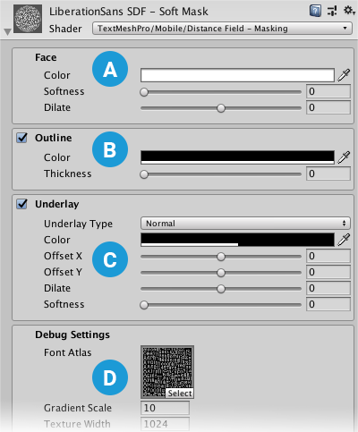
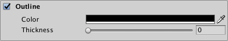
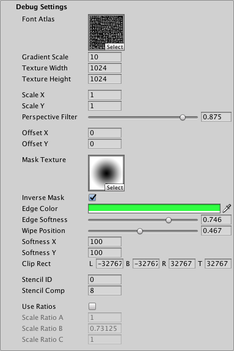

# Distance Field Masking Mobile Shader

The Distance Field and Distance Field Overlay shaders are two nearly-identical variants of the TextMesh Pro signed distance field (SDF)shader. The difference between the two is that the Distance Field Overlay variant always renders the TextMesh Pro object on top of everything else in the Scene, while the Distance Field variant renders the Scene normally—objects in front of the TextMesh Pro object are rendered on top of the text.

Both of these variants are unlit, meaning they do not interact with Scene lighting. Instead, they can simulate local directional lighting effects.

## Properties

The Distance Field and Distance Field Overlay shaders have identical properties, which you can edit in the TextMesh Pro object Inspector.

Properties are divided into several sections, some of which you must enable in order to activate the property group.

 **[Face](#Face):** Controls the text's overall appearance.

 **[Outline](#Outline):** Adds a colored and/or textured outline to the text.

 **[Underlay](#Underlay):** Adds a second rendering of the text underneath the original rendering, for example to add a drop shadow.

 **[Debug Settings](#DebugSettings):** Exposes internal shader properties that are sometimes useful for troubleshooting.

### Face

The Face properties control the overall appearance of the text.

| Property:    | Description |
|--------------|-------------|
| **Color**    |Adjust the face color of the text.  The value you set here is multiplied with the vertex **Colors** you set in the TextMeshPro component.  Set this to white to use the original vertex colors.  Set this to black to cancel out the vertex colors.  Similarly, setting the Alpha to **1** uses the original vertex-color alpha, while setting it to **0** removes any alpha set in the original vertex colors.|
| **Softness** |Adjust the softness of the text edges.  A value of **0** produces  crisp, anti-aliased edges.  Values greater than **0** produce increasingly soft/blurry edges.  This setting applies to both the text face and the outline.|
| **Dilate**   |Adjust the position of the text contour in the font [distance field](FontAssetsSDF.md).  A value of **0** places the contour halfway, which corresponds to the contour of the original font.  Negative values thin the characters, while positive values thicken them.|

### Outline

The outline properties allow you to add an outline to the text and control its appearance. The outline is not visible unless you set a **Thickness** value greater than **0**.

| Property:    |Description |
|--------------|------------|
| **Color** |Adjust the color for the text outline.|
| **Thickness** |Adjust the thickness of the outline. The higher the value, the thicker the line.  The outline is drawn on the text contour, with half its thickness inside the contour and half of it outside the contour.  You can pull it farther in or push it farther out  by adjusting the **Face > Dilate** property.|

### Underlay

Underlay adds an additional rendering of the text underneath the original rendering. You can use it to add a drop-shadow effect.

| Property:    |   | Description |
|--------------|---|-------------|
| **Underlay Type** |   |Choose the type of underlay to render.|
| | None  |No underlay.             |
| | Normal  |Renders the underlay underneath the original text.  This creates a standard drop-shadow style effect.|
| | Inner  |Inverts the underlay and masks it with the original text so it is only visible inside the outline of the original letters.  This creates the type of drop shadow you would see through a cutout of the text.  To see an **Inner** underlay, you must make the text face transparent by setting its Alpha to **0**.|
| **Color** |   |Set the color of the underlay text. The default is a semi-transparent black.|
| **Offset X/Offset Y** |   |Offset the underlay text horizontally and vertically  from the original text.  For example, if you’re using the underlay to create a drop shadow, you can position it to suggest a specific lighting direction.|
| **Dilate** |   |Adjust the position of the underlay text contour in the font's [distance field](FontAssetsSDF.md).  A value of **0** places the contour halfway, which corresponds to the contour of the original font.  Negative values thin the characters, while positive values thicken them.|
| **Softness** |   |Adjust the softness of the underlay text edges.  A value of **0** produces  crisp, anti-aliased edges.  Values greater than **0** produce increasingly soft/blurry edges.  When using the underlay to create a drop-shadow, you can use this setting to make the shadows harder or softer.|

### Debug Settings

The debug section contains options for defining and controlling masking. It also exposes some of the shader’s internal properties, which can be helpful for troubleshooting.

| Property:                        |           | Description |
|----------------------------------|-----------|-------------|
| **Font Atlas**                   |           | Points to the atlas texture used by the font Asset. |
| **Gradient Scale**               |           |Represents the spread / range of the font’s [signed distance field](FontAssetsSDF.md).  This determines the effective range of material properties such as  **Outline > Width** and **Underlay > Offset X/Y**.  This value is equal to Padding +1, with Padding being the **Padding** value set when the font Asset was created.  **Note:** This value is displayed for debugging purposes. You should not edit it manually. |
| **Texture Width/Texture Height** |           | Displays the texture atlas width and height specified in the **Atlas Resolution** settings when the font Asset was created. |
| **Scale X/Scale X**              |           | Set multipliers for the SDF scale.  When set to **0**, characters are rendered as blocks.  Negative values soften the characters, while positive values make them appear sharper. |
| **Perspective Filter**           |           | When using a perspective camera, adjust this setting to make text look softer when viewed at sharp angles.  The default setting of **0.875** is adequate in most cases.  When using orthographic cameras, set this to **0**. |
| **Offset X/Offset Y**            |           | Offset the vertex positions of each character in X and Y.  You can change these values using a script to create simulated crawl or scrolling FX. |
| **Mask Texture**  |    | Choose a texture file to use as a mask. Black and white images work best.   By default, black regions of the image  mask the text, while white areas reveal it.  |
| **Inverse Mask**   |   | Invert the mask so that white regions of the image  mask the text, while black areas reveal it.  |
| **Edge Color**   |   | Tint the edge of the mask with a specific color.   The softer the edge, the larger the tinted region.  |
| **Edge Softness**   |   | Make the edges of the mask softer or harder.   A value of **0.5** applies the mask as-is. Higher values soften the edges. Lower values make them sharper.  |
| **Wipe Position**   |   | Control the extent to which the text is masked.    A value of **0.5** masks the text exactly as defined by the **Mask Texture**.   A value of **0** fully exposes the text (no masking at all).    A value of **1** hides the text (all of the text is masked).    |
| **Softness X/Softness Y**        |           | Apply soft masking to the text in either axis.   Increase the **X** value to add soft masking to the left and right sides of the text. Increase the **Y** value to add soft masking at the top and bottom.   This masking is added to any masking defined by the **Mask Texture**.|
| **Clip Rect**                    |           | Clip Rect defines the Left (**L**), Bottom (**B**), Right (**R**) and Top (**T**) world space coordinates of the masking rectangle.   This is normally set automatically by the **2D RectMask**. However when using a normal **TextMeshPro** component, this allows you to set / control the masking region. |
