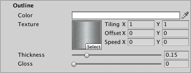
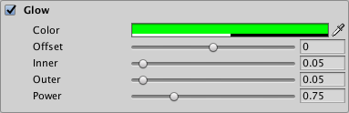
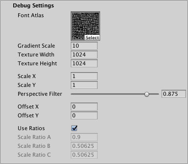

# Distance Field (Surface) Mobile Shader

The Distance Field (Surface) surface shader is similar to the Distance Field shader, but rather than simulating local directional lighting, it  interacts with Scene lighting. It is not a physically based shader.

This shader uses Unity's surface shader framework, which makes it quite flexible, but also more demanding on the GPU.

## Properties

 **[Face](#Face):** Controls the appearance of the text face.

 **[Outline](#Outline):** Controls the appearance of the text outline.

 **[Glow](#Glow):** Adds a smooth outline to the text in order to simulate glow.

 **[Debug Settings](#DebugSettings):** Exposes internal shader properties that are sometimes useful for troubleshooting.

### Face

You edit Distance Field Surface shader properties in the TextMesh Pro object Inspector. Properties are divided into several sections, some of which you must enable in order to activate the property group.

| Property:    || Description |
|--------------|---|-------------|
| **Color**    ||Adjust the face color of the text.  The value you set here is multiplied with the vertex **Colors** you set in the TextMeshPro component.  Set this to white to use the original vertex colors.  Set this to black to cancel out the vertex colors.  Similarly, setting the Alpha to **1** uses the original vertex-color alpha, while setting it to **0** removes any alpha set in the original vertex colors.|
| **Texture**  ||Apply a texture to the text face.  The texture is multiplied with the face **Color** and the vertex colors in the TextMesh Pro component to produce the final face color.  The **Horizontal Mapping** and **Vertical Mapping** properties in the TextMesh Pro component determine how TextMesh Pro fits the texture to the text face.|
| **Tiling**   ||Increase these values to repeat the texture across the text surface, in accordance with the TextMesh Pro object's **Horizontal Mapping** and **Vertical Mapping** properties.|
| **Offset**   ||Adjust these values to change the texture's relative position, horizontally or vertically, on the text surface.|
| **Speed**    ||Animate the face texture by setting a value greater than **0**.  The resulting animation is a scrolling effect as the texture’s UV coordinates change over time.  **Note:** To see this effect in the Scene view, you must enable **Animated Materials** from the Effects menu in the [Scene view control bar](https://docs.unity3d.com/Manual/ViewModes.html).|
| **Softness** ||Adjust the softness of the text edges.  A value of **0** produces  crisp, anti-aliased edges.  Values greater than **0** produce increasingly soft/blurry edges.  This setting applies to both the text face and the outline.|
| **Dilate**   ||Adjust the position of the text contour in the font [distance field](FontAssetsSDF.md).  A value of **0** places the contour halfway, which corresponds to the contour of the original font.  Negative values thin the characters, while positive values thicken them.|
| **Gloss**   ||Adjust the glossiness of the text face.    Glossiness determines the appearance of specular highlights when light hits the text. Higher values produce smaller specular highlights.|

### Outline

Description

| Property:    |Description |
|--------------|------------|
| **Color** |Adjust the color for the text outline.  Tthe outline is not visible unless you set a **Thickness** value greater than **0**.|
| **Texture** |Apply a texture to the text outline.  The texture is multiplied with the outline **Color** to produce the final outline color.  The **Horizontal Mapping** and **Vertical Mapping** properties in the TextMesh Pro component determine how TextMesh Pro fits the texture to the text outline.|
| **Tiling** |            |
| **Offset** |            |
| **Speed** |Animate the outline texture by setting a value greater than 0.  The resulting animation is a scrolling effect as the texture’s UV coordinates change over time.  **Note:** To see this effect in the Scene view, you must enable **Animated Materials** from the Effects menu in the [Scene view control bar](https://docs.unity3d.com/Manual/ViewModes.html).|
| **Thickness** |Adjust the thickness of the outline. The higher the value, the thicker the line.  The outline is drawn on the text contour, with half its thickness inside the contour and half of it outside the contour.  You can pull it farther in or push it farther out  by adjusting the **Face > Dilate** property.|
| **Gloss**   |Adjust the glossiness of the text outline.    Glossiness determines the appearance of specular highlights when light hits the text. Higher values produce smaller specualr highlights.|

### Glow

The **Glow** effect adds a smooth outline on top of other text effects, which is typically used to suggest a glow. The effect is additive, so it is more noticeable on dark backgrounds.

When the glow extends beyond the text boundary, the surface shader shades it as if it were part of the solid text, meaning that it gets simulated lighting effects such as specular highlights.

| Property:    |Description |
|--------------|------------|
| **Color** |Set the tint and strength of the glow effect by adjusting the **Color** and **Alpha** values respectively. |
| **Offset** | Adjust the center of the glow effect.  A value of **0** places the center of the glow effect right on the text contour.  Positive values move the center out from the contour. Negative values move it in toward the center of the text. |
| **Inner** | Control how far the glow effect extends inward from the its start point (text contour + **Offset**). |
| **Outer** | Control how far the glow effect extends outward  from the text contour (text contour + Offset). |
| **Power** | Control how the glow effect falls off from its center to its edges.  A value of **1** produces a strong, bright glow effect with a sharp linear falloff.  Lower values produce a glow effect with a quick drop in intensity followed by a more gradual falloff. |

### Debug Settings

The debug section exposes some of the shader’s internal properties. They can be helpful for troubleshooting problems you encounter with the shader.

| Property:                        |           | Description |
|----------------------------------|-----------|-------------|
| **Font Atlas**                   |           | Points to the atlas texture used by the font Asset. |
| **Gradient Scale**               |           |Represents the spread / range of the font’s [signed distance field](FontAssetsSDF.md).  This determines the effective range of material properties such as  **Outline > Width** and **Underlay > Offset X/Y**.  This value is equal to Padding +1, with Padding being the **Padding** value set when the font Asset was created.  **Note:** This value is displayed for debugging purposes. You should not edit it manually. |
| **Texture Width/Texture Height** |           | Displays the texture atlas width and height specified in the **Atlas Resolution** settings when the font Asset was created. |
| **Scale X/Scale X**              |           | Set multipliers for the SDF scale.  When set to **0**, characters are rendered as blocks.  Negative values soften the characters, while positive values make them appear sharper. |
| **Perspective Filter**           |           | When using a perspective camera, adjust this setting to make text look softer when viewed at sharp angles.  The default setting of **0.875** is adequate in most cases.  When using orthographic cameras, set this to **0**. |
| **Offset X/Offset Y**            |           | Offset the vertex positions of each character in X and Y.  You can change these values using a script to create simulated crawl or scrolling FX. |
