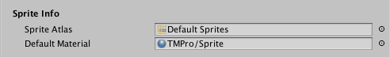
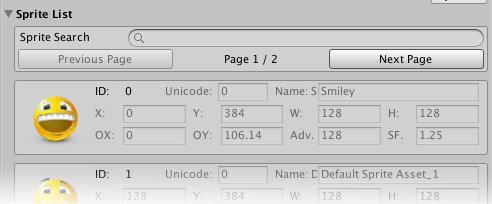

# Sprites

TextMesh Pro allows you to include sprites in your text via [rich text tags](RichTextSprite.md).

To use sprites in your Scene, you need a Sprite Asset. You create sprite assets from atlas textures that each contain a given set of sprites.

 
_A sprite atlas texture_

You can use as many sprite atlases and assets as you like, but keep in mind that using multiple atlases per text object results in multiple draw calls for that object, which consumes more system resources. As a rule, try to stick to one atlas per object.

**Note:** Sprites are regular bitmap textures, so make sure that their resolution is high enough to display correctly on your target platforms.

## Using Sprite Assets

To use a sprite Asset in your project, put it in a `Resources/Sprites` folder. This allows TextMesh Pro to find it.

Once you've added/created your sprite assets, you can set one as the default source for sprites in the project. You set the default sprite Asset in the [TextMesh Pro Settings](Settings.md#DefaultSprite).

You can also choose sprite assets to use with specific text objects. Edit a [TexMesh Pro 3D]() or [TextmeshPro UI]() Asset to specify a sprite Asset to use with the font.

## Creating a Sprite Asset

You create sprite assets from atlas textures. Although sprite assets and their source textures are separate entities, you must keep the source textures in the project after creating the sprite assets.

1. Select the texture you want to use for the Sprite Asset.

1. In the Inspector, change the following Texture Importer properties.

  * Set the **Texture Type** to **Sprite (2D and UI)**.

  * Set the **Sprite Mode** to **Multiple**.  

1. Open the Sprite Editor from the Inspector, or choose **Window > 2D > Sprite Editor** from the menu, and use it to divide the texture into individual sprites.

1. With the texture still selected, choose **Asset > Create > TextMesh Pro > Sprite Asset** from the menu to create a new sprite Asset.

After creating the sprite Asset, you can revert the atlas texture's **Texture Type**
to its original setting.

## Sprite Asset Properties

The Sprite Asset properties are divided into the following groups:

 **[Sprite Info](#SpriteInfo):** Provides references to the sprite Asset's material and source texture.

 **[Fallback Sprite Assets](#FallbackSpriteAssets):** Provides references to the sprite Asset's material and source texture.

 **[Sprite List](#SpriteList):** Provides references to the sprite Asset's material and source texture.

### Sprite Info

|Property:|Function:|
|-|-|
|**Sprite Atlas**|A reference to the sprite Asset's source texture.|
|**Default Material**|A reference to the sprite Asset's material, which it uses to render sprites.|

### Fallback Sprite Assets

When TextMesh Pro can't find a glyph in this sprite assets, it searches the fallback sprite assets that you specify here.

|Property:|Function:|
|-|-|
|**Fallback Sprite Asset List**|Manage the fallback sprite assets.  Click **+** and **-** to add and remove font slots.  Click the circle icon next to a font to choose a font Asset using the Object Picker.  Drag the handles on the left side of any font Asset to reorder the list.|

### Sprite List

|Property:||Function:|
|-|-|-|
|**Sprite Search**||Search the sprite list by **ID** or **Name**.  Search results are ordered by **ID**, lowest to highest.|
|**Previous Page / Next Page**||Long sprite lists are split into pages, which you can navigate using these buttons (also located at the bottom of the section).|
|**Sprite Properties**||Manage the sprites in this Asset.  Click a sprite to make it active.  Click **Up** or **Down** to move the sprite up or down in the list.  Enter an **ID** in the text field and click **Goto** to move the sprite to that position in then list.  **Note:** Moving a sprite updates its **ID** and the **ID**s of all preceding sprites accordingly.  Click **+** to add a copy of the sprite to the list.  Click **-** to remove the sprite from the list.|
||ID|A unique ID for the sprite, based on its portion in the list.  You can use this value in [rich text tags](RichTextSprite.md) tags to add this sprite to text.  Reordering the list updates the **ID**s of any affected sprites|
||Unicode||
||Name|A unique name for the sprite.  You can change this value, but it must be unique in the list  You can use this value in [rich text tags](RichTextSprite.md) to add this sprite to text.|
||X, Y, W, H|The rectangular area the character occupies in the sprite atlas.|
||OX, OY|Control the placement of the sprite, defined at its top-left corner relative to its origin on the baseline.|
||Adv.|Specify  how far to advance along the baseline before placing the next sprite.|
||SF|Change this scaling factor value to adjust the size of the sprite.|
|**Global Offsets & Scale**||Use these settings to override the following values for all sprites in the Asset: **OX**, **OY**, **ADV.**, and **SF.**|
