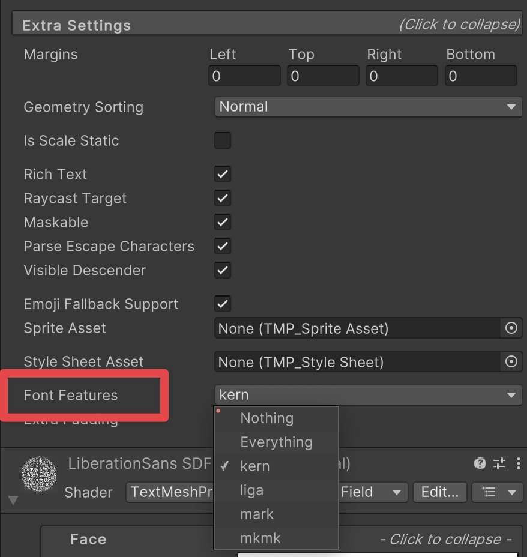

# Creating text

To create text, add TextMesh Pro GameObjects to a Scenes. There are two types of TextMesh Pro GameObject:

- [TextMesh Pro UI Text GameObjects](TMPObjectUIText.md) use [Unity's UI system](https://docs.unity3d.com/Manual/UISystem.html), and are designed for use on a [Canvas](https://docs.unity3d.com/Manual/UICanvas.html).

- [TextMesh Pro 3D Text GameObjects](TMPObject3DText.md) behave like regular 3D GameObjects in the Scene.

## TextMesh Pro UI Text GameObjects

TextMesh Pro UI text objects use [Unity's UI system](https://docs.unity3d.com/Manual/UISystem.html). When you create one, it is placed on a [Canvas](https://docs.unity3d.com/Manual/UICanvas.html) in the Scene. If the Scene does not have a canvas, Unity creates one automatically when you create the TexMesh Pro UI text GameObject.

**To create a new TextMesh Pro UI Text GameObject:**

1. From the menu, choose **GameObject > UI > TextMesh Pro - Text**.
1. In the **TextMesh Pro (UGUI)** Inspector, enter your text.
1. Adjust the [UI text properties](TMPObjectUIText.md) as needed.

### Other TextMesh Pro UI GameObjects

In addition to the UI text GameObject, you can create TextMesh Pro **Dropdown** and **Input Field** components from the **GameObject > UI** menu.

These components are nearly identical to regular Unity UI components, but have a few key differences:

* The TextMesh Pro Dropdown GameObject uses [TextMesh Pro font assets](FontAssets.md) instead of regular Unity font assets.    For more information about Unity dropdowns, see the [Dropdown](https://docs.unity3d.com/Manual/script-Dropdown.html) documentation in the Unity manual.   
* The TextMesh Pro Input Field GameObject uses uses [TextMesh Pro font assets](FontAssets.md) instead of regular Unity font assets, and has more options for defining the input field.    For more information about Unity input fields, see the [Input Field](https://docs.unity3d.com/Manual/script-InputField.html) documentation in the Unity manual.

## TextMesh Pro 3D Text GameObjects

TextMesh Pro 3D text objects are nearly identical to their UI counterparts, but rather than being positioned on a Canvas, they behave like regular 3D objects in the Scene.

**To create a new TextMesh Pro 3D Text GameObject:**

1. From the menu, choose **GameObject > 3D GameObject > TextMesh Pro - Text**.
1. In the **TextMesh Pro** Inspector, enter your text.
1. Adjust the [3D text properties](TMPObject3DText.md) as needed.

## OpenType FontFeature
Font Features define the typographic capabilities of a font asset. These features define potential substitutions or positional adjustments of glyphs. The following are the currently supported Font Features:

- **Ligatures:** Defines the substitution of multiple glyphs by a single glyph, such as 'fi' or 'ffl'. This features is identified as "liga".

- **Kerning:** Defines positional adjustments between two glyphs relative to each other. This features is identified as "kern".

- **Diacritical Marks:** Defines positional adjustments between Base glyphs and Mark glyphs. 

    The Mark-to-Base feature "mark" defines the positional adjustments of Mark glyphs relative to Base glyphs.

    The Mark-to-Mark feature "mkmk" defines the positional adjustments of Mark glyphs relative to Base Mark glyphs.

You can enable or disable the Font Features through the Font Features field in the Text component's Extra Settings section shown in the image below:

