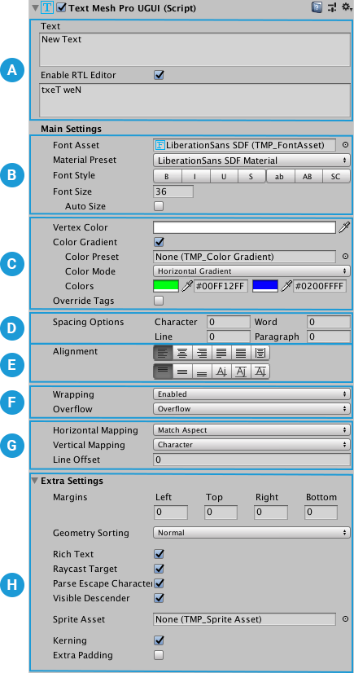
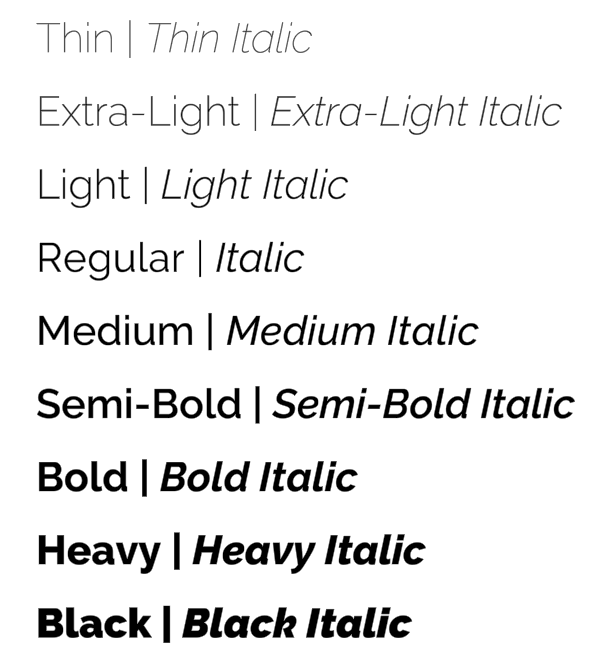
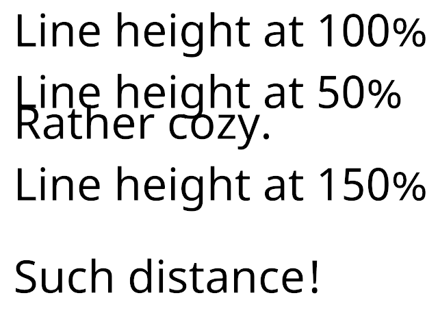
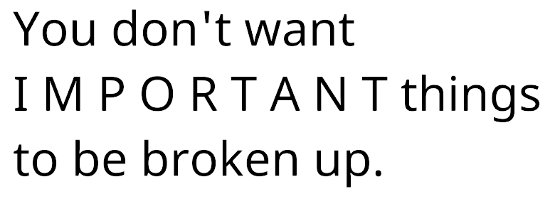

<a name="index.md"></a>
# TextMesh Pro Documentation

TextMesh Pro is a set of Unity tools for 2D and 3D text.

[IMAGE] 

TextMesh Pro provides better control over text formatting and layout than to Unity's UI Text & Text Mesh systems. It includes features such as:

* Character, word, line and paragraph spacing.
* Kerning.
* Justified text.
* Links.
* More than thirty rich text tags.
* Support for multiple fonts.
* Support for sprites.
* Custom styles.
* Advanced text rendering using custom [shaders](Shaders.md).

## Getting started

The TextMesh Pro package is included in the Unity Editor. You do not need to install it.

You can switch to other versions of TextMesh Pro from the [Packages Window](https://docs.unity3d.com/Manual/upm-ui.html).

To use TextMesh Pro, you must import the TMP Essential Resources package (see the next section).

You can also import the TMP Examples & Extras package to help you learn TextMesh Pro.

### Importing required resources into projects

To use TextMesh Pro in your projects, you need to import the **TMP Essential Resources**.

- From the menu, select **Window > TextMeshPro > Import TMP Essential Resources**

This adds the essential resources to the **TextMesh Pro** folder in the Project.

### Importing examples and additional resources

TextMesh Pro also includes additional resources and examples to help you learn about various features.

You can import these into your projects as well.

- From the menu, select **Window > TextMeshPro > Import TMP Examples & Extras**

This adds the examples and additional resources to the **TextMesh Pro > Examples & Extras** folder in the Project.

Installing the TMP Examples & Extras is not mandatory, but is strongly recommended for first-time TextMesh Pro users.


----
_NEW FILE:_ TMPObjects.md


<a name="TMPObjects.md"></a>
# Creating text

To create text, add TextMesh Pro GameObjects to a Scenes. There are two types of TextMesh Pro GameObject:

- [TextMesh Pro UI Text GameObjects](TMPObjectUIText.md) use [Unity's UI system](https://docs.unity3d.com/Manual/UISystem.html), and are designed for use on a [Canvas](https://docs.unity3d.com/Manual/UICanvas.html).

- [TextMesh Pro 3D Text GameObjects](TMPObject3DText.md) behave like regular 3D GameObjects in the Scene.


## TextMesh Pro UI Text GameObjects

TextMesh Pro UI text objects use [Unity's UI system](https://docs.unity3d.com/Manual/UISystem.html). When you create one, it is placed on a [Canvas](https://docs.unity3d.com/Manual/UICanvas.html) in the Scene. If the Scene does not have a canvas, Unity creates one automatically when you create the TexMesh Pro UI text GameObject.

**To create a new TextMesh Pro UI Text GameObject:**

1. From the menu, choose **GameObject > UI > TextMesh Pro - Text**.
1. In the **TextMesh Pro (UGUI)** Inspector, enter your text.
1. Adjust the [UI text properties](TMPObjectUIText.md) as needed.

### Other TextMesh Pro UI GameObjects

In addition to the UI text GameObject, you can create TextMesh Pro **Dropdown** and **Input Field** components from the **GameObject > UI** menu.

These components are nearly identical to regular Unity UI components, but have a few key differences:

* The TextMesh Pro Dropdown GameObject uses [TextMesh Pro font assets](FontAssets.md) instead of regular Unity font assets. <br/><br/> For more information about Unity dropdowns, see the [Dropdown](https://docs.unity3d.com/Manual/script-Dropdown.html) documentation in the Unity manual. <br/><br/>
* The TextMesh Pro Input Field GameObject uses uses [TextMesh Pro font assets](FontAssets.md) instead of regular Unity font assets, and has more options for defining the input field. <br/><br/> For more information about Unity input fields, see the [Input Field](https://docs.unity3d.com/Manual/script-InputField.html) documentation in the Unity manual.

## TextMesh Pro 3D Text GameObjects

TextMesh Pro 3D text objects are nearly identical to their UI counterparts, but rather than being positioned on a Canvas, they behave like regular 3D objects in the Scene.

**To create a new TextMesh Pro 3D Text GameObject:**

1. From the menu, choose **GameObject > 3D GameObject > TextMesh Pro - Text**.
1. In the **TextMesh Pro** Inspector, enter your text.
1. Adjust the [3D text properties](TMPObject3DText.md) as needed.


----
_NEW FILE:_ TMPObjectUIText.md


<a name="TMPObjectUIText.md"></a>
## UI Text GameObjects

By default, a TextMesh Pro UI Text GameObject has the following components:

* **Rect Transform:** Controls the GameObject's position and size on the canvas. For more information, see the [Rect Transform](https://docs.unity3d.com/Manual/class-RectTransform.html) documentation in the Unity Manual.<br/><br/>
* **Canvas Renderer:** Renders the GameObject on the canvas. For more information, see the [Canvas Renderer](https://docs.unity3d.com/Manual/class-CanvasRenderer.html) documentation in the Unity Manual.<br/><br/>
* **TextMesh Pro UGUI (Script):** Contains the text to display, and the properties that control its appearance and behavior. These properties are described [below](properties).<br/><br/>
* **Material:** A Unity material that uses one of the TextMesh Pro shaders to further control the text's appearance. For more information see the [Shaders](Shaders.md) section.

### Properties Overview



[!include[](include-tmpobject-legend.md)]

[!include[](include-tmpobject-text.md)]

[!include[](include-tmpobject-main-settings.md)]

[!include[](include-tmpobject-font.md)]

[!include[](include-tmpobject-color.md)]

[!include[](include-tmpobject-spacing.md)]

[!include[](include-tmpobject-alignment.md)]

[!include[](include-tmpobject-wrapping.md)]

[!include[](include-tmpobject-uv-mapping.md)]

[!include[](include-tmpobject-extra-settings-ui.md)]


----
_NEW FILE:_ TMPObject3DText.md


<a name="TMPObject3DText.md"></a>
## 3D Text GameObjects

By default, a TextMesh Pro 3D Text GameObject has the following components:

* **Rect Transform:** Controls the GameObject's position and size. For more information, see the [Rect Transform](https://docs.unity3d.com/Manual/class-RectTransform.html) documentation in the Unity Manual.

> [!NOTE]
> **Note:** If you want to use the Rect Transform component's anchoring system, the TextMesh Pro component's parent GameObject must also have a Rect Transform component.

* **Mesh Renderer:** Renders the GameObject. For more information, see the [Mesh Renderer](https://docs.unity3d.com/Manual/class-MeshRenderer.html) documentation in the Unity Manual.
* **TextMesh Pro UGUI (Script):** Contains the text to display, and the properties that control its appearance and behavior. These properties are described [below](#properties).
* **Material:** A Unity material that uses one of the TextMesh Pro shaders to further control the text's appearance. For more information see the [Shaders](Shaders.md) section.

### Properties Overview


[!include[](include-tmpobject-legend.md)]

[!include[](include-tmpobject-text.md)]

[!include[](include-tmpobject-main-settings.md)]

[!include[](include-tmpobject-font.md)]

[!include[](include-tmpobject-color.md)]

[!include[](include-tmpobject-spacing.md)]

[!include[](include-tmpobject-alignment.md)]

[!include[](include-tmpobject-wrapping.md)]

[!include[](include-tmpobject-uv-mapping.md)]

[!include[](include-tmpobject-extra-settings-3d.md)]


----
_NEW FILE:_ FontAssets.md


<a name="FontAssets.md"></a>
# Font Assets

To use different fonts with TextMesh Pro, you need to create font assets. TextMesh Pro has its own font Asset format that is distinct from, but related to, [Unity's regular font Asset format](https://docs.unity3d.com/2019.1/Documentation/Manual/class-Font.html). You create TextMesh Pro font assets _from_ Unity font assets.

Every TextMesh Pro font Asset has two sub-assets:

* **Font atlas:** a black and white or grayscale texture file that contains all of the characters included in the font Asset.<br/><br/><br/>_Example of a font atlas_ <br/><br/>
* **Font material:** a material that controls the appearance of TextMesh Pro text using one of the [TextMesh Pro shaders](Shaders.md).

Font assets must be stored in a specific folder, defined in the **Default Font Asset > Path** option of the [TextMesh Pro settings](Settings.md).This  ensures that TextMesh Pro can find them and that they are included in builds.


## Creating Font Assets

There are two ways to create a TextMesh Pro font Asset:

* Select a Unity font Asset and choose **Asset > Create > TextMeshPro > Font Asset** from Unity's main menu or press **Ctrl/Cmd + Shift + F12**.<br/><br/>This creates an empty,  font Asset, meaning its font atlas does not yet include any characters.


* Using the TexMesh Pro [Font Asset Creator](FontAssetsCreator.md), a tool for creating and updating TextMesh Pro font assets.


## Types of font atlas

When you generate a font Asset you can choose what type of font atlas texture to render from the **Font Settings > Render Mode** dropdown in the Font Asset Creator.

* **Distance Field:** Use these options to render font atlases containing [signed distance field (SDF)](FontAssetsSDF.md) information.<br/><br/>This is the recommended mode for most applications because SDF atlases produce text that is smooth when transformed.

* **Smooth/Hinted Smooth:** These options render antialiased bitmap textures. The Hinted version aligns glyph pixels with texture pixels to produce a smoother result.<br/><br/>This mode works well for static text that will be viewed head on, with a good correspondence between texture pixels and screen pixels. Transforming the text produces blurry edges.

* **Raster/Raster Hinted:** These options render un-smoothed bitmap textures. These will almost always produce text with jagged, pixellated edges. The Hinted version aligns glyph pixels with texture pixels to produce a smoother result.


----
_NEW FILE:_ FontAssetsProperties.md


<a name="FontAssetsProperties.md"></a>
## Font Asset Properties


### Properties


Properties are divided into the following sections:

 **[Face Info](#FaceInfo):**

 **[Generation Settings](#generation-settings):**

 **[Atlas & Material](#AtlasAndMaterial):**

 **[Font Weights](#FontWeights):**

 **[Fallback Font Assets](#FallbackFontAssets):**

 **[Glyph Table](#GlyphTable):**

 **[Glyph Adjustment Table](#GlyphAdjustmentTable):**

<a name="FaceInfo"></a>
#### Face Info

The Face Info properties allow you to control the font's line metrics. They also include a few read-only properties that are generated when you create the font Asset.  


_Line metrics_

|Property:|Function:|
|-|-|
|**Update Texture Atlas**|Open the [Font Asset Creator](FontAssetsCreator.md) pre-configured to modify and regenerate this font Asset.|
|**Family Name**|The name of the font used to create this font Asset.<br/><br/>TextMesh Pro sets this value when you generate the font Asset. You cannot change it manually.|
|**Style Name**|The style of the font used to create this font Asset. For example, **Regular**, **Bold**, **Italic**, and so on.<br/><br/>TextMesh Pro sets this value when you generate the font Asset. You cannot change it manually.|
|**Point Size**|The font size in points.<br/><br/>TextMesh Pro bakes this value into the atlas texture when you generate the font Asset. You cannot change it manually.|
|**Scale**|Scales the font by this amount. For example, a value of **1.5** scales glyphs to 150% of their normal size.|
|**Line Height**|Controls the distance between the tops of consecutive lines.<br/><br/>If you set a line height greater than the sum of the **Ascent Line** and **Descent Line** values, it creates in a gap between lines.<br/><br/>If you set a line height greater than the sum of the **Ascent Line** and **Descent Line** values, characters on different lines might overlap.|
|**Ascent Line**|Controls the maximum distance that glyphs can extend above the baseline. It corresponds to the top of a line.|
|**Cap Line**|Controls the distance between the base line and the tops of uppercase glyphs.|
|**Mean Line**|Controls the maximum height for non-ascending lowercase glyphs (for example. "a" and "c", but not "b" and "d," which have ascenders).<br/><br/>The tops of rounded glyphs sometimes extend a slightly above the mean line.|
|**Baseline**|Controls the height of the baseline.<br/><br/>The baseline is the horizontal line that characters sit on.|
|**Descent Line**|Controls the maximum distance that glyphs can extend below the baseline.|
|**Underline Offset**|Controls the position of underlines relative to the baseline.|
|**Underline Thickness**   | Controls the thickness of underlines.  |
|**Strikethrough Offset**|Controls the position of strikethrough lines relative to the baseline.|
|**Superscript Offset**| Offsets superscript text from the baseline.|
|**Superscript Size**|Scales superscript text relative to the normal font size.|
|**Subscript Offset**| Offsets subscript text from the baseline.|
|**Subscript Size**|Scales subscript text relative to the normal font size.|
| **Tab Width**   | Specifies the width of a TAB character.  |

#### Generation Settings

<br/><br/>These values are set when you generate the font Asset.<br/><br/>When the **Atlas Population Mode** is set to **Dynamic**, you can change the atlas size without regenerating the atlas.

|Property:||Function:|
|-|-|-|
|**Source Font File**   ||   |
|**Atlas Population Mode**   ||   |
|   |Dynamic|   |
|   |Static|   |
|**Atlas Render Mode**   ||   |
||SMOOTH|Renders the atlas to an antialiased bitmap.|
||RASTER|Renders the atlas to a non-antialiased bitmap.|
||SMOOTH_HINTED|Renders the atlas to an antialiased bitmap, and aligns character pixels with texture pixels for a crisper result.|
||RASTER_HINTED|Renders the atlas to a non-antialiased bitmap and aligns character pixels with texture pixels for a crisper result.|
|   |SDF| Renders the atlas using a slower, but more accurate SDF generation mode, and  no oversampling.   |
|   |SDFAA| Renders the atlas using a faster, but less accurate SDF generation mode. It produces font atlases that are sufficient for most situations.|
|   |SDFAA_HINTED| Renders the atlas using a faster, but less accurate SDF generation mode, and aligns character pixels with texture pixels for a crisper result.. It produces font atlases that are sufficient for most situations  |
|   |SDF8|  Renders the atlas using a slower, but more accurate SDF generation mode, and  8x oversampling. |
|   |SDF16| Renders the atlas using a slower, but more accurate SDF generation mode, and  16x oversampling.  |
|   |SDF32|  Renders the atlas using a slower, but more accurate SDF generation mode, and  32x oversampling. Use this setting for fonts with complex or small characters. |
|**Sampling Point Size**   || The size, in points, of characters in the font texture.  |
|**Padding**||The amount of padding between characters in the font atlas texture.<br/><br/>This value is set when you generate the font Asset, and is not editable.|
|**Atlas Width/Height**||The width and height the font atlas texture.<br/><br/>Choose for each dimension, choose one of the available values from the drop-down menu.|


<a name="AtlasAndMaterial"></a>
#### Atlas & Material

This section lists the sub-assets created when you generated the font Asset. You should not edit these directly.

|Property:|Function:|
|-|-|
|Font Atlas|The font texture atlas created when you generated the font Asset.|
|Font Material|The font material created when you generated the font Asset.|

<a name="FontWeights"></a>
#### Font Weights

The Font Weights options allow you to control the appearance of bold and italicized text. There are two ways of doing this:

1. Create different bold and italic variants of the font Asset, and add them to the Font Table.<br/><br/>You can specify regular and italic fonts for weights ranging from 100 (Thin) to 900 (Black).

1. Define "fake" bolding and italicization by setting the **Font Weight > Italic Style** and **Bold Weight** properties.<br/><br/>These settings tell TextMesh Pro how to treat the current font Asset when you bold or italicize text.   


|Property:||Function:|
|-|-|-|
|Font Table||Specify font assets to use for the following font variants.<br/><br/>100 - Thin<br/>200 - Extra-Light<br/>300 - Light<br/>400 - Regular (italic only)<br/>500 - Medium<br/>600 - Semi-Bold<br/>700 - Bold<br/>800 - Heavy<br/>900 - Black <br/><br/> &ast; **400 - Regular > Regular Typeface** is the current font Asset. You cannot change it.<br/><br/> If you don't specify font assets, TextMesh Pro "fakes" bolding and italicization according to the rest of the the **Font Weights** settings. <br/><br/> Practically speaking, this limits you to regular and italic versions of normal and bold text (equivalent to weights of 400 and 700 respectively). |
||Italic Style|Choose a font Asset to use for italic style.|
||Regular Typeface|The regular font Asset that you created using the Font Asset Creator. You cannot change this Asset.|
||Italic Style|Choose a font Asset to use for italic style.<br/><br/>If you don’t specify a font Asset, TextMesh Pro “fakes” italics  slanting the character sprites in the **Normal Style** font Asset by an amount defined in the **Italic Style** setting.|
|**400 - Regular**|||
||Regular Typeface|The regular font Asset that you created using the Font Asset Creator. You cannot change this Asset.|
||Italic Style|Choose a font Asset to use for italic style.<br/><br/>If you don’t specify a font Asset, TextMesh Pro “fakes” italics  slanting the character sprites in the **Normal Style** font Asset by an amount defined in the **Italic Style** setting.|
|**700 - Bold**|||
||Regular Typeface|Choose a font Asset to use for bold style.<br/><br/>If you don’t specify a font Asset, TextMesh Pro bolds character sprites in the **Normal Style** font Asset according to the **Bold Weight** setting.|
||Italic Style|Choose a font Asset to use for bold italicized style.<br/><br/>If you don’t specify a font Asset, TextMesh pro bolds and slants the character sprites in the **Normal Style** font Asset according to the **Bold Weight** and **Italic Style** settings respectively.|
|**Normal Weight**||Set the regular font weight to use when no font Asset is available.|
|**Bold Weight**||Set the bold font weight assumed when no font Asset is available.|
|**Spacing Offset**||Add space between characters when using the normal text style.|
|**Bold Spacing**||Add space between characters when using the fake bold text style (meaning you haven’t specified a Bold font Asset).|
|**Italic Style**||If you don’t specify a font Asset for **400 - Regular > Italic Style** variant, TextMeshPro slanting the character sprites in the Normal Style font Asset by an amount defined in the **Italic Style** setting.<br/><br/>Set this value to control the |
|**Tab Multiple**||Set the tab size. This value is multiplied by the width of the font's space character to calculate the tab size used.|

<a name="FallbackFontAssets"></a>
#### Fallback Font Assets

Each font Asset contains a limited number of characters. When the font you’re using is missing a glyph, TextMesh Pro searches the fallback font list until it finds a font Asset that includes it. The text object then uses that font to render the character.

You can use this feature to distribute fonts over multiple textures, or use different fonts for specific characters. However, keep in mind that searching the list for missing characters requires extra computing resources, and that using additional fonts requires additional draw calls.

|Property:|Function:|
|-|-|
|**Fallback Font Asset list**|Manage the fallback fonts for this font Asset.<br/><br/>Click **+** and **-** to add and remove font slots.<br/><br/>Click the circle icon next to a font to open an Object Picker where you can choose a font Asset.<br/><br/>Drag the handles on the left side of any font Asset to reorder the list.|

<a name="GlyphTable"></a>
#### Glyph Table

|Property:||Function:|
|-|-|-|
|**Glyph Search**||Search the character list by character, ASCII value, or Hex value.<br/><br/>Search results are ordered by ASCII value, lowest to highest.|
|**Previous Page/Next Page**||Long character lists are split into pages, which you can navigate using these buttons (also located at the bottom of the section).|
|**Glyph Properties**||Displays a single glyph’s properties. Each glyph has its own entry.<br/><br/>Click an entry to make it active. You can then edit the glyph, copy it, or remove it from the list.|
||Ascii|Displays the character’s ASCII decimal value.|
||Hex|Displays the character’s Unicode Hex value.|
||Char|Displays the character.|
||X, Y, W, H|Define the rectangular area the character occupies in the font atlas.|
||OX, OY|Control the placement of the character's sprite, defined at its top-left corner relative to its origin on the baseline.|
||ADV|Specify  how far to advance along the baseline before placing the next character.|
||SF|Change this scaling factor value to adjust the size of the character.|
|**Copy to**||Duplicate this glyph.<br/><br/>To make a copy, enter an unused Unicode (Hex) ID in the text field and click **Copy to**.|
|**Remove**||Remove this glyph from the list.|

<a name="GlyphAdjustmentTable"></a>
#### Glyph Adjustment Table

The glyph adjustment table controls spacing between specific pairs of characters. Some  fonts include kerning information, which is imported automatically. You can add kerning paris for fonts that don’t include them.

|Property:||Function:|
|-|-|-|
|**Adjustment Pair Search**||Search the adjustment table by character or ASCII value.<br/><br/>Search results include entries where either the left or right character matches the search string.<br/><br/>Search results are ordered by the ASCII value of the left character, lowest to highest.|
|**Previous Page/Next Page**||Long adjustment tables are split into pages, which you can navigate using these buttons (also located at the bottom of the section).|
|**Glyph Properties**||Displays a single glyph’s properties. Each glyph has its own entry.<br/><br/>Click an entry to make it active. You can then edit the glyph, copy it, or remove it from the list.|
||Char (left and right)|Display the left and right characters for the kerning pair.<br/><br/>When you add anew kerning pair, you can specify the left and right characters to use by typing them in these fields.|
||ID (left and right)|Display the left and right characters’ ASCII decimal values.<br/><br/>When you add anew kerning pair, you can specify the left and right characters to use by typing their ASCII values in these fields.|
||OX, OY|For each character in the kerning pair, set the horizontal (**X**) and vertical (**Y**) offset relative to the character's initial position.|
||AX|For each character in the kerning pair, specify how far to advance along the baseline before placing the next character.<br/><br/>Practically speaking, the left **AX** value controls the distance between the characters in the kerning pair, while the right **AX** value controls the distance between the kerning pair and the next character.|
|**Add New Kerning Pair**||Add a new entry to the Glyph Adjustment Table.<br/><br/>You cannot duplicate an existing entry.|


----
_NEW FILE:_ FontAssetsCreator.md


<a name="FontAssetsCreator.md"></a>
### Font Asset Creator

The Font Asset Creator converts [Unity font assets](FontAssets.md) into TextMesh Pro font assets. You can use it to create both Signed [Distance Field (SDF)](FontAssetsSDF.md) fonts and bitmap fonts.

When you create a new font Asset, TextMesh Pro generates the Asset itself, as well as the atlas texture and material for the font.

After you create a TextMesh Pro font Asset, you can delete the Unity font Asset you used as a source, although you may want to keep it in the Scene in case you need to regenerate the TextMesh Pro font Asset.

### Creating a font Asset

Before you start, make sure that you've already imported the font (usually a TrueType .ttf file) you want to use into the project. For more information about importing fonts into Unity, see the documentation on [Fonts](https://docs.unity3d.com/Manual/class-Font.html) in the Unity manual.

**To create a TextMesh Pro font Asset:**

1. From the menu, choose: **Window > TextMesh Pro > Font Asset Creator** to open the Font Asset Creator.

1. Choose a **Source Font File**. This the Unity font Asset that you want to convert into a TextMesh Pro font Asset.

1. Adjust the **[Font Settings](#FontAssetCreatorSettings)** as needed, then click **Generate Font Atlas** to create the atlas texture<br/><br/>The atlas, and information about the font Asset appear in the texture preview area.<br/><br/>IMAGE

1. Continue adjusting the settings and regenerating the atlas until you're satisfied with the result.

1. Click **Save** or **Save as...** to save the font Asset to your project.<br/><br/>You must save the Asset to a **Resources** folder  to make it accessible to TextMesh Pro.

<a name="FontAssetCreatorSettings"></a>
### Font Asset Creator Settings:

|Property:||Function:|
|-|-|-|
|**Source Font File**||Select a font from which to generate a Text Mesh Pro font Asset.<br/><br/>This font is not included in project builds, unless you use it elsewhere in the project, or put it in a Resources folder.<br/><br/>You can use one of the default TextMesh Pro font assets, or [import your own](https://docs.unity3d.com/Manual/class-Font.html).|
|**Sampling Point Size**||Set the font size, in points, used to generate the font texture.|
|**Auto Sizing**||Use the largest point size possible while still fitting all characters on the texture.<br/><br/>This is the usual setting for SDF fonts.|
|**Custom Size**||Use a custom point size. Enter the desired size in the text box.<br/><br/>Use this setting to achieve pixel-accurate control over bitmap-only fonts.|
|**Padding**||Specify the space, in pixels, between characters in the font texture.<br/><br/>Padding provides the space required to render character separately, and to generate the SDF gradient (See the documentation on [Font Assets](FontAssetsSDF.md) for details).<br/><br/>The larger the padding, the smoother the transition, which allows for higher-quality rendering and larger effects, like thick outlines.<br/><br/>A padding of 5 is often fine for a 512x512 texture.|
|**Packing Method**||Specify how to fit the characters into the font texture.|
||Optimum|Finds the largest possible automatic font size that still fits all characters in the texture.<br/><br/>Use this setting to generate the final font texture.
||Fast|Computes character packing more quickly, but may   use a smaller font size than Optimum mode.<br/><br/>Use this setting when testing out font Asset creation settings.|
|**Atlas Resolution**||Set the size width and height of the font texture, in pixels.<br/><br/>A resolution of 512 x 512 is fine for most fonts, as long as you are only including ASCII characters. Fonts with more characters may require larger resolutions, or multiple atlases. <br/><br/>When using an SDF font, a higher resolution produces finer gradients, and therefore higher quality text.|
|**Character Set**||The characters in a font file aren't included in the font Asset automatically. You have to specify which ones you need. You can select a predefined character set, provide a list of characters to include, or include all of the characters in an existing font Asset or text Asset.|
||ASCII|Includes the visible characters in the ASCII character set.|
||Extended ASCII|Includes the visible characters in the extended ASCII character set.|
||ASCII Lowercase|Includes only visible lower-case characters from the ASCII character set.|
||ASCII Uppercase|Includes only visible upper-case characters from the ASCII character set.|
||Numbers + Symbols|Includes only the visible numbers and symbols from the ASCII character set.|
||Custom Range|Includes a range of characters that you define.<br/><br/>Enter a sequence of decimal values, or ranges of values, to specify which characters to include.<br/><br/>Use a hyphen to separate the first and last values of a range. Use commas to separate values and ranges (for example `32-126,160,8230`).<br/><br/>You can also choose an existing font Asset to include the characters in that Asset.|
||Unicode Range (Hex)|Includes a range of characters that you define.<br/><br/>Enter a sequence of unicode hexadecimal values, or ranges of values, to specify which characters to include.<br/><br/>Use a hyphen to separate the first and last values of a range. Use commas to separate values and ranges (for example `20-7E,A0,2026`).<br/><br/>You can also choose an existing font Asset to include the characters in that Asset.|
||Custom Characters|Includes a range of characters that you define.<br/><br/>Enter a sequence of characters to specify which characters to include.<br/><br/>Enter characters one after the other, with no spaces or delimiting characters in between (for example `abc123*#%`).<br/><br/>You can also choose an existing font Asset to include the characters in that Asset.|
||Characters from File|Includes all the characters in a text Asset that you specify.<br/><br/>Use this option when you want to save your character set.|
|**Font Style**||Apply basic font styling when creating a bitmap-only font Asset.<br/><br/>For SDF fonts, you configure the styling in the shader rather than the font Asset.|
||Normal|Generates characters with no styling.|
||Bold, Italic, Bold_Italic|Generates the font Asset with bold characters, italicized characters, or both.<br/><br/>With these settings, you can set a strength value that applied to bolding and italicization|
||Outline|Generates the font Asset with outline characters.|
||Bold_Sim|Generates the font Asset with a simulated bold.|
|**Render Mode**||Specify the render mode to use when outputting the font atlas.|
||SMOOTH|Renders the atlas to an antialiased bitmap.|
||RASTER|Renders the atlas to a non-antialiased bitmap.|
||SMOOTH_HINTED|Renders the atlas to an antialiased bitmap, and aligns character pixels with texture pixels for a crisper result.|
||RASTER_HINTED|Renders the atlas to a non-antialiased bitmap and aligns character pixels with texture pixels for a crisper result.|
|   |SDF| Renders the atlas using a slower, but more accurate SDF generation mode, and  no oversampling.   |
|   |SDFAA| Renders the atlas using a faster, but less accurate SDF generation mode. It produces font atlases that are sufficient for most situations.|
|   |SDFAA_HINTED| Renders the atlas using a faster, but less accurate SDF generation mode, and aligns character pixels with texture pixels for a crisper result.. It produces font atlases that are sufficient for most situations  |
|   |SDF8|  Renders the atlas using a slower, but more accurate SDF generation mode, and  8x oversampling. |
|   |SDF16| Renders the atlas using a slower, but more accurate SDF generation mode, and  16x oversampling.  |
|   |SDF32|  Renders the atlas using a slower, but more accurate SDF generation mode, and  32x oversampling. Use this setting for fonts with complex or small characters. |
|**Get Kerning Pairs**||Enable this option to copy the kerning data from the font.<br/><br/>Kerning data is used to adjust the spacing between specific character pairs to produce a more visually pleasing result.<br/><br/>**Note:** It isn't always possible to import kerning data. Some fonts store kerning pairs in their glyph positioning (GPOS) table, which is not supported by FreeType, the font engine used by TextMesh Pro.   Other fonts do not store kerning pairs at all.|
|**Generate Font Atlas**||Generate the font atlas texture.|
|**Save**||Save the current font atlas.|
|**Save As**||Save the current font atlas as a new font Asset.|

### Tips for creating font assets


Characters in the font texture need some padding between them so they can be rendered separately. This padding is specified in pixels.
Padding also creates room for the SDF gradient. The larger the padding, the smoother the transition, which allows for higher-quality rendering and larger effects, like thick outlines. A padding of 5 is often fine for a 512x512 texture.


For most fonts, a 512x512 texture resolution is fine when including all ASCII characters.
When you need to support thousands of character, you will have to use large textures. But even at maximum resolution, you might not be able to fit everything. In that case, you can split the characters by creating multiple font assets. Put the most often used characters in a main font Asset, and the others in a fallback font assets.


----
_NEW FILE:_ FontAssetsLineMetrics.md


<a name="FontAssetsLineMetrics.md"></a>
## Line metrics.

TextMesh Pro sets line metrics automatically when you generate a font Asset.

If the generated values produce strange or incorrect results, you can tweak the line metrics settings to fine-tune the font.

Most line metric values are relative to the **Baseline**, which is the horizontal line that characters sit on.

- Values for above-the-baseline metrics, such as the **Ascender** height, are greater that the **Baseline** value.
- Values for below-the-baseline metrics, such as the **Descender** height, are less than **Baseline** value.


|Metric:|Function:|
|-|-|
|**Line Height**|The distance between the tops of consecutive lines.<br/><br/>If you set the line height to a value greater than the combined size of the **Ascender** and **Descender**, it creates a gap between lines.<br/><br/>If you set a line height to a value less than the combined size of the ascender and descender results in potential overlap between characters on different lines.|
|**Ascender**|The ascender height, which  specifies how far characters can extend above the baseline. It corresponds to the top of a line.|
|**Cap Height**|The height of capital letters from the baseline.|
|**Baseline**|The baseline height.<br/><br/>The baseline is the horizontal line that characters sit on.|
|**Descender**|The descender height, which specifies how far characters can extend below the baseline.|
|**Underline Offset**|The position of underlines relative to the baseline.|
|**Strikethrough Offset**|The position of strikethrough lines relative to the baseline.|
|**Superscript/ Subscript Offset**|Adjust the baseline for superscript and subscript text.|
|**Super/ Subscript Size**|The scale of superscript and subscript text relative to the normal font size.|
|**Padding**|The amount of padding between characters in the font atlas texture.<br/><br/>TextMesh Pro sets this value when you generate the font Asset. It is not editable.|
|**Width/Height**|The font atlas texture's width and height, in pixels.<br/><br/>TextMesh Pro sets these values when you generate the font Asset. They are not editable.|


----
_NEW FILE:_ FontAssetsSDF.md


<a name="FontAssetsSDF.md"></a>
### About SDF fonts

TextMesh Pro takes advantage of Signed Distance Field (SDF) rendering to generate font assets that look crisp when transformed, magnified, and so on, and support effects like outlines and drop shadows.

Unlike black and white bitmap font textures, SDF font assets contain contour distance information. In font atlases, this information looks like grayscale gradients running from the middle of each glyph to a point past its edge, with the mid-point of the gradient corresponding to the edge of the glyph.

The images below show bitmap and SDF font assets and the rendered text they produce. Notice that the bitmap fonts produce text whose edges are more or less jagged/blurry, depending on how far the text is from the camera, and how it is transformed/distorted. The SDF font, on the other hand produces text with completely smooth edges.


_A bitmap font, atlas texture and rendered result_


_A smoothed bitmap, atlas texture and rendered result_


_An SDF font, atlas texture and rendered result_


----
_NEW FILE:_ FontAssetsDynamicFonts.md


<a name="FontAssetsDynamicFonts.md"></a>

## Dynamic fonts assets
Normally when you generate a font Asset using the Font Asset Creator, you choose which characters to include, and bake them into a Font Atlas texture.

Dynamic font assets work the other way around. Instead of baking characters into an atlas in advance, you start with an empty atlas to which characters are added automatically as you use them.

This makes dynamic fonts assets more flexible, but that flexibility comes at a cost.

* Dynamic fonts require more computational resources than static fonts.

* Dynamic font assets maintain a link to the original font file used to created them. That means:

    * During development, you must keep the font file in the project. You cannot delete it as you can the source fonts of static font assets.

    * Source fonts of any dynamic font assets in your game are included in builds, which can increase build size.


This has several uses, for example:

* Use dynamic fonts during development to capture characters you forgot to include in your baked font assets.

* At runtime, use  

### Working with dynamic font assets

#### Creating a dynamic font Asset

Empty font assets are dynamic by default. To create one:

* From Unity's main menu, choose **Assets > Create > TextMeshPro > Font Asset** or press **Ctrl/Cmd + Shift + F12**.

To make an existing font Asset dynamic:

1. Select Asset and open it in the Inspector.

1. Set the **Generation Settings > Atlas Population Mode** property to **Dynamic**.

#### Modifying dynamic font Asset settings

#### Resetting a dynamic font Asset

You reset TextMesh Pro dynamic font assets, the same way you reset other components: by choosing **Reset** from the gear icon menu or context menu in the Inspector.

[IMAGE]

However, instead of resetting all of the Asset's properties to their default values, the command affects only:

* The Font Atlas
* The Character Table
* The Glyph Table
* The Glyph Adjustment Table (kerning)

These are reset to include only the characters/glyphs used by TextMesh Pro text objects that use the font Asset.

If the Asset is currently unused, TextMesh Pro resizes the atlas texture to 0 x 0 pixels.

**NOTE:** Resetting a static font Asset leaves the atlas texture as-is, but empties the character-, glyph-, and glyph adjustment tables.  


#### Updating/Baking a dynamic font Asset


----
_NEW FILE:_ FontAssetsFallback.md


<a name="FontAssetsFallback.md"></a>
## Fallback font assets

A font atlas, and by extension a font Asset, can only contain a certain number of glyphs. The exact number depends on the font, the size of the atlas texture, and the settings you use when generating the atlas. The fallback font system allows you to specify other font assets to search when TextMesh Pro can't find a glyph in a text object's font Asset.

This is useful in a variety of situations, including:
* Working with languages that have very large alphabets (Chinese, Korean, and Japanese, for example). Use fallback fonts to distribute an alphabet across several assets.

* Designing for mobile devices, where an imposed maximum texture size prevents you from fitting an entire set of glyphs in a single atlas of  sufficient quality.

* Including special characters from other alphabets in your text.

### Local and general fallback font assets

Every font Asset can have its own list of fallback font assets. You set these in the [font Asset properties](FontAssetsProperties.md).

You can also set general fallback font assets that apply to every TextMesh Pro font Asset in your project. You set these in the [TextMesh Pro settings](Settings.md).

### The fallback chain

In addition to a text object's fallback fonts, TextMesh Pro searches several other assets for missing glyphs. Together, these assets form the fallback chain.

The table below lists the assets in the fallback chain in the order in which they are searched.

|Position:| Asset: | Defined in:|Notes:|
|:-:|-|-||
|1   | TextMesh Pro object's primary **Font Asset**  | [Text object properties](TMPObjects.md) ||  
|2   | Primary font assets **Fallback Font Assets**  | [Font Asset properties](FontAssetsProperties.md)  |TexMesh Pro searches these assets in the order they're listed in the [font Asset properties](FontAssetsProperties.md). <br/><br/>The search is recursive, and includes each fallback Asset's fallback assets. |
|3   | Text object's **Sprite Asset**  | [Text object properties](TMPObjects.md)  |When searching sprite assets, TextMesh Pro looks for sprites with an assigned unicode value that matches the missing character's unicode value.|
|4   | General **Fallback Font Assets**  | [TextMesh Pro settings](Settings.md)  |TexMesh Pro searches these assets in the order they're listed in the [font Asset properties](FontAssetsProperties.md). <br/><br/>The search is recursive, and includes each fallback Asset's fallback assets. |
|5   | **Default Sprite Asset**  | [TextMesh Pro settings](Settings.md)  |When searching sprite assets, TextMesh Pro looks for sprites with an assigned unicode value that matches the missing character's unicode value.|
|6   | **Default Font Asset** | [TextMesh Pro settings](Settings.md)  | |
|7   | **Missing glyphs** character | [TextMesh Pro settings](Settings.md)  |  |

The fallback chain search is designed to detect circular references so each Asset in the chain is only searched once.


----
_NEW FILE:_ RichText.md


<a name="RichText.md"></a>
# Rich Text

Rich text tags alter the appearance and layout of text by supplementing or overriding TextMesh Pro GameObject properties. For example, you can use rich text tags to change the color or alignment of some, or all of your text without modifying its properties or material.

**To use rich text tags:**
* Enter any [supported rich text tags](RichTextSupportedTags.md) in the TextMeshPro [**Text** input field](TMPObjectUIText.md#text), inline with the text you want to display.

**To disable rich text for a TextMesh Pro object:**
* Open the TextMesh Pro GameObject in the Inspector, and disable the **Text Mesh Pro > Extra Settings > Rich Text** property.

## Rich Text Tags

Rich text tags are  similar to  HTML or XML tags, but have less strict syntax.

A simple tag consists of only the tag name, and looks like  this:

`<tag>`

For example, the `<b>` tag makes text bold, while the `<u>` tag underlines it.

### Tag attributes and values

Some tags have additional values or attributes, and look like this:

 `<tag="value">` or `<tag attribute="value">`

For example `<color=”red”>` makes text red. `Red` is the `color` tag’s value.

 Similarly `<sprite index=3>` inserts the fourth sprite from the default Sprite Asset. `index` is an attribute of the `sprite` tag, and its value is `3`.

A tag, including its attributes, can be up to 128 characters long.

The table below lists possible attribute/value types.

|Attribute/value type:|Example|
|-------------|-------------|
|Decimals|`0.5`|
|Percentages|`25%`|
|Pixel values|`5px`|
|Font units|`1.5em`|
|Hex color values|`#FFFFFF` (RGB)<br/>`#FFFFFFFF` (RGBA)<br/>`#FF` (A)|
|Names|Both `<link=”ID”>` and `<link=ID>` are valid.|

## Tag scope and nested tags

Tags have a scope that defines how much of the text they affect. Most of the time, a tag added to a given point in the text affects all of the text from that point forward.

For example, adding the tag `<color="red">` at the beginning of the text affects the entire text block:

`<color="red">This text is red`

<br/>
_Successive color tags_

Adding the same tag in the middle of the text block affects only the text between the tag and the end of the block :

`This text turns<color="red"> red`

<br/>
_Successive color tags_

If you use the same tag more than once in a text block, the last tag supersedes all previous tags of the same type.

`<color="red">This text goes from red<color="green"> to green`

<br/>
_Successive color tags_

You can also limit the scope of most tags using a closing tag. Closing tags contain only a forward slash and the tag name, like this: `</tag>`

Tags can also be _nested_ so one tag’s scope is within another tag’s scope. For example:

```
<color=red>This text is <color=green>mostly </color>red.
```

<br/>
_Successive color tags_

The first `<color>` tag’s scope is the entire text block. The the second `<color>` tag has a closing tag that limits its scope to one word.

When you nest tags, you don't have to close their scopes in the same order that you started them.

## Rich-text tags and right-to-left text

TextMesh Pro's right-to-left editor does not distinguish between regular text and rich text tags. Rich text tags that you enter in the right-to-left editor do not work unless you type them right-to-left as well.

The easiest way to apply rich text tags to right-to-left text is to type the text in the right-to-left editor, and then apply the tags in the regular editor.


----
_NEW FILE:_ RichTextSupportedTags.md


<a name="RichTextSupportedTags.md"></a>
## Supported Rich Text Tags

The following table is a quick reference of supported rich text tags. For details, see the main pages for specific tags.

[!include[](include-rich-text-tags.md)]


----
_NEW FILE:_ RichTextAlignment.md


<a name="RichTextAlignment.md"></a>
## Text Alignment

Each text object has an overall alignment, but you can override this with `<align>` tags. All [horizontal alignment options](TMPObjectUIText.md#alignment) are available except for **Geometry Center**.

Normally you put these tags at the start of a paragraph. Successive alignment scopes don't stack. If you put multiple alignment tags on the same line, the last one overrides the others.

The closing `</align>` tag reverts back to the object's overall alignment.

**Example:**

```
<align="left"><b>Left-aligned</b>

<align="center"><b>Center-aligned</b>

<align="right"><b>Right-aligned</b>

<align="justified"><b>Justified:</b> stretched to fill the display area (except for the last line)

<align="flush"><b>Flush:</b> stretched to fill the display area (including the last line)
```

<br/>
_Text Alignment_


----
_NEW FILE:_ RichTextLetterCase.md


<a name="RichTextLetterCase.md"></a>
## Lowercase, Uppercase, and Smallcaps

The `<lowercase>`, `<uppercase>`, `<allcaps>` and `<smallcaps>` tags alter the capitalization of your text before rendering. The text in the **Text** field remains as you entered it.

* The `<lowercase>` and `<uppercase>` tags work as you would expect, converting to all capitals or no capitals before rendering.

* The `<allcaps>` tag is functionally identical to `<uppercase>`.

* The `<smallcaps>` tag works like `<uppercase>`, but also reduces the size of all characters that you entered in lowercase.

**Example:**

```
<lowercase>Alice and Bob watched TV.</lowercase>
<uppercase>Alice and Bob watched TV.</uppercase>
<allcaps>Alice and Bob watched TV.</allcaps>
<smallcaps>Alice and Bob watched TV.</smallcaps>
```
<br/>
_Modifying capitalization._


----
_NEW FILE:_ RichTextOpacity.md


<a name="RichTextOpacity.md"></a>
## Text Opacity (Alpha)

Use the `<alpha>` tag to change text opacity. It works with hexadecimal values.

**Example:**

```
<alpha=#FF>FF <alpha=#CC>CC <alpha=#AA>AA <alpha=#88>88 <alpha=#66>66 <alpha=#44>44 <alpha=#22>22 <alpha=#00>00
```

<br/>
_Successive `<alpha>` tags_


----
_NEW FILE:_ RichTextBoldItalic.md


<a name="RichTextBoldItalic.md"></a>
## Bold and Italic

You can apply bold and italic styling to your text with the `<b>` and `<i>` tags respectively. The [font Asset](FontAssetsProperties.md) defines how bold and italicized text looks when rendered.

The closing `</b>` and `</i>` tags revert to the text's normal appearance.

**Example:**

```
The <i>quick brown fox</i> jumps over the <b>lazy dog</b>.
```

<br/>
_Bold and italic._


----
_NEW FILE:_ RichTextColor.md


<a name="RichTextColor.md"></a>
## Text Color

There are two ways to change text color with color tags:

* Use named colors, as in `<color="colorName">`<br/><br/>
  The following color names are supported: `black`, `blue`, `green`, `orange`, `purple`, `red`, `white`, and `yellow`.<br/><br/>
* Use hexadecimal values, as in `<color=#FFFFFF>` or `<color=#FFFFFFFF>` if you also want to define the alpha value.

If you apply successive `<color>` tags in the same text, the last one takes precedence over the others until you either add another `<color>`tage or use a closing `</color>` tag to end the current color's scope.

**Example:**

```
<color="red">Red <color=#005500>Dark Green <#0000FF>Blue <color=#FF000088>Semitransparent Red
```

<br/>
_Successive color tags_

```
<color="red">Red, <color="blue">Blue,</color> and red again.
```

<br/>
_Closing color tag_


----
_NEW FILE:_ RichTextCharacterSpacing.md


<a name="RichTextCharacterSpacing.md"></a>
## Character Spacing

The `<cspace>` tag allows you to adjust character spacing, either absolute or relative to the original font Asset. You can use pixels or font units.

Postive adjustments push the characters apart, negative adjustments pull them together.

The closing `</cspace>` tag reverts back to the font's normal spacing.

**Example:**

```
<cspace=1em>Spacing</cspace> is just as important as <cspace=-0.5em>timing.
```

<br/>
_Character spacing_


----
_NEW FILE:_ RichTextFont.md


<a name="RichTextFont.md"></a>
## Font

You can switch to a different font using `<font="fontAssetName">`.

The font you specify replaces the default font until you insert a closing `<font>` tag. Font tags can be nested.

You can also use the `material` attribute to switch between different materials for a single font. Font and material assets must be placed in specified in the TextMesh Pro settings Asset.

To revert to the default font:
* Close all open font tags using  `</font>` tag
* Use another `<font>` tag and set the font Asset name to `default`

**Example:**

```
Would you like <font="Impact SDF">a different font?</font> or just <font="NotoSans" material="NotoSans Outline">a different material?
```

<br/>
_Mixing fonts and materials_


----
_NEW FILE:_ RichTextFontWeight.md


<a name="RichTextFontWeight.md"></a>
## Font weight

Use the `<font-weight>` tag to switch between the font weights available for the current [Font Asset](FontAssets.md).

You specify the weight using its numeric value, for example `400` for **normal**, `700` for **bold**, and so on.

You can only apply font weights defined in the [Font Asset properties](FontAssetsProperties.md#FontWeights). If you have not defined any font weights, you can still use values of **400** and **700** to apply the multipliers set in the **Normal Weight** and **Bold Weight** properties.

The closing `</font-weight>` tag reverts to the original font specified for the TextMesh Pro object.

**Example:**

```
<font-weight="100">Thin</font-weight>
<font-weight="200">Extra-Light</font-weight>
<font-weight="300">Light</font-weight>
<font-weight="400">Regular</font-weight>
<font-weight="500">Medium</font-weight>
<font-weight="600">Semi-Bold</font-weight>
<font-weight="700">Bold</font-weight>
<font-weight="800">Heavy</font-weight>
<font-weight="900">Black</font-weight>
```

<br/>
_Font weights_


----
_NEW FILE:_ RichTextGradient.md


<a name="RichTextGradient.md"></a>
## Gradient

The `<gradient>` tag applies a pre-defined gradient preset to text.

For more information about creating gradient presets, see the documentation on [Gradient Presets](ColorGradientsPresets.md).

The closing `</gradient>` tag reverts to the TextMesh pro object's original color.

**Example:**

```
Apply<b>
<gradient="Yellow to Orange - Vertical">any
<gradient="Light to Dark Green - Vertical">gradient
<gradient="Blue to Purple - Vertical">preset</gradient>
</b>to your text
```

<br/>
_Successive gradient tags ended with a closing `</gradient>`_

**Note:** When you apply a gradient using this tag, it's multiplied by the TextMesh Pro object's current vertex colors.

```
This <gradient="Light to Dark Green - Vertical">Light to Dark Green gradient</gradient> is tinted by the red vertex color
```
<br/>
_Applying a green gradient to red text_

To apply the pure gradient to a selection of text, you can use a `<color>` tag to "reset" the color to white before applying the gradient.

```
This <color=#FFFFFFFF><gradient="Light to Dark Green - Vertical">Light to Dark Green gradient</gradient></color> is no longer tinted by the red vertex color
```
<br/>
_"Resetting" the text's vertex color before applying a gradient_


----
_NEW FILE:_ RichTextBoldItalic.md


<a name="RichTextBoldItalic.md"></a>
## Bold and Italic

You can apply bold and italic styling to your text with the `<b>` and `<i>` tags respectively. The [font Asset](FontAssetsProperties.md) defines how bold and italicized text looks when rendered.

The closing `</b>` and `</i>` tags revert to the text's normal appearance.

**Example:**

```
The <i>quick brown fox</i> jumps over the <b>lazy dog</b>.
```

<br/>
_Bold and italic._


----
_NEW FILE:_ RichTextIndentation.md


<a name="RichTextIndentation.md"></a>
## Indentation

The `<indent>` tag controls  the horizontal caret position the same way the [`<pos>`](RichTextPos.md) tag does, but the effect persists across lines.

Use this tag to create text patterns, such as bullet points, that work with word-wrapping.

You specify indentation in pixels, font units, or percentages.

**Example:**

```
1. <indent=15%>It is useful for things like bullet points.</indent>
2. <indent=15%>It is handy.
```

<br/>
_Using indentation to make a list._


----
_NEW FILE:_ RichTextLineHeight.md


<a name="RichTextLineHeight.md"></a>
## Line Height

Use the `<line-height>` tag to manually control line height. The line-height controls how far down from the current line the next line starts. It does not change the current line.

Smaller values pull lines closer together. Larger values push them farther apart.

You can specify the line height in pixels, font units, or percentages.

Adjustments you make using this tag are relative to the line-height specified in the [Font Asset](FontAssetsProperties.md#FaceInfo). The `</line-height>` closing tag reverts to this height.

**Example:**

```
Line height at 100%
<line-height=50%>Line height at 50%
<line-height=100%>Rather cozy.
<line-height=150%>Line height at 150%
Such distance!
```

<br/>
_Different line heights_


----
_NEW FILE:_ RichTextLineIndentation.md


<a name="RichTextLineIndentation.md"></a>
## Line Indentation

The `<line-indent>` tag inserts horizontal space directly after it, and before the start of each new line. It only affects manual line breaks (including line breaks created with the [`<br>` tag](RichTextLineBreak.md), not word-wrapped lines.

You can specify the indentation in pixels, font units, or percentages.

The `</line-indent>` closing tag ends the indentation of lines.

**Example:**

```
<line-indent=15%>This is the first line of this text example.
This is the second line of the same text.
```
<br/>
_Indent every new line, with one tag_


----
_NEW FILE:_ RichTextLink.md


<a name="RichTextLink.md"></a>
## Text Link

You can use `<link="ID">my link</link>` to add link metadata to a text segment. The link ID should be unique to allow you to retrieve its ID and link text content when the user interacts with your text.

You do not have to give each link a unique ID. You can reuse IDs when it makes sense, for example when linking to the same data multiple times. The `linkInfo` array contains each ID only once.

While this link enables user interaction, it does not change the appearance of the linked text. You have to use other tags for that.


----
_NEW FILE:_ RichTextLetterCase.md


<a name="RichTextLetterCase.md"></a>
## Lowercase, Uppercase, and Smallcaps

The `<lowercase>`, `<uppercase>`, `<allcaps>` and `<smallcaps>` tags alter the capitalization of your text before rendering. The text in the **Text** field remains as you entered it.

* The `<lowercase>` and `<uppercase>` tags work as you would expect, converting to all capitals or no capitals before rendering.

* The `<allcaps>` tag is functionally identical to `<uppercase>`.

* The `<smallcaps>` tag works like `<uppercase>`, but also reduces the size of all characters that you entered in lowercase.

**Example:**

```
<lowercase>Alice and Bob watched TV.</lowercase>
<uppercase>Alice and Bob watched TV.</uppercase>
<allcaps>Alice and Bob watched TV.</allcaps>
<smallcaps>Alice and Bob watched TV.</smallcaps>
```
<br/>
_Modifying capitalization._


----
_NEW FILE:_ RichTextMargins.md


<a name="RichTextMargins.md"></a>
## Margin

You can increase the horizontal margins of the text with the `<margin>` tag.

If you only want to adjust the left or right margin, you can use the `<margin-left>` or `<margin-right>` tag.

You can specify the margins in pixels, font units, and percentages. Negative values have no effect.

Adjustments you make using this tag are relative to the margins specified in the [TexMesh Pro object](TMPObjectUIText.md#extra-settings). The `</margin>` closing tag reverts to this value.

**Example:**

```
Our margins used to be very wide.
<margin=5em>But those days are long gone.
```

<br/>
_Adjusting margins_


----
_NEW FILE:_ RichTextMark.md


<a name="RichTextMark.md"></a>
## Mark

The `<mark>` tag adds an overlay on top of the text. You can use it to highlight portions of your text.

Because markings are overlaid on the text, you have to give them a semitransparent color for the text to show through. You can do this by specifying the color using a hex value that includes Alpha.

You cannot combine marks. Each tag affects the text between itself and the next `<mark>` tag or a closing `</mark>` tag.

**Example:**

```
Text <mark=#ffff00aa>can be marked with</mark> an overlay.
```

<br/>
_Marked text_


----
_NEW FILE:_ RichTextMonospace.md


<a name="RichTextMonospace.md"></a>
## Monospacing

You can override a font's character spacing and turn it into a monospace font with the `<mspace>` tag. This gives all characters the same amount of horizontal space.

You can specify the character width in pixels or font units.

The `</mspace>` closing tag clears all monospace overrides.

**Example:**

```
Any font can become <mspace=2.75em>monospace, if you really want it.
```

<br/>
_Treating a font as monospace_


----
_NEW FILE:_ RichTextNoBreak.md


<a name="RichTextNoBreak.md"></a>
## No Break

Use the `<nobr>` tag to keep specific words together, and not be separated by word wrapping.

The closing `</nobr>` tag reverts to the default behavior of allowing words to break where the line wraps.

If you apply the `<nobr>` tag to a segment of text that is too big to fit on one line, the segment will break wherever the line wraps.

**Example:**

```
You don't want <nobr>I M P O R T A N T</nobr> things to be broken up.
```

<br/>
_The important parts stay together_


----
_NEW FILE:_ RichTextNoParse.md


<a name="RichTextNoParse.md"></a>
## Noparse

The `<noparse>` tag creates a scope that TextMesh Pro does not parse.

This is useful for rendering text that TextMesh Pro normally interprets as a rich text tag, without disabling rich text tags.

**Example:**

```
Use <noparse><b></noparse> for <b>bold</b> text.
```

<br/>
_Prevent parsing of some tags_


----
_NEW FILE:_ RichTextPageBreak.md


<a name="RichTextPageBreak.md"></a>
## Page Break

You can use the `<page>` tag to insert page breaks in your text. This cuts the text into separate blocks.

For page breaks to work, you must set the TextMesh Pro object's [**Overflow** mode](TMPObjectUIText.md#wrapping) to **Page**.


----
_NEW FILE:_ RichTextPos.md


<a name="RichTextPos.md"></a>
## Horizontal Position

The `<pos>` tag gives you direct control over the horizontal caret position. This works best with horizontal alignment.

The `<pos>` tag's position in the line has no effect on the caret position.

This tag is best used with left alignment.

You can specify the horizontal position in pixels, font units, or percentages.

**Example:**

```
at <pos=75%>75%
at <pos=25%>25%
at <pos=50%>50%
at 0%
```

<br/>
_Setting caret positions_


----
_NEW FILE:_ RichTextRotate.md


<a name="RichTextRotate.md"></a>
## Rotate

Use the `<rotate>` tag to rotate each character about its center. Specify the amount of rotation in degrees. Positive values rotate characters counter-clockwise. Negative values rotate them clockwise.

Rotation affects the spacing between characters, and may cause characters to overlap in some cases. Use the [`<cspace>`](RichTextCharacterSpacing) tag to correct character spacing as needed.

**Example:**

```
Rotate text <rotate="-10">counter-clockwise</rotate> or <rotate="10">clockwise</rotate>
```

<br/>
_Text rotated counter-clockwise (left) and clockwise (right)_

```
Rotate text <rotate="45">counter-clockwise</rotate>
```

<br/>
_More rotation makes it more likely that characters overlap_

```
Rotate text <cspace="15"><rotate="45">counter-clockwise</rotate></cspace>
```

<br/>
_The `<cspace>` tag adjusts character spacing, and can help correct overlap caused by rotation_


----
_NEW FILE:_ RichTextStrikethroughUnderline.md


<a name="RichTextStrikethroughUnderline.md"></a>
## Strikethrough and Underline

You can add additional lines that run along your text.

- The `<underline>` tag draws the line slightly below the baseline to underline the text. The vertical offset is defined in the [Font Asset](FontAssetsProperties.md#FaceInfo).

- The `<strikethrough>` tag places the line slightly above the baseline so it crosses out the text.

**Example:**

```
The <s>quick brown</s> fox jumps over <u>the lazy dog</u>.
```

<br/>
_Strikethrough and underline_


----
_NEW FILE:_ RichTextSize.md


<a name="RichTextSize.md"></a>
## Font Size

Use the `<size>` tag to adjust the font size of your text.

You can specify the new size in pixels, font units, or percentage.

Pixel adjustments can be absolute (`5px`, `10px`, and so on) or relative (`+1` or `-1`, for example). Relative sizes are based on the original font size, so they're not cumulative.

**Example:**

```
<size=100%>Echo <size=80%>Echo <size=60%>Echo <size=40%>Echo <size=20%>Echo
```

<br/>
_Adjusting font size_


----
_NEW FILE:_ RichTextLetterCase.md


<a name="RichTextLetterCase.md"></a>
## Lowercase, Uppercase, and Smallcaps

The `<lowercase>`, `<uppercase>`, `<allcaps>` and `<smallcaps>` tags alter the capitalization of your text before rendering. The text in the **Text** field remains as you entered it.

* The `<lowercase>` and `<uppercase>` tags work as you would expect, converting to all capitals or no capitals before rendering.

* The `<allcaps>` tag is functionally identical to `<uppercase>`.

* The `<smallcaps>` tag works like `<uppercase>`, but also reduces the size of all characters that you entered in lowercase.

**Example:**

```
<lowercase>Alice and Bob watched TV.</lowercase>
<uppercase>Alice and Bob watched TV.</uppercase>
<allcaps>Alice and Bob watched TV.</allcaps>
<smallcaps>Alice and Bob watched TV.</smallcaps>
```
<br/>
_Modifying capitalization._


----
_NEW FILE:_ RichTextSpace.md


<a name="RichTextSpace.md"></a>
## Horizontal Space

The `<space>` tag inserts a horizontal offset, as if you inserted multiple spaces.

You can specify the offset in pixels or font units.

When the `<space>` tag touches adjacent text, it appends or prepends the offset to that text, which affects how the text wraps. If you do not want the offset to wrap independently of adjacent text, make sure to add a space character on either side of the `<space>` tag.

**Example:**

```
Give me some <space=5em> space.
```

<br/>
_Adding some space_


----
_NEW FILE:_ RichTextSprite.md


<a name="RichTextSprite.md"></a>
## Sprite

The `<sprite>` tag inserts images from a [Sprite Asset](Sprites.md) into your text. Sprite assets must be located in the folder specified in the [TextMesh Pro settings](Settings.md).

You can access sprites from the default sprite assets by index `<sprite index=1>` or by name `<sprite name="spriteName">`. When accessing a sprite from the default Asset by index, you can also use the index shorthand, `<sprite=1>`,

To use sprites from a different Asset, specify the Asset before accessing the sprites by index `<sprite="assetName" index=1>` or by name `<sprite="assetName" name="spriteName">`.

Adding the `tint=1` attribute to the tag tints the sprite with the [TextMesh Pro object's](TMPObjectUIText.md#Color) **Vertex Color**. You can choose a different color by adding a `color` attribute to the tag (`color=#FFFFFF`).

**Example:**

```
Sprites! <sprite=0> More sprites! <sprite index=3> And even more! <sprite name="Default Sprite Asset_4" color=#55FF55FF>
```

<br/>
_Inserting sprites from the default sprite asset_


----
_NEW FILE:_ RichTextStyle.md


<a name="RichTextStyle.md"></a>
## Style

Apply custom styles using the `<style>` tag. For more information about creating custom styles, see the documentation on [Style Sheets](StyleSheets.md).

The opening `<style>` tag must contain the style name. The closing `</style>` tag, which simply closes the last style opened.

**Example:**

```
<style="Title">Styles</style>
You can create your own.
```

<br/>
_Applying a custom style_


----
_NEW FILE:_ RichTextSubSuper.md


<a name="RichTextSubSuper.md"></a>
## Subscript and Superscript

Use the `<sub>` and `<sup>` tags to render text as superscript or subscript. This is often used in scientific notation and ordinal numbering (1st, 2nd, etc.).

Set the offset and size for sub- and superscript in the [Font Asset](FontAssetsProperties.md#FaceInfo).

**Example:**

```
We have 1m<sup>3</sup> of H<sub>2</sub>O.
```

<br/>
_Subscript and superscript_


----
_NEW FILE:_ RichTextSubSuper.md


<a name="RichTextSubSuper.md"></a>
## Subscript and Superscript

Use the `<sub>` and `<sup>` tags to render text as superscript or subscript. This is often used in scientific notation and ordinal numbering (1st, 2nd, etc.).

Set the offset and size for sub- and superscript in the [Font Asset](FontAssetsProperties.md#FaceInfo).

**Example:**

```
We have 1m<sup>3</sup> of H<sub>2</sub>O.
```

<br/>
_Subscript and superscript_


----
_NEW FILE:_ RichTextStrikethroughUnderline.md


<a name="RichTextStrikethroughUnderline.md"></a>
## Strikethrough and Underline

You can add additional lines that run along your text.

- The `<underline>` tag draws the line slightly below the baseline to underline the text. The vertical offset is defined in the [Font Asset](FontAssetsProperties.md#FaceInfo).

- The `<strikethrough>` tag places the line slightly above the baseline so it crosses out the text.

**Example:**

```
The <s>quick brown</s> fox jumps over <u>the lazy dog</u>.
```

<br/>
_Strikethrough and underline_


----
_NEW FILE:_ RichTextLetterCase.md


<a name="RichTextLetterCase.md"></a>
## Lowercase, Uppercase, and Smallcaps

The `<lowercase>`, `<uppercase>`, `<allcaps>` and `<smallcaps>` tags alter the capitalization of your text before rendering. The text in the **Text** field remains as you entered it.

* The `<lowercase>` and `<uppercase>` tags work as you would expect, converting to all capitals or no capitals before rendering.

* The `<allcaps>` tag is functionally identical to `<uppercase>`.

* The `<smallcaps>` tag works like `<uppercase>`, but also reduces the size of all characters that you entered in lowercase.

**Example:**

```
<lowercase>Alice and Bob watched TV.</lowercase>
<uppercase>Alice and Bob watched TV.</uppercase>
<allcaps>Alice and Bob watched TV.</allcaps>
<smallcaps>Alice and Bob watched TV.</smallcaps>
```
<br/>
_Modifying capitalization._


----
_NEW FILE:_ RichTextVOffset.md


<a name="RichTextVOffset.md"></a>
## Vertical Offset

Use the `<voffset>` tag to offset the text baseline vertically. This adjusts the line height accordingly to accommodate the text's offset position. You can compensate for that adjustment by manually adjusting the line height.

Specify the offset in pixels or font units. The offset is always relative to the original baseline.

The `</voffset>` closing tag resets the baseline back to its original position.

**Example:**

```
Up <voffset=1em>up <voffset=2em>UP</voffset> and <voffset=-0.5em>down</voffset> we go again.
```

<br/>
_Vertical offset_


----
_NEW FILE:_ RichTextWidth.md


<a name="RichTextWidth.md"></a>
## Text Width

Use the `<width>` tag adjust the horizontal size of text area. The change takes effect on the current line, after the tag. Typically, you place the tag at the start of a paragraph.

If you add more than one `,width>` tag to a line, the last one takes precedence over the others.

You can specify the width in either pixels, font units, or percentages. The adjusted width cannot exceed the TextMesh Pro object's original width.

The closing `</width>` tag reverts to the original width.

**Example:**

```
I remember when we had lots of space for text.
<width=60%>But those days are long gone.
```
<br/>
_Adjusting text area width_


----
_NEW FILE:_ StyleSheets.md


<a name="StyleSheets.md"></a>
# Style Sheets

Use style sheets to create custom text styles that you can apply to text using the [`<style>` rich text tag](RichTextStyle.md).

A custom style can include opening and closing rich text tags, as well as leading and trailing text.

For example, you might want headings in your text to be big, red, bold, with an asterisk to either side and a line break at the end.


Instead of typing this for every heading:

`<font-weight=700><size=2em><color=#FF0000>*Heading*</color></size></font-weight><br>`

You can create a style, called `H1` that includes all of that formatting:


You can then format all of your headings with a single `<style>` tag:

`<style="H1">Heading</style>`


## The default style sheet

The default style sheet is the style sheet that every TextMesh Pro object in your

TextMesh Pro ships with a default style sheet stored in the **TextMesh Pro > Resources > Style Sheets** folder, but you can set any style sheet to be the default.

To change the default style sheet, set the **Default Style Sheet > Default Style Sheet** option in the [TextMesh Pro settings](Settings.md).

## Per-object style sheets


## Creating custom style sheets

To create a new style sheet, choose **Assets > Create  > TextMesh Pro > Style Sheet** from the menu.

This adds a new TextMesh Pro style sheet to the Project. Open it in the Inspector to add custom styles.

----
_NEW FILE:_ Sprites.md


<a name="Sprites.md"></a>
# Sprites

TextMesh Pro allows you to include sprites in your text via [rich text tags](RichTextSprite.md).

To use sprites in your Scene, you need a Sprite Asset. You create sprite assets from atlas textures that each contain a given set of sprites.

<br/>
_A sprite atlas texture_

You can use as many sprite atlases and assets as you like, but keep in mind that using multiple atlases per text object results in multiple draw calls for that object, which consumes more system resources. As a rule, try to stick to one atlas per object.

**Note:** Sprites are regular bitmap textures, so make sure that their resolution is high enough to display correctly on your target platforms.

## Using Sprite Assets

To use a sprite Asset in your project, put it in a `Resources/Sprites` folder. This allows TextMesh Pro to find it.

Once you've added/created your sprite assets, you can set one as the default source for sprites in the project. You set the default sprite Asset in the [TextMesh Pro Settings](Settings.md#DefaultSprite).

You can also choose sprite assets to use with specific text objects. Edit a [TexMesh Pro 3D]() or [TextmeshPro UI]() Asset to specify a sprite Asset to use with the font.

## Creating a Sprite Asset

You create sprite assets from atlas textures. Although sprite assets and their source textures are separate entities, you must keep the source textures in the project after creating the sprite assets.

1. Select the texture you want to use for the Sprite Asset.

1. In the Inspector, change the following Texture Importer properties.

  * Set the **Texture Type** to **Sprite (2D and UI)**.

  * Set the **Sprite Mode** to **Multiple**.<br/><br/>

1. Open the Sprite Editor from the Inspector, or choose **Window > 2D > Sprite Editor** from the menu, and use it to divide the texture into individual sprites.

1. With the texture still selected, choose **Asset > Create > TextMesh Pro > Sprite Asset** from the menu to create a new sprite Asset.

After creating the sprite Asset, you can revert the atlas texture's **Texture Type**
to its original setting.

## Sprite Asset Properties


The Sprite Asset properties are divided into the following groups:

 **[Sprite Info](#SpriteInfo):** Provides references to the sprite Asset's material and source texture.

 **[Fallback Sprite Assets](#FallbackSpriteAssets):** Provides references to the sprite Asset's material and source texture.

 **[Sprite List](#SpriteList):** Provides references to the sprite Asset's material and source texture.

<a name="FallbackFont"></a>
### Sprite Info


|Property:|Function:|
|-|-|
|**Sprite Atlas**|A reference to the sprite Asset's source texture.|
|**Default Material**|A reference to the sprite Asset's material, which it uses to render sprites.|

<a name="FallbackFont"></a>
### Fallback Sprite Assets


When TextMesh Pro can't find a glyph in this sprite assets, it searches the fallback sprite assets that you specify here.

|Property:|Function:|
|-|-|
|**Fallback Sprite Asset List**|Manage the fallback sprite assets.<br/><br/>Click **+** and **-** to add and remove font slots.<br/><br/>Click the circle icon next to a font to choose a font Asset using the Object Picker.<br/><br/>Drag the handles on the left side of any font Asset to reorder the list.|

<a name="FallbackFont"></a>
### Sprite List


|Property:||Function:|
|-|-|-|
|**Sprite Search**||Search the sprite list by **ID** or **Name**.<br/><br/>Search results are ordered by **ID**, lowest to highest.|
|**Previous Page / Next Page**||Long sprite lists are split into pages, which you can navigate using these buttons (also located at the bottom of the section).|
|**Sprite Properties**||Manage the sprites in this Asset.<br/><br/>Click a sprite to make it active.<br/><br/>Click **Up** or **Down** to move the sprite up or down in the list.<br/><br/>Enter an **ID** in the text field and click **Goto** to move the sprite to that position in then list.<br/><br/>**Note:** Moving a sprite updates its **ID** and the **ID**s of all preceding sprites accordingly.<br/><br/>Click **+** to add a copy of the sprite to the list.<br/><br/>Click **-** to remove the sprite from the list.|
||ID|A unique ID for the sprite, based on its portion in the list.<br/><br/>You can use this value in [rich text tags](RichTextSprite.md) tags to add this sprite to text.<br/><br/>Reordering the list updates the **ID**s of any affected sprites|
||Unicode||
||Name|A unique name for the sprite.<br/><br/>You can change this value, but it must be unique in the list<br/><br/>You can use this value in [rich text tags](RichTextSprite.md) to add this sprite to text.|
||X, Y, W, H|The rectangular area the character occupies in the sprite atlas.|
||OX, OY|Control the placement of the sprite, defined at its top-left corner relative to its origin on the baseline.|
||Adv.|Specify  how far to advance along the baseline before placing the next sprite.|
||SF|Change this scaling factor value to adjust the size of the sprite.|
|**Global Offsets & Scale**||Use these settings to override the following values for all sprites in the Asset: **OX**, **OY**, **ADV.**, and **SF.**|


----
_NEW FILE:_ ColorGradients.md


<a name="ColorGradients.md"></a>
# Color Gradients

You can apply gradients of up to four colors to TextMesh Pro GameObjects. When you add a gradient, TextMesh Pro applies it to each character in the text individually. It stores gradient colors as in each character sprite's vertex colors.  


_TextMesh Pro text with a four-color gradient_

Because each character sprite consists of two triangles, gradients tend to have a dominant direction. This is most obvious in diagonal gradients.

For example, the dominant direction in gradient below favors the red and black colors in the bottom-left and top-right corners


When you reverse the gradient colors, so both the top-right and bottom-left corners are yellow, the dominant color changes.


TextMesh Pro multiplies gradient colors with the text's main vertex color (**Main Settings > Vertex Color** in the TextMesh Pro Inspector). If the main vertex color is white you see only the gradient colors. If it’s black you don’t see the gradient colors at all.

## Applying a Gradient

To apply a gradient to a TextMesh Pro GameObject, edit the [Gradient properties](TMPObjectUIText.md#color) in the Inspector.

> [!NOTE]
> - To apply a gradient to only a portion of the text, use the [gradient](RichTextGradient.md) rich text tag.
> - To apply a gradient to multiple text objects, use a [gradient preset](ColorGradientsPresets.md).


**To apply a color gradient to a TextMesh Pro GameObject:**

1. Enable the **Main Settings > Color Gradient** property.

1. Set **Main Settings > Color Gradient > Color Mode** to the [type of gradient](ColorGradientsTypes.md) you want to apply.

1. Use the **Main Settings > Color Gradient > Colors** settings to choose colors for the gradient. For each color you can:

  - Click the color swatch to open a [Color Picker](https://docs.unity3d.com/Manual/EditingValueProperties.html).
  - Use the eyedropper to pick a color from anywhere on your screen.
  - Enter the color’s hexadecimal value directly in the text field.


----
_NEW FILE:_ ColorGradientsTypes.md


<a name="ColorGradientsTypes.md"></a>
## Color Gradient Types

You can apply the following types of gradients to text.

- **[Single](#single-color):** A single color that is TextMesh Pro multiplies with the text object's vertex color.

- **[Horizontal](#horizontal-gradients):** A two-color side-to-side gradient.

- **[Vertical](#vertical-gradients):** A two-color up-and-down gradient.

- **[Four Corner](#four-corner-gradients):** A four-color gradient. Each color radiates from one corner.

<br/>
_The TexMesh Pro color gradient settings_ <br/><br/>

The number of colors available in the **Colors** settings depends on the type of gradient you choose. Each swatch corresponds to the color's origin on a character sprite.

The image above shows a the settings for a four color gradient. Each color originates in the corresponding corner of the sprite (top-left, top-right, bottom-left, bottom-right). IT produces the following gradient:


### Single Color

The **Single** gradient type applies a single color.


### Horizontal Gradients

The **Horizontal** gradient type applies two colors, and produces a side to side transition between them on each character.


<br/><br/>

### Vertical Gradients

The **Vertical** gradient type consists of two colors, and produces an up and down transition between the two on each character.

<br/><br/>

<br/><br/>

### Four Corner Gradients

The **Four Corner** gradient type applies four colors. Each one radiates out from its assigned corner of each character.

<br/><br/>


This is the most versatile gradient type. By varying some colors and keeping others identical, you can create different kinds of gradients. For example:

- Give three corners one color and the fourth a different color.


- Give pairs of adjacent corners the same color to create horizontal  or vertical gradients.

<br/><br/>


- Give pairs of diagonally opposite corners the same color to create diagonal gradients.

<br/><br/>

<br/><br/>

- Create horizontal and vertical 3-color gradients with a dominant color at one end and a transition between two colors at the other.

<br/><br/>


- Give two diagonally opposite corners same color and give the other two corners different colors to create a diagonal stripe 3-color gradient.

<br/><br/>


----
_NEW FILE:_ ColorGradientsPresets.md


<a name="ColorGradientsPresets.md"></a>
## Gradient Presets

Use gradient presets to reuse the same color gradients across text objects. A gradient preset overrides the text’s local gradient type and colors.

You have to store Gradient presets in a specific folder so TextMesh Pro can find them and include them in builds. You can change the folder from the [TextMesh Pro settings](Settings.md#color-gradient-presets).

### Creating gradient presets

To create a gradient preset, choose **Assets > Create  > TextMesh Pro > Color Gradient** from the menu.

This adds a new TextMesh Pro Color Gradient Asset to the Scene, and opens it in the Inspector.


You can then select a [gradient type](ColorGradientTypes.md) from the **Color Mode** dropdown, and set the gradient **Colors**.

### Applying gradient presets

You apply a gradient preset to text from the TextMesh Pro Inspector.

**To apply a gradient preset:**

1. Enable the **Main Settings > Color Gradient** property.

1. Open the Object Picker (circle icon) for **Main Settings > Color Preset**, and choose choose a preset

When you apply a gradient preset, the Inspector overrides the text's gradient type and colors with the values from the preset.

> [!CAUTION]
> If you modify the gradient settings in the TextMesh Pro Inspector after you apply a preset, it affects the preset itself. Changes affect every object that uses the same preset.

### Removing gradient presets

To remove a gradient preset, open the Object Picker (circle icon) for **Main Settings > Color Preset**, and choose **None**.

When you remove the preset, the text reverts to its local gradient properties.


----
_NEW FILE:_ Shaders.md


<a name="Shaders.md"></a>
# Shaders

TextMesh Pro has been designed to take advantage of signed distance field (SDF) rendering and includes a collection of shaders for this purpose. There are also bitmap-only shaders, in case you don't want to use SDF rendering.

All shaders have a desktop and a mobile version. The mobile versions are less demanding and suitable for mobile devices, but support fewer effects. All shaders can be found in the shader menu under TextMeshPro and TextMeshPro / Mobile.

## SDF Shaders

There are three variants of the SDF shader, known as Distance Field, Distance Field (Surface), and Distance Field Overlay. The regular and overlay shaders are unlit, so they don't interact with the Scene lighting. They can support locally simulated lighting effects instead.

The surface shader versions do interact with the Scene lighting. They use Unity's surface shader framework and are quite flexible, but also more demanding on the GPU. They are not physically based shaders.

SDF shaders can use the distance data to generate special effects, like outlines, underlays, and bevels. These effects often increase the visual size of the text. When taken to their extremes, you might see artifacts appear around the edges of character sprites. If this happens, scale down the effects. For example, a soft dilated underlay with large offsets might take things too far.

The artifacts occur because data from adjacent characters in the font atlas will bleed into the current character. You can increase the padding when importing a font to give the effects more space.

----
_NEW FILE:_ ShadersDistanceField.md


<a name="ShadersDistanceField.md"></a>
### Distance Field / Distance Field Overlay Shaders

The Distance Field and Distance Field Overlay shaders are two nearly-identical variants of the TextMesh Pro signed distance field (SDF)shader. The difference between the two is that the Distance Field Overlay variant always renders the TextMesh Pro object on top of everything else in the Scene, while the Distance Field variant renders the Scene normally—objects in front of the TextMesh Pro object are rendered on top of the text.


Both of these variants are unlit, meaning they do not interact with Scene lighting. Instead, they can simulate local directional lighting effects.

#### Properties

The Distance Field and Distance Field Overlay shaders have identical properties, which you can edit in the TextMesh Pro object Inspector.

Properties are divided into several sections, some of which you must enable in order to activate the property group.


 **[Face](#Face):** Controls the text's overall appearance.

 **[Outline](#Outline):** Adds a colored and/or textured outline to the text.

 **[Underlay](#Underlay):** Adds a second rendering of the text underneath the original rendering, for example to add a drop shadow.

 **[Lighting](#Lighting):** Simulates local directional lighting on the text.

 **[Glow](#Glow):** Adds a smooth outline to the text in order to simulate glow.

 **[Debug Settings](#DebugSettings):** Exposes internal shader properties that are sometimes useful for troubleshooting.

<a name="Face"></a>
##### Face

The Face properties control the overall appearance of the text.


| Property:    || Description |
|--------------|---|-------------|
| **Color**    ||Adjust the face color of the text.<br/><br/>The value you set here is multiplied with the vertex **Colors** you set in the TextMeshPro component.<br/><br/>Set this to white to use the original vertex colors.<br/><br/>Set this to black to cancel out the vertex colors.<br/><br/>Similarly, setting the Alpha to **1** uses the original vertex-color alpha, while setting it to **0** removes any alpha set in the original vertex colors.|
| **Texture**  ||Apply a texture to the text face.<br/><br/>The texture is multiplied with the face **Color** and the vertex colors in the TextMesh Pro component to produce the final face color.<br/><br/>The **Horizontal Mapping** and **Vertical Mapping** properties in the TextMesh Pro component determine how TextMesh Pro fits the texture to the text face.|
| **Tiling X/Y**   ||Increase these values to repeat the texture across the text surface, in accordance with the TextMesh Pro object's **Horizontal Mapping** and **Vertical Mapping** properties.|
| **Offset X/Y**   ||Adjust these values to change the texture's relative position, horizontally or vertically, on the text surface.             |
| **Speed X/Y**    ||Animate the face texture by setting a value greater than **0**.<br/><br/>The resulting animation is a scrolling effect as the texture’s UV coordinates change over time.<br/><br/>**Note:** To see this effect in the Scene view, you must enable **Animated Materials** from the Effects menu in the [Scene view control bar](https://docs.unity3d.com/Manual/ViewModes.html).|
| **Softness** ||Adjust the softness of the text edges.<br/><br/>A value of **0** produces  crisp, anti-aliased edges.<br/><br/>Values greater than **0** produce increasingly soft/blurry edges.<br/><br/>This setting applies to both the text face and the outline.|
| **Dilate**   ||Adjust the position of the text contour in the font [distance field](FontAssetsSDF.md).<br/><br/>A value of **0** places the contour halfway, which corresponds to the contour of the original font.<br/><br/>Negative values thin the characters, while positive values thicken them.|

<a name="Outline"></a>
##### Outline

The outline properties allow you to add an outline to the text and control its appearance. The outline is not visible unless you set a **Thickness** value greater than **0**.


| Property:    |Description |
|--------------|------------|
| **Color** |Adjust the color for the text outline.|
| **Texture** |Apply a texture to the text outline.<br/><br/>The texture is multiplied with the outline **Color** to produce the final outline color.<br/><br/>The **Horizontal Mapping** and **Vertical Mapping** properties in the TextMesh Pro component determine how TextMesh Pro fits the texture to the text outline.|
| **Tiling** |            |
| **Offset** |            |
| **Speed** |Animate the outline texture by setting a value greater than 0.<br/><br/>The resulting animation is a scrolling effect as the texture’s UV coordinates change over time.<br/><br/>**Note:** To see this effect in the Scene view, you must enable **Animated Materials** from the Effects menu in the [Scene view control bar](https://docs.unity3d.com/Manual/ViewModes.html).|
| **Thickness** |Adjust the thickness of the outline. The higher the value, the thicker the line.<br/><br/>The outline is drawn on the text contour, with half its thickness inside the contour and half of it outside the contour.<br/><br/>You can pull it farther in or push it farther out  by adjusting the **Face > Dilate** property.|

<a name="Underlay"></a>
##### Underlay

Underlay adds an additional rendering of the text underneath the original rendering. You can use it to add a drop-shadow effect.


| Property:    |   | Description |
|--------------|---|-------------|
| **Underlay Type** |   |Choose the type of underlay to render.|
| | None  |No underlay.             |
| | Normal  |Renders the underlay underneath the original text.<br/><br/>This creates a standard drop-shadow style effect.|
| | Inner  |Inverts the underlay and masks it with the original text so it is only visible inside the outline of the original letters.<br/><br/>This creates the type of drop shadow you would see through a cutout of the text.<br/><br/>To see an **Inner** underlay, you must make the text face transparent by setting its Alpha to **0**.|
| **Color** |   |Set the color of the underlay text. The default is a semi-transparent black.|
| **Offset X/Offset Y** |   |Offset the underlay text horizontally and vertically  from the original text.<br/><br/>For example, if you’re using the underlay to create a drop shadow, you can position it to suggest a specific lighting direction.|
| **Dilate** |   |Adjust the position of the underlay text contour in the font's [distance field](FontAssetsSDF.md).<br/><br/>A value of **0** places the contour halfway, which corresponds to the contour of the original font.<br/><br/>Negative values thin the characters, while positive values thicken them.|
| **Softness** |   |Adjust the softness of the underlay text edges.<br/><br/>A value of **0** produces  crisp, anti-aliased edges.<br/><br/>Values greater than **0** produce increasingly soft/blurry edges.<br/><br/>When using the underlay to create a drop-shadow, you can use this setting to make the shadows harder or softer.|

<a name="Lighting"></a>
##### Lighting

The Distance Field shader does not react to Scene lighting. Instead, it uses the settings in this group to simulate local directional lighting, and light effects.

If you want your text to react to Scene lighting, use the [Distance Field Surface](ShaderDistanceFieldSurface.md) shader.


The Lighting properties are grouped into the following sections

 **[Bevel](#Bevel):**

 **[Local Lighting](#LocalLighting):**

 **[Bump Map](#BumpMap):**

 **[Environment Map](#EnvironmentMap):**


<a name="Bevel"></a>
###### Bevel

A bevel adds the illusion of depth to your text. It works like a normal map, except that the shader calculates the bevel using the font’s signed distance field.

Bevels are prone to showing artifacts, especially when they are too pronounced. These artifacts are more obvious on some materials than on others. Sometimes, artifacts that are more obvious on a simple material are hardly noticeable on a more complex material.

Although bevels work best with text that has an outline, you can apply them to text with no outline. In that case, you must set a positive **Width**, and should set a negative **Offset** to ensure that the whole bevel is visible.


| Property:    |             | Description |
|--------------|-------------|-------------|
| **Type** |             | Choose the type of bevel to apply            |
|              | Outer Bevel | Produces raised lettering with sloped sides.<br/><br/>The bevel starts at the outside of the outline and increases in height until it reaches the inside of the outline. |
|              | Inner Bevel | Produces text with a raised outline.<br/><br/>The bevel starts at the outside of the outline, increases in height until it reaches the middle of the outline, and decreases in height until it reaches the inside of the outline. |
| **Amount** |             | Adjust the steepness of the bevel.<br/><br/>This setting defines the apparent difference in height between low and high regions of the bevel. |
| **Offset** |             | Offset the bevel from its usual position so it no longer matches the outline.<br/><br/>Different offsets produce very different bevels.<br/><br/>This is especially useful when you apply a bevel to text with no outline. |
| **Width** |             | Adjust the bevel size.<br/><br/>Set a value of **0** to make the bevel fill the full thickness of the outline.<br/><br/>Set a positive value to make the bevel extend beyond both sides of the outline.<br/><br/>Set a negative value to shrink the bevel toward the middle of the outline.|
| **Roundness** |             | Increase this value to smooth out more angular regions of the bevel. The effect is often quite subtle. |
| **Clamp** |             | Set this value to limit the maximum height of the bevel.<br/><br/>Higher values mean the bevel reaches its maximum height sooner.<br/><br/>Clamped outer bevels end before reaching the inside edge of the outline.<br/><br/>Clamped inner bevels have a larger flat region in the middle of the outline. |

<a name="LocalLighting"></a>
###### Local Lighting

These settings control simulated local directional lighting. They work in combination with the Bevel, Bump Map, and Environment Map settings.


| Property:    |Description |
|--------------|------------|
| **Light Angle** | Adjust the angle, in radians, of the simulated local light illuminating the text.<br/><br/>The default angle is approximately π (pi) radians, which positions the light above the text.|
| **Specular Color** | Set the tint for specular highlights.<br/><br/>These are the highlights you see when the text directly reflects the simulated local light source. |
| **Specular Power** | Adjust the appearance of specular highlights. Larger values produce larger and brighter highlights. |
| **Reflectivity Power** | Adjust the how much the **[Environment Map](#EnvironmentMap)** contributes to the final color of the text.<br/><br/>The higher the value, the more the text appears to reflect the environment map texture and color. |
| **Diffuse Shadow** | Adjust the overall shadow level.<br/><br/>Higher values produce stronger shadowing, and consequently fewer apparent light effects on the text. |
| **Ambient Shadow** | Adjust the ambient light level.<br/><br/>Settings lower than **1** darken the text color based on the slope of the text. This is a subtle effect that is only noticeable with strong bevels or normal maps. |

<a name="BumpMap"></a>
###### Bump Map

You can use a normal map as a bump map to add bumpiness to the text. The bump map affects both  the text face and outline, but you can control how strongly it affects each one individually. If your text has both a bevel and a bump map, the two mix together.


| Property:    |Description |
|--------------|------------|
| **Texture** | Select a normal map texture to use as a bump map. |
| **Face** | Control how much the bump map affects the text face.<br/><br/>A value of **0** shows no effect while a value of **1** shows the full effect of the bump map. |
| **Outline** | Control how much the bump map affects the text outline.<br/><br/>A value of **0** shows nothing while a value of **1** shows the full effect of the bump map. |

<a name="EnvironmentMap"></a>
###### Environment Map

You can use an environment map to add a reflection effect to your text face or outline, or for special image effects. The environment texture must be a cubemap. You can provide a static cubemap or create one at run time via a script.


| Property:    |Description |
|--------------|------------|
| **Face Color** | Choose a color to use to tint reflections on the text face.<br/><br/>This color is multiplied with the environment map before the reflectivity effect is applied to the text face.<br/><br/>When this color is set to black, the environment map has no effect on the text face.<br/><br/>When this color is set to white, the environment map is at full strength on the text face. |
| **Outline Color** | Choose a color to use to tint reflections on the text outline.<br/><br/>This color is multiplied with the environment map before the reflectivity effect is applied to the text outline.<br/><br/>When this color is set to black, the environment map has no effect on the text outline.<br/><br/>When this color is set to white, the environment map is at full strength on the text outline. |
| **Texture** | Choose a cubemap texture to use as an environment map. |
| **Rotation** | Rotate the environment map to control which parts of the texture are visible in the reflection. You can animate the rotation to create a sense of movement. |

<a name="Glow"></a>
##### Glow

The **Glow** effect adds a smooth outline on top of other text effects, which is typically used to suggest a glow. The effect is additive, so it is more noticeable on dark backgrounds.

When the glow extends beyond the text boundary, the surface shader shades it as if it were part of the solid text, meaning that it gets simulated lighting effects such as specular highlights.


| Property:    |Description |
|--------------|------------|
| **Color** |Set the tint and strength of the glow effect by adjusting the **Color** and **Alpha** values respectively. |
| **Offset** | Adjust the center of the glow effect.<br/><br/>A value of **0** places the center of the glow effect right on the text contour.<br/><br/>Positive values move the center out from the contour. Negative values move it in toward the center of the text. |
| **Inner** | Control how far the glow effect extends inward from the its start point (text contour + **Offset**). |
| **Outer** | Control how far the glow effect extends outward  from the text contour (text contour + Offset). |
| **Power** | Control how the glow effect falls off from its center to its edges.<br/><br/>A value of **1** produces a strong, bright glow effect with a sharp linear falloff.<br/><br/>Lower values produce a glow effect with a quick drop in intensity followed by a more gradual falloff. |

<a name="DebugSettings"></a>
##### Debug Settings

The debug section exposes some of the shader’s internal properties. They can be helpful for troubleshooting problems you encounter with the shader.


| Property:                        |           | Description |
|----------------------------------|-----------|-------------|
| **Font Atlas**                   |           | Points to the atlas texture used by the font Asset. |
| **Gradient Scale**               |           |Represents the spread / range of the font’s [signed distance field](FontAssetsSDF.md).<br/><br/>This determines the effective range of material properties such as  **Outline > Width** and **Underlay > Offset X/Y**.<br/><br/>This value is equal to Padding +1, with Padding being the **Padding** value set when the font Asset was created.<br/><br/>**Note:** This value is displayed for debugging purposes. You should not edit it manually. |
| **Texture Width/Texture Height** |           | Displays the texture atlas width and height specified in the **Atlas Resolution** settings when the font Asset was created. |
| **Scale X/Scale X**              |           | Set multipliers for the SDF scale.<br/><br/>When set to **0**, characters are rendered as blocks.<br/><br/>Negative values soften the characters, while positive values make them appear sharper. |
| **Perspective Filter**           |           | When using a perspective camera, adjust this setting to make text look softer when viewed at sharp angles.<br/><br/>The default setting of **0.875** is adequate in most cases.<br/><br/>When using orthographic cameras, set this to **0**. |
| **Offset X/Offset Y**            |           | Offset the vertex positions of each character in X and Y.<br/><br/>You can change these values using a script to create simulated crawl or scrolling FX. |
| **Mask**                         |           |             |
|                                  | Mask Off  |             |
|                                  | Mask Hard |             |
|                                  | Mask Soft |             |
| **Mask Bounds**                  |           |             |
| **Softness X/Softness Y**        |           | When **Mask** is set to **Soft**, set these to adjust the softness of the edge of the text. |
| **Match Bounds Renderer**        |           |             |
| **Clip Rect**                    |           | Clip Rect defines the Left (**L**), Bottom (**B**), Right (**R**) and Top (**T**) world space coordinates of the masking rectangle.<br/><br/> This is normally set automatically by the **2D RectMask**. However when using a normal **TextMeshPro** component, this allows you to set / control the masking region. |


----
_NEW FILE:_ ShadersDistanceField.md


<a name="ShadersDistanceField.md"></a>
### Distance Field / Distance Field Overlay Shaders

The Distance Field and Distance Field Overlay shaders are two nearly-identical variants of the TextMesh Pro signed distance field (SDF)shader. The difference between the two is that the Distance Field Overlay variant always renders the TextMesh Pro object on top of everything else in the Scene, while the Distance Field variant renders the Scene normally—objects in front of the TextMesh Pro object are rendered on top of the text.


Both of these variants are unlit, meaning they do not interact with Scene lighting. Instead, they can simulate local directional lighting effects.

#### Properties

The Distance Field and Distance Field Overlay shaders have identical properties, which you can edit in the TextMesh Pro object Inspector.

Properties are divided into several sections, some of which you must enable in order to activate the property group.


 **[Face](#Face):** Controls the text's overall appearance.

 **[Outline](#Outline):** Adds a colored and/or textured outline to the text.

 **[Underlay](#Underlay):** Adds a second rendering of the text underneath the original rendering, for example to add a drop shadow.

 **[Lighting](#Lighting):** Simulates local directional lighting on the text.

 **[Glow](#Glow):** Adds a smooth outline to the text in order to simulate glow.

 **[Debug Settings](#DebugSettings):** Exposes internal shader properties that are sometimes useful for troubleshooting.

<a name="Face"></a>
##### Face

The Face properties control the overall appearance of the text.


| Property:    || Description |
|--------------|---|-------------|
| **Color**    ||Adjust the face color of the text.<br/><br/>The value you set here is multiplied with the vertex **Colors** you set in the TextMeshPro component.<br/><br/>Set this to white to use the original vertex colors.<br/><br/>Set this to black to cancel out the vertex colors.<br/><br/>Similarly, setting the Alpha to **1** uses the original vertex-color alpha, while setting it to **0** removes any alpha set in the original vertex colors.|
| **Texture**  ||Apply a texture to the text face.<br/><br/>The texture is multiplied with the face **Color** and the vertex colors in the TextMesh Pro component to produce the final face color.<br/><br/>The **Horizontal Mapping** and **Vertical Mapping** properties in the TextMesh Pro component determine how TextMesh Pro fits the texture to the text face.|
| **Tiling X/Y**   ||Increase these values to repeat the texture across the text surface, in accordance with the TextMesh Pro object's **Horizontal Mapping** and **Vertical Mapping** properties.|
| **Offset X/Y**   ||Adjust these values to change the texture's relative position, horizontally or vertically, on the text surface.             |
| **Speed X/Y**    ||Animate the face texture by setting a value greater than **0**.<br/><br/>The resulting animation is a scrolling effect as the texture’s UV coordinates change over time.<br/><br/>**Note:** To see this effect in the Scene view, you must enable **Animated Materials** from the Effects menu in the [Scene view control bar](https://docs.unity3d.com/Manual/ViewModes.html).|
| **Softness** ||Adjust the softness of the text edges.<br/><br/>A value of **0** produces  crisp, anti-aliased edges.<br/><br/>Values greater than **0** produce increasingly soft/blurry edges.<br/><br/>This setting applies to both the text face and the outline.|
| **Dilate**   ||Adjust the position of the text contour in the font [distance field](FontAssetsSDF.md).<br/><br/>A value of **0** places the contour halfway, which corresponds to the contour of the original font.<br/><br/>Negative values thin the characters, while positive values thicken them.|

<a name="Outline"></a>
##### Outline

The outline properties allow you to add an outline to the text and control its appearance. The outline is not visible unless you set a **Thickness** value greater than **0**.


| Property:    |Description |
|--------------|------------|
| **Color** |Adjust the color for the text outline.|
| **Texture** |Apply a texture to the text outline.<br/><br/>The texture is multiplied with the outline **Color** to produce the final outline color.<br/><br/>The **Horizontal Mapping** and **Vertical Mapping** properties in the TextMesh Pro component determine how TextMesh Pro fits the texture to the text outline.|
| **Tiling** |            |
| **Offset** |            |
| **Speed** |Animate the outline texture by setting a value greater than 0.<br/><br/>The resulting animation is a scrolling effect as the texture’s UV coordinates change over time.<br/><br/>**Note:** To see this effect in the Scene view, you must enable **Animated Materials** from the Effects menu in the [Scene view control bar](https://docs.unity3d.com/Manual/ViewModes.html).|
| **Thickness** |Adjust the thickness of the outline. The higher the value, the thicker the line.<br/><br/>The outline is drawn on the text contour, with half its thickness inside the contour and half of it outside the contour.<br/><br/>You can pull it farther in or push it farther out  by adjusting the **Face > Dilate** property.|

<a name="Underlay"></a>
##### Underlay

Underlay adds an additional rendering of the text underneath the original rendering. You can use it to add a drop-shadow effect.


| Property:    |   | Description |
|--------------|---|-------------|
| **Underlay Type** |   |Choose the type of underlay to render.|
| | None  |No underlay.             |
| | Normal  |Renders the underlay underneath the original text.<br/><br/>This creates a standard drop-shadow style effect.|
| | Inner  |Inverts the underlay and masks it with the original text so it is only visible inside the outline of the original letters.<br/><br/>This creates the type of drop shadow you would see through a cutout of the text.<br/><br/>To see an **Inner** underlay, you must make the text face transparent by setting its Alpha to **0**.|
| **Color** |   |Set the color of the underlay text. The default is a semi-transparent black.|
| **Offset X/Offset Y** |   |Offset the underlay text horizontally and vertically  from the original text.<br/><br/>For example, if you’re using the underlay to create a drop shadow, you can position it to suggest a specific lighting direction.|
| **Dilate** |   |Adjust the position of the underlay text contour in the font's [distance field](FontAssetsSDF.md).<br/><br/>A value of **0** places the contour halfway, which corresponds to the contour of the original font.<br/><br/>Negative values thin the characters, while positive values thicken them.|
| **Softness** |   |Adjust the softness of the underlay text edges.<br/><br/>A value of **0** produces  crisp, anti-aliased edges.<br/><br/>Values greater than **0** produce increasingly soft/blurry edges.<br/><br/>When using the underlay to create a drop-shadow, you can use this setting to make the shadows harder or softer.|

<a name="Lighting"></a>
##### Lighting

The Distance Field shader does not react to Scene lighting. Instead, it uses the settings in this group to simulate local directional lighting, and light effects.

If you want your text to react to Scene lighting, use the [Distance Field Surface](ShaderDistanceFieldSurface.md) shader.


The Lighting properties are grouped into the following sections

 **[Bevel](#Bevel):**

 **[Local Lighting](#LocalLighting):**

 **[Bump Map](#BumpMap):**

 **[Environment Map](#EnvironmentMap):**


<a name="Bevel"></a>
###### Bevel

A bevel adds the illusion of depth to your text. It works like a normal map, except that the shader calculates the bevel using the font’s signed distance field.

Bevels are prone to showing artifacts, especially when they are too pronounced. These artifacts are more obvious on some materials than on others. Sometimes, artifacts that are more obvious on a simple material are hardly noticeable on a more complex material.

Although bevels work best with text that has an outline, you can apply them to text with no outline. In that case, you must set a positive **Width**, and should set a negative **Offset** to ensure that the whole bevel is visible.


| Property:    |             | Description |
|--------------|-------------|-------------|
| **Type** |             | Choose the type of bevel to apply            |
|              | Outer Bevel | Produces raised lettering with sloped sides.<br/><br/>The bevel starts at the outside of the outline and increases in height until it reaches the inside of the outline. |
|              | Inner Bevel | Produces text with a raised outline.<br/><br/>The bevel starts at the outside of the outline, increases in height until it reaches the middle of the outline, and decreases in height until it reaches the inside of the outline. |
| **Amount** |             | Adjust the steepness of the bevel.<br/><br/>This setting defines the apparent difference in height between low and high regions of the bevel. |
| **Offset** |             | Offset the bevel from its usual position so it no longer matches the outline.<br/><br/>Different offsets produce very different bevels.<br/><br/>This is especially useful when you apply a bevel to text with no outline. |
| **Width** |             | Adjust the bevel size.<br/><br/>Set a value of **0** to make the bevel fill the full thickness of the outline.<br/><br/>Set a positive value to make the bevel extend beyond both sides of the outline.<br/><br/>Set a negative value to shrink the bevel toward the middle of the outline.|
| **Roundness** |             | Increase this value to smooth out more angular regions of the bevel. The effect is often quite subtle. |
| **Clamp** |             | Set this value to limit the maximum height of the bevel.<br/><br/>Higher values mean the bevel reaches its maximum height sooner.<br/><br/>Clamped outer bevels end before reaching the inside edge of the outline.<br/><br/>Clamped inner bevels have a larger flat region in the middle of the outline. |

<a name="LocalLighting"></a>
###### Local Lighting

These settings control simulated local directional lighting. They work in combination with the Bevel, Bump Map, and Environment Map settings.


| Property:    |Description |
|--------------|------------|
| **Light Angle** | Adjust the angle, in radians, of the simulated local light illuminating the text.<br/><br/>The default angle is approximately π (pi) radians, which positions the light above the text.|
| **Specular Color** | Set the tint for specular highlights.<br/><br/>These are the highlights you see when the text directly reflects the simulated local light source. |
| **Specular Power** | Adjust the appearance of specular highlights. Larger values produce larger and brighter highlights. |
| **Reflectivity Power** | Adjust the how much the **[Environment Map](#EnvironmentMap)** contributes to the final color of the text.<br/><br/>The higher the value, the more the text appears to reflect the environment map texture and color. |
| **Diffuse Shadow** | Adjust the overall shadow level.<br/><br/>Higher values produce stronger shadowing, and consequently fewer apparent light effects on the text. |
| **Ambient Shadow** | Adjust the ambient light level.<br/><br/>Settings lower than **1** darken the text color based on the slope of the text. This is a subtle effect that is only noticeable with strong bevels or normal maps. |

<a name="BumpMap"></a>
###### Bump Map

You can use a normal map as a bump map to add bumpiness to the text. The bump map affects both  the text face and outline, but you can control how strongly it affects each one individually. If your text has both a bevel and a bump map, the two mix together.


| Property:    |Description |
|--------------|------------|
| **Texture** | Select a normal map texture to use as a bump map. |
| **Face** | Control how much the bump map affects the text face.<br/><br/>A value of **0** shows no effect while a value of **1** shows the full effect of the bump map. |
| **Outline** | Control how much the bump map affects the text outline.<br/><br/>A value of **0** shows nothing while a value of **1** shows the full effect of the bump map. |

<a name="EnvironmentMap"></a>
###### Environment Map

You can use an environment map to add a reflection effect to your text face or outline, or for special image effects. The environment texture must be a cubemap. You can provide a static cubemap or create one at run time via a script.


| Property:    |Description |
|--------------|------------|
| **Face Color** | Choose a color to use to tint reflections on the text face.<br/><br/>This color is multiplied with the environment map before the reflectivity effect is applied to the text face.<br/><br/>When this color is set to black, the environment map has no effect on the text face.<br/><br/>When this color is set to white, the environment map is at full strength on the text face. |
| **Outline Color** | Choose a color to use to tint reflections on the text outline.<br/><br/>This color is multiplied with the environment map before the reflectivity effect is applied to the text outline.<br/><br/>When this color is set to black, the environment map has no effect on the text outline.<br/><br/>When this color is set to white, the environment map is at full strength on the text outline. |
| **Texture** | Choose a cubemap texture to use as an environment map. |
| **Rotation** | Rotate the environment map to control which parts of the texture are visible in the reflection. You can animate the rotation to create a sense of movement. |

<a name="Glow"></a>
##### Glow

The **Glow** effect adds a smooth outline on top of other text effects, which is typically used to suggest a glow. The effect is additive, so it is more noticeable on dark backgrounds.

When the glow extends beyond the text boundary, the surface shader shades it as if it were part of the solid text, meaning that it gets simulated lighting effects such as specular highlights.


| Property:    |Description |
|--------------|------------|
| **Color** |Set the tint and strength of the glow effect by adjusting the **Color** and **Alpha** values respectively. |
| **Offset** | Adjust the center of the glow effect.<br/><br/>A value of **0** places the center of the glow effect right on the text contour.<br/><br/>Positive values move the center out from the contour. Negative values move it in toward the center of the text. |
| **Inner** | Control how far the glow effect extends inward from the its start point (text contour + **Offset**). |
| **Outer** | Control how far the glow effect extends outward  from the text contour (text contour + Offset). |
| **Power** | Control how the glow effect falls off from its center to its edges.<br/><br/>A value of **1** produces a strong, bright glow effect with a sharp linear falloff.<br/><br/>Lower values produce a glow effect with a quick drop in intensity followed by a more gradual falloff. |

<a name="DebugSettings"></a>
##### Debug Settings

The debug section exposes some of the shader’s internal properties. They can be helpful for troubleshooting problems you encounter with the shader.


| Property:                        |           | Description |
|----------------------------------|-----------|-------------|
| **Font Atlas**                   |           | Points to the atlas texture used by the font Asset. |
| **Gradient Scale**               |           |Represents the spread / range of the font’s [signed distance field](FontAssetsSDF.md).<br/><br/>This determines the effective range of material properties such as  **Outline > Width** and **Underlay > Offset X/Y**.<br/><br/>This value is equal to Padding +1, with Padding being the **Padding** value set when the font Asset was created.<br/><br/>**Note:** This value is displayed for debugging purposes. You should not edit it manually. |
| **Texture Width/Texture Height** |           | Displays the texture atlas width and height specified in the **Atlas Resolution** settings when the font Asset was created. |
| **Scale X/Scale X**              |           | Set multipliers for the SDF scale.<br/><br/>When set to **0**, characters are rendered as blocks.<br/><br/>Negative values soften the characters, while positive values make them appear sharper. |
| **Perspective Filter**           |           | When using a perspective camera, adjust this setting to make text look softer when viewed at sharp angles.<br/><br/>The default setting of **0.875** is adequate in most cases.<br/><br/>When using orthographic cameras, set this to **0**. |
| **Offset X/Offset Y**            |           | Offset the vertex positions of each character in X and Y.<br/><br/>You can change these values using a script to create simulated crawl or scrolling FX. |
| **Mask**                         |           |             |
|                                  | Mask Off  |             |
|                                  | Mask Hard |             |
|                                  | Mask Soft |             |
| **Mask Bounds**                  |           |             |
| **Softness X/Softness Y**        |           | When **Mask** is set to **Soft**, set these to adjust the softness of the edge of the text. |
| **Match Bounds Renderer**        |           |             |
| **Clip Rect**                    |           | Clip Rect defines the Left (**L**), Bottom (**B**), Right (**R**) and Top (**T**) world space coordinates of the masking rectangle.<br/><br/> This is normally set automatically by the **2D RectMask**. However when using a normal **TextMeshPro** component, this allows you to set / control the masking region. |


----
_NEW FILE:_ ShadersDistanceFieldSurface.md


<a name="ShadersDistanceFieldSurface.md"></a>
### Distance Field (Surface) Shader

The Distance Field (Surface) surface shader is similar to the Distance Field shader, but rather than simulating local directional lighting, it  interacts with Scene lighting. It is not a physically based shader.

This shader uses Unity's surface shader framework, which makes it quite flexible, but also more demanding on the GPU.

#### Properties


 **[Face](#Face):** Controls the appearance of the text face.

 **[Outline](#Outline):** Controls the appearance of the text outline.

 **[Bevel](#Bevel):** Adds a second rendering of the text underneath the original rendering, for example to add a drop shadow.

 **[SurfaceLighting](#SurfaceLighting):** Controls the appearance of locally simulated lighting on the text.

 **[Bump Map](#BumpMap):** Adds bumpiness to the text face and/or outline using a normal map texture.

 **[Environment Map](#EnvironmentMap):** Adds a reflection effect to the text face and/or outline using a normal map texture

 **[Glow](#Glow):** Adds a smooth outline to the text in order to simulate glow.

 **[Debug Settings](#DebugSettings):** Exposes internal shader properties that are sometimes useful for troubleshooting.

<a name="Face"></a>
##### Face

You edit Distance Field Surface shader properties in the TextMesh Pro object Inspector. Properties are divided into several sections, some of which you must enable in order to activate the property group.


| Property:    || Description |
|--------------|----|-------------|
| **Color**    ||Adjust the face color of the text.<br/><br/>The value you set here is multiplied with the vertex **Colors** you set in the TextMeshPro component.<br/><br/>Set this to white to use the original vertex colors.<br/><br/>Set this to black to cancel out the vertex colors.<br/><br/>Similarly, setting the Alpha to **1** uses the original vertex-color alpha, while setting it to **0** removes any alpha set in the original vertex colors.|
| **Texture**  ||Apply a texture to the text face.<br/><br/>The texture is multiplied with the face **Color** and the vertex colors in the TextMesh Pro component to produce the final face color.<br/><br/>The **Horizontal Mapping** and **Vertical Mapping** properties in the TextMesh Pro component determine how TextMesh Pro fits the texture to the text face.|
| **Tiling**   ||Increase these values to repeat the texture across the text surface, in accordance with the TextMesh Pro object's Horizontal Mapping and Vertical Mapping properties. |
| **Offset**   ||Adjust these values to change the texture's relative position, horizontally or vertically, on the text surface.|
| **Speed**    ||Animate the face texture by setting a value greater than **0**.<br/><br/>The resulting animation is a scrolling effect as the texture’s UV coordinates change over time.<br/><br/>**Note:** To see this effect in the Scene view, you must enable **Animated Materials** from the Effects menu in the [Scene view control bar](https://docs.unity3d.com/Manual/ViewModes.html).|
| **Softness** ||Adjust the softness of the text edges.<br/><br/>A value of **0** produces  crisp, anti-aliased edges.<br/><br/>Values greater than **0** produce increasingly soft/blurry edges.<br/><br/>This setting applies to both the text face and the outline.|
| **Dilate**   ||Adjust the position of the text contour in the font [distance field](FontAssetsSDF.md).<br/><br/>A value of **0** places the contour halfway, which corresponds to the contour of the original font.<br/><br/>Negative values thin the characters, while positive values thicken them.|
| **Gloss**   ||Adjust the glossiness of the text face. <br/><br/> Glossiness determines the appearance of specular highlights when light hits the text. Higher values produce smaller specular highlights.|

<a name="Outline"></a>
##### Outline

Description


| Property:    |Description |
|--------------|------------|
| **Color** |Adjust the color for the text outline.<br/><br/>Tthe outline is not visible unless you set a **Thickness** value greater than **0**.|
| **Texture** |Apply a texture to the text outline.<br/><br/>The texture is multiplied with the outline **Color** to produce the final outline color.<br/><br/>The **Horizontal Mapping** and **Vertical Mapping** properties in the TextMesh Pro component determine how TextMesh Pro fits the texture to the text outline.|
| **Tiling** |            |
| **Offset** |            |
| **Speed** |Animate the outline texture by setting a value greater than 0.<br/><br/>The resulting animation is a scrolling effect as the texture’s UV coordinates change over time.<br/><br/>**Note:** To see this effect in the Scene view, you must enable **Animated Materials** from the Effects menu in the [Scene view control bar](https://docs.unity3d.com/Manual/ViewModes.html).|
| **Thickness** |Adjust the thickness of the outline. The higher the value, the thicker the line.<br/><br/>The outline is drawn on the text contour, with half its thickness inside the contour and half of it outside the contour.<br/><br/>You can pull it farther in or push it farther out  by adjusting the **Face > Dilate** property.|
| **Gloss**   |Adjust the glossiness of the text outline. <br/><br/> Glossiness determines the appearance of specular highlights when light hits the text. Higher values produce smaller specualr highlights.|

<a name="Bevel"></a>
##### Bevel

A bevel adds the illusion of depth to your text. It works like a normal map, except that the shader calculates the bevel sing the font’s signed distance field.

Bevels are prone to showing artifacts, especially when they are too pronounced. These artifacts are more or less obvious, depending on the material you use. Sometimes, artifacts that are more obvious on a simple material are hardly noticeable on a more complex material.

Although bevels work best with text that has an outline, you can apply them to text without an outline as well.


| Property:    |             | Description |
|--------------|-------------|-------------|
| **Type** |             | Choose the type of bevel to apply            |
|              | Outer Bevel | Produces raised lettering with sloped sides.<br/><br/>The bevel starts at the outside of the outline and increases in height until it reaches the inside of the outline. |
|              | Inner Bevel | Produces text with a raised outline.<br/><br/>The bevel starts at the outside of the outline, increases in height until it reaches the middle of the outline, and decreases in height until it reaches the inside of the outline. |
| **Amount** |             | Adjust the steepness of the bevel.<br/><br/>This setting defines the apparent difference in height between low and high regions of the bevel. |
| **Offset** |             | Offset the bevel from its usual position so it no longer matches the outline.<br/><br/>Different offsets produce very different bevels.<br/><br/>This is especially useful when you apply a bevel to text with no outline. |
| **Width** |             | Adjust the bevel size.<br/><br/>Set a value of **0** to make the bevel fill the full thickness of the outline.<br/><br/>Set a positive value to make the bevel extend beyond both sides of the outline.<br/><br/>Set a negative value to shrink the bevel toward the middle of the outline.<br/><br/>If you are setting a bevel for text with no outline, you must set a positive **Width**. You should also set a negative **Offset** to ensure that the whole bevel is visible. |
| **Roundness** |             | Increase this value to smooth out more angular regions of the bevel. The effect is often quite subtle. |
| **Clamp** |             | Set this value to limit the maximum height of the bevel.<br/><br/>Higher values mean the bevel reaches its maximum height sooner.<br/><br/>Clamped outer bevels end before reaching the inside edge of the outline.<br/><br/>Clamped inner bevels have a larger flat region in the middle of the outline. |

<a name="SurfaceLighting"></a>
##### Surface Lighting

These settings control simulated local directional lighting. They work in combination with the Bevel, Bump Map, and Environment Map settings.


| Property:    |Description |
|--------------|------------|
| **Specular Color** | Set the tint for specular highlights.<br/><br/>These are the highlights you see when the text directly reflects the simulated local light source. |

<a name="BumpMap"></a>
##### Bump Map

You can use a normal map as a bump map to add bumpiness to the text. The bump map affects both  the text face and outline, but you can control how strongly it affects each one individually. If your text has both a bevel and a bump map, the two mix together.


| Property:    |Description |
|--------------|------------|
| **Texture** | Select a normal map texture to use as a bump map. |
| **Face** | Control how much the bump map affects the text face.<br/><br/>A value of **0** shows no effect while a value of **1** shows the full effect of the bump map. |
| **Outline** | Control how much the bump map affects the text outline.<br/><br/>A value of **0** shows nothing while a value of **1** shows the full effect of the bump map. |

<a name="EnvironmentMap"></a>
##### Environment Map

An environment map can be used to add a reflection effect to your text face or outline. You can either use it for reflections of a static Scene or for special image effects. The mobile shaders do not support this.The environment texture is a cubemap. You can either provide a static cubemap or create one at run time via a script.


| Property:    |Description |
|--------------|------------|
| **Face Color** | Choose a color to use to tint reflections on the text face.<br/><br/>This color is multiplied with the environment map before the reflectivity effect is applied to the text face.<br/><br/>When this color is set to black, the environment map has no effect on the text face.<br/><br/>When this color is set to white, the environment map is at full strength on the text face. |
| **Outline Color** | Choose a color to use to tint reflections on the text outline.<br/><br/>This color is multiplied with the environment map before the reflectivity effect is applied to the text outline.<br/><br/>When this color is set to black, the environment map has no effect on the text outline.<br/><br/>When this color is set to white, the environment map is at full strength on the text outline. |
| **Texture** | Choose a cubemap texture to use as an environment map. |
| **Rotation** | Rotate the environment map to control which parts of the texture are visible in the reflection. You can animate the rotation to create a sense of movement. |

<a name="Glow"></a>
##### Glow

The **Glow** effect adds a smooth outline on top of other text effects, which is typically used to suggest a glow. The effect is additive, so it is more noticeable on dark backgrounds.

When the glow extends beyond the text boundary, the surface shader shades it as if it were part of the solid text, meaning that it gets simulated lighting effects such as specular highlights.


| Property:    |Description |
|--------------|------------|
| **Color** |Set the tint and strength of the glow effect by adjusting the **Color** and **Alpha** values respectively. |
| **Offset** | Adjust the center of the glow effect.<br/><br/>A value of **0** places the center of the glow effect right on the text contour.<br/><br/>Positive values move the center out from the contour. Negative values move it in toward the center of the text. |
| **Inner** | Control how far the glow effect extends inward from the its start point (text contour + **Offset**). |
| **Outer** | Control how far the glow effect extends outward  from the text contour (text contour + Offset). |
| **Power** | Control how the glow effect falls off from its center to its edges.<br/><br/>A value of **1** produces a strong, bright glow effect with a sharp linear falloff.<br/><br/>Lower values produce a glow effect with a quick drop in intensity followed by a more gradual falloff. |

<a name="DebugSettings"></a>
##### Debug Settings

The debug section exposes some of the shader’s internal properties. They can be helpful for troubleshooting problems you encounter with the shader.


| Property:                        |           | Description |
|----------------------------------|-----------|-------------|
| **Font Atlas**                   |           | Points to the atlas texture used by the font Asset. |
| **Gradient Scale**               |           |Represents the spread / range of the font’s [signed distance field](FontAssetsSDF.md).<br/><br/>This determines the effective range of material properties such as  **Outline > Width** and **Underlay > Offset X/Y**.<br/><br/>This value is equal to Padding +1, with Padding being the **Padding** value set when the font Asset was created.<br/><br/>**Note:** This value is displayed for debugging purposes. You should not edit it manually. |
| **Texture Width/Texture Height** |           | Displays the texture atlas width and height specified in the **Atlas Resolution** settings when the font Asset was created. |
| **Scale X/Scale X**              |           | Set multipliers for the SDF scale.<br/><br/>When set to **0**, characters are rendered as blocks.<br/><br/>Negative values soften the characters, while positive values make them appear sharper. |
| **Perspective Filter**           |           | When using a perspective camera, adjust this setting to make text look softer when viewed at sharp angles.<br/><br/>The default setting of **0.875** is adequate in most cases.<br/><br/>When using orthographic cameras, set this to **0**. |
| **Offset X/Offset Y**            |           | Offset the vertex positions of each character in X and Y.<br/><br/>You can change these values using a script to create simulated crawl or scrolling FX. |


----
_NEW FILE:_ ShadersDistanceFieldMobile.md


<a name="ShadersDistanceFieldMobile.md"></a>
### Distance Field / Distance Field Overlay Mobile Shaders

The Distance Field and Distance Field Overlay shaders are two nearly-identical variants of the TextMesh Pro signed distance field (SDF)shader. The difference between the two is that the Distance Field Overlay variant always renders the TextMesh Pro object on top of everything else in the Scene, while the Distance Field variant renders the Scene normally—objects in front of the TextMesh Pro object are rendered on top of the text.


Both of these variants are unlit, meaning they do not interact with Scene lighting. Instead, they can simulate local directional lighting effects.

#### Properties

The Distance Field and Distance Field Overlay shaders have identical properties, which you can edit in the TextMesh Pro object Inspector.

Properties are divided into several sections, some of which you must enable in order to activate the property group.


 **[Face](#Face):** Controls the text's overall appearance.

 **[Outline](#Outline):** Adds a colored and/or textured outline to the text.

 **[Underlay](#Underlay):** Adds a second rendering of the text underneath the original rendering, for example to add a drop shadow.

 **[Debug Settings](#DebugSettings):** Exposes internal shader properties that are sometimes useful for troubleshooting.

<a name="Face"></a>
##### Face

The Face properties control the overall appearance of the text.


| Property:    | Description |
|--------------|-------------|
| **Color**    |Adjust the face color of the text.<br/><br/>The value you set here is multiplied with the vertex **Colors** you set in the TextMeshPro component.<br/><br/>Set this to white to use the original vertex colors.<br/><br/>Set this to black to cancel out the vertex colors.<br/><br/>Similarly, setting the Alpha to **1** uses the original vertex-color alpha, while setting it to **0** removes any alpha set in the original vertex colors.|
| **Softness** |Adjust the softness of the text edges.<br/><br/>A value of **0** produces  crisp, anti-aliased edges.<br/><br/>Values greater than **0** produce increasingly soft/blurry edges.<br/><br/>This setting applies to both the text face and the outline.|
| **Dilate**   |Adjust the position of the text contour in the font [distance field](FontAssetsSDF.md).<br/><br/>A value of **0** places the contour halfway, which corresponds to the contour of the original font.<br/><br/>Negative values thin the characters, while positive values thicken them.|

<a name="Outline"></a>
##### Outline

The outline properties allow you to add an outline to the text and control its appearance. The outline is not visible unless you set a **Thickness** value greater than **0**.


| Property:    |Description |
|--------------|------------|
| **Color** |Adjust the color for the text outline.|
| **Thickness** |Adjust the thickness of the outline. The higher the value, the thicker the line.<br/><br/>The outline is drawn on the text contour, with half its thickness inside the contour and half of it outside the contour.<br/><br/>You can pull it farther in or push it farther out  by adjusting the **Face > Dilate** property.|

<a name="Underlay"></a>
##### Underlay

Underlay adds an additional rendering of the text underneath the original rendering. You can use it to add a drop-shadow effect.


| Property:    |   | Description |
|--------------|---|-------------|
| **Underlay Type** |   |Choose the type of underlay to render.|
| | None  |No underlay.             |
| | Normal  |Renders the underlay underneath the original text.<br/><br/>This creates a standard drop-shadow style effect.|
| | Inner  |Inverts the underlay and masks it with the original text so it is only visible inside the outline of the original letters.<br/><br/>This creates the type of drop shadow you would see through a cutout of the text.<br/><br/>To see an **Inner** underlay, you must make the text face transparent by setting its Alpha to **0**.|
| **Color** |   |Set the color of the underlay text. The default is a semi-transparent black.|
| **Offset X/Offset Y** |   |Offset the underlay text horizontally and vertically  from the original text.<br/><br/>For example, if you’re using the underlay to create a drop shadow, you can position it to suggest a specific lighting direction.|
| **Dilate** |   |Adjust the position of the underlay text contour in the font's [distance field](FontAssetsSDF.md).<br/><br/>A value of **0** places the contour halfway, which corresponds to the contour of the original font.<br/><br/>Negative values thin the characters, while positive values thicken them.|
| **Softness** |   |Adjust the softness of the underlay text edges.<br/><br/>A value of **0** produces  crisp, anti-aliased edges.<br/><br/>Values greater than **0** produce increasingly soft/blurry edges.<br/><br/>When using the underlay to create a drop-shadow, you can use this setting to make the shadows harder or softer.|

<a name="DebugSettings"></a>
##### Debug Settings

The debug section exposes some of the shader’s internal properties. They can be helpful for troubleshooting problems you encounter with the shader.


| Property:                        |           | Description |
|----------------------------------|-----------|-------------|
| **Font Atlas**                   |           | Points to the atlas texture used by the font Asset. |
| **Gradient Scale**               |           |Represents the spread / range of the font’s [signed distance field](FontAssetsSDF.md).<br/><br/>This determines the effective range of material properties such as  **Outline > Width** and **Underlay > Offset X/Y**.<br/><br/>This value is equal to Padding +1, with Padding being the **Padding** value set when the font Asset was created.<br/><br/>**Note:** This value is displayed for debugging purposes. You should not edit it manually. |
| **Texture Width/Texture Height** |           | Displays the texture atlas width and height specified in the **Atlas Resolution** settings when the font Asset was created. |
| **Scale X/Scale X**              |           | Set multipliers for the SDF scale.<br/><br/>When set to **0**, characters are rendered as blocks.<br/><br/>Negative values soften the characters, while positive values make them appear sharper. |
| **Perspective Filter**           |           | When using a perspective camera, adjust this setting to make text look softer when viewed at sharp angles.<br/><br/>The default setting of **0.875** is adequate in most cases.<br/><br/>When using orthographic cameras, set this to **0**. |
| **Offset X/Offset Y**            |           | Offset the vertex positions of each character in X and Y.<br/><br/>You can change these values using a script to create simulated crawl or scrolling FX. |
| **Softness X/Softness Y**        |           | When **Mask** is set to **Soft**, set these to adjust the softness of the edge of the text. |
| **Clip Rect**                    |           | Clip Rect defines the Left (**L**), Bottom (**B**), Right (**R**) and Top (**T**) world space coordinates of the masking rectangle.<br/><br/> This is normally set automatically by the **2D RectMask**. However when using a normal **TextMeshPro** component, this allows you to set / control the masking region. |


----
_NEW FILE:_ ShadersDistanceFieldMaskingMobile.md


<a name="ShadersDistanceFieldMaskingMobile.md"></a>
### Distance Field Masking Mobile Shader

The Distance Field and Distance Field Overlay shaders are two nearly-identical variants of the TextMesh Pro signed distance field (SDF)shader. The difference between the two is that the Distance Field Overlay variant always renders the TextMesh Pro object on top of everything else in the Scene, while the Distance Field variant renders the Scene normally—objects in front of the TextMesh Pro object are rendered on top of the text.


Both of these variants are unlit, meaning they do not interact with Scene lighting. Instead, they can simulate local directional lighting effects.

#### Properties

The Distance Field and Distance Field Overlay shaders have identical properties, which you can edit in the TextMesh Pro object Inspector.

Properties are divided into several sections, some of which you must enable in order to activate the property group.


 **[Face](#Face):** Controls the text's overall appearance.

 **[Outline](#Outline):** Adds a colored and/or textured outline to the text.

 **[Underlay](#Underlay):** Adds a second rendering of the text underneath the original rendering, for example to add a drop shadow.

 **[Debug Settings](#DebugSettings):** Exposes internal shader properties that are sometimes useful for troubleshooting.

<a name="Face"></a>
##### Face

The Face properties control the overall appearance of the text.


| Property:    | Description |
|--------------|-------------|
| **Color**    |Adjust the face color of the text.<br/><br/>The value you set here is multiplied with the vertex **Colors** you set in the TextMeshPro component.<br/><br/>Set this to white to use the original vertex colors.<br/><br/>Set this to black to cancel out the vertex colors.<br/><br/>Similarly, setting the Alpha to **1** uses the original vertex-color alpha, while setting it to **0** removes any alpha set in the original vertex colors.|
| **Softness** |Adjust the softness of the text edges.<br/><br/>A value of **0** produces  crisp, anti-aliased edges.<br/><br/>Values greater than **0** produce increasingly soft/blurry edges.<br/><br/>This setting applies to both the text face and the outline.|
| **Dilate**   |Adjust the position of the text contour in the font [distance field](FontAssetsSDF.md).<br/><br/>A value of **0** places the contour halfway, which corresponds to the contour of the original font.<br/><br/>Negative values thin the characters, while positive values thicken them.|

<a name="Outline"></a>
##### Outline

The outline properties allow you to add an outline to the text and control its appearance. The outline is not visible unless you set a **Thickness** value greater than **0**.


| Property:    |Description |
|--------------|------------|
| **Color** |Adjust the color for the text outline.|
| **Thickness** |Adjust the thickness of the outline. The higher the value, the thicker the line.<br/><br/>The outline is drawn on the text contour, with half its thickness inside the contour and half of it outside the contour.<br/><br/>You can pull it farther in or push it farther out  by adjusting the **Face > Dilate** property.|

<a name="Underlay"></a>
##### Underlay

Underlay adds an additional rendering of the text underneath the original rendering. You can use it to add a drop-shadow effect.


| Property:    |   | Description |
|--------------|---|-------------|
| **Underlay Type** |   |Choose the type of underlay to render.|
| | None  |No underlay.             |
| | Normal  |Renders the underlay underneath the original text.<br/><br/>This creates a standard drop-shadow style effect.|
| | Inner  |Inverts the underlay and masks it with the original text so it is only visible inside the outline of the original letters.<br/><br/>This creates the type of drop shadow you would see through a cutout of the text.<br/><br/>To see an **Inner** underlay, you must make the text face transparent by setting its Alpha to **0**.|
| **Color** |   |Set the color of the underlay text. The default is a semi-transparent black.|
| **Offset X/Offset Y** |   |Offset the underlay text horizontally and vertically  from the original text.<br/><br/>For example, if you’re using the underlay to create a drop shadow, you can position it to suggest a specific lighting direction.|
| **Dilate** |   |Adjust the position of the underlay text contour in the font's [distance field](FontAssetsSDF.md).<br/><br/>A value of **0** places the contour halfway, which corresponds to the contour of the original font.<br/><br/>Negative values thin the characters, while positive values thicken them.|
| **Softness** |   |Adjust the softness of the underlay text edges.<br/><br/>A value of **0** produces  crisp, anti-aliased edges.<br/><br/>Values greater than **0** produce increasingly soft/blurry edges.<br/><br/>When using the underlay to create a drop-shadow, you can use this setting to make the shadows harder or softer.|

<a name="DebugSettings"></a>
##### Debug Settings

The debug section contains options for defining and controlling masking. It also exposes some of the shader’s internal properties, which can be helpful for troubleshooting.


| Property:                        |           | Description |
|----------------------------------|-----------|-------------|
| **Font Atlas**                   |           | Points to the atlas texture used by the font Asset. |
| **Gradient Scale**               |           |Represents the spread / range of the font’s [signed distance field](FontAssetsSDF.md).<br/><br/>This determines the effective range of material properties such as  **Outline > Width** and **Underlay > Offset X/Y**.<br/><br/>This value is equal to Padding +1, with Padding being the **Padding** value set when the font Asset was created.<br/><br/>**Note:** This value is displayed for debugging purposes. You should not edit it manually. |
| **Texture Width/Texture Height** |           | Displays the texture atlas width and height specified in the **Atlas Resolution** settings when the font Asset was created. |
| **Scale X/Scale X**              |           | Set multipliers for the SDF scale.<br/><br/>When set to **0**, characters are rendered as blocks.<br/><br/>Negative values soften the characters, while positive values make them appear sharper. |
| **Perspective Filter**           |           | When using a perspective camera, adjust this setting to make text look softer when viewed at sharp angles.<br/><br/>The default setting of **0.875** is adequate in most cases.<br/><br/>When using orthographic cameras, set this to **0**. |
| **Offset X/Offset Y**            |           | Offset the vertex positions of each character in X and Y.<br/><br/>You can change these values using a script to create simulated crawl or scrolling FX. |
| **Mask Texture**  |    | Choose a texture file to use as a mask. Black and white images work best. <br/><br/>By default, black regions of the image  mask the text, while white areas reveal it.  |
| **Inverse Mask**   |   | Invert the mask so that white regions of the image  mask the text, while black areas reveal it.  |
| **Edge Color**   |   | Tint the edge of the mask with a specific color. <br/><br/>The softer the edge, the larger the tinted region.  |
| **Edge Softness**   |   | Make the edges of the mask softer or harder. <br/><br/>A value of **0.5** applies the mask as-is. Higher values soften the edges. Lower values make them sharper.  |
| **Wipe Position**   |   | Control the extent to which the text is masked. <br/><br/> A value of **0.5** masks the text exactly as defined by the **Mask Texture**. <br/><br/>A value of **0** fully exposes the text (no masking at all). <br/><br/> A value of **1** hides the text (all of the text is masked).    |
| **Softness X/Softness Y**        |           | Apply soft masking to the text in either axis. <br/><br/>Increase the **X** value to add soft masking to the left and right sides of the text. Increase the **Y** value to add soft masking at the top and bottom. <br/><br/>This masking is added to any masking defined by the **Mask Texture**.|
| **Clip Rect**                    |           | Clip Rect defines the Left (**L**), Bottom (**B**), Right (**R**) and Top (**T**) world space coordinates of the masking rectangle.<br/><br/> This is normally set automatically by the **2D RectMask**. However when using a normal **TextMeshPro** component, this allows you to set / control the masking region. |


----
_NEW FILE:_ ShadersDistanceFieldMobile.md


<a name="ShadersDistanceFieldMobile.md"></a>
### Distance Field / Distance Field Overlay Mobile Shaders

The Distance Field and Distance Field Overlay shaders are two nearly-identical variants of the TextMesh Pro signed distance field (SDF)shader. The difference between the two is that the Distance Field Overlay variant always renders the TextMesh Pro object on top of everything else in the Scene, while the Distance Field variant renders the Scene normally—objects in front of the TextMesh Pro object are rendered on top of the text.


Both of these variants are unlit, meaning they do not interact with Scene lighting. Instead, they can simulate local directional lighting effects.

#### Properties

The Distance Field and Distance Field Overlay shaders have identical properties, which you can edit in the TextMesh Pro object Inspector.

Properties are divided into several sections, some of which you must enable in order to activate the property group.


 **[Face](#Face):** Controls the text's overall appearance.

 **[Outline](#Outline):** Adds a colored and/or textured outline to the text.

 **[Underlay](#Underlay):** Adds a second rendering of the text underneath the original rendering, for example to add a drop shadow.

 **[Debug Settings](#DebugSettings):** Exposes internal shader properties that are sometimes useful for troubleshooting.

<a name="Face"></a>
##### Face

The Face properties control the overall appearance of the text.


| Property:    | Description |
|--------------|-------------|
| **Color**    |Adjust the face color of the text.<br/><br/>The value you set here is multiplied with the vertex **Colors** you set in the TextMeshPro component.<br/><br/>Set this to white to use the original vertex colors.<br/><br/>Set this to black to cancel out the vertex colors.<br/><br/>Similarly, setting the Alpha to **1** uses the original vertex-color alpha, while setting it to **0** removes any alpha set in the original vertex colors.|
| **Softness** |Adjust the softness of the text edges.<br/><br/>A value of **0** produces  crisp, anti-aliased edges.<br/><br/>Values greater than **0** produce increasingly soft/blurry edges.<br/><br/>This setting applies to both the text face and the outline.|
| **Dilate**   |Adjust the position of the text contour in the font [distance field](FontAssetsSDF.md).<br/><br/>A value of **0** places the contour halfway, which corresponds to the contour of the original font.<br/><br/>Negative values thin the characters, while positive values thicken them.|

<a name="Outline"></a>
##### Outline

The outline properties allow you to add an outline to the text and control its appearance. The outline is not visible unless you set a **Thickness** value greater than **0**.


| Property:    |Description |
|--------------|------------|
| **Color** |Adjust the color for the text outline.|
| **Thickness** |Adjust the thickness of the outline. The higher the value, the thicker the line.<br/><br/>The outline is drawn on the text contour, with half its thickness inside the contour and half of it outside the contour.<br/><br/>You can pull it farther in or push it farther out  by adjusting the **Face > Dilate** property.|

<a name="Underlay"></a>
##### Underlay

Underlay adds an additional rendering of the text underneath the original rendering. You can use it to add a drop-shadow effect.


| Property:    |   | Description |
|--------------|---|-------------|
| **Underlay Type** |   |Choose the type of underlay to render.|
| | None  |No underlay.             |
| | Normal  |Renders the underlay underneath the original text.<br/><br/>This creates a standard drop-shadow style effect.|
| | Inner  |Inverts the underlay and masks it with the original text so it is only visible inside the outline of the original letters.<br/><br/>This creates the type of drop shadow you would see through a cutout of the text.<br/><br/>To see an **Inner** underlay, you must make the text face transparent by setting its Alpha to **0**.|
| **Color** |   |Set the color of the underlay text. The default is a semi-transparent black.|
| **Offset X/Offset Y** |   |Offset the underlay text horizontally and vertically  from the original text.<br/><br/>For example, if you’re using the underlay to create a drop shadow, you can position it to suggest a specific lighting direction.|
| **Dilate** |   |Adjust the position of the underlay text contour in the font's [distance field](FontAssetsSDF.md).<br/><br/>A value of **0** places the contour halfway, which corresponds to the contour of the original font.<br/><br/>Negative values thin the characters, while positive values thicken them.|
| **Softness** |   |Adjust the softness of the underlay text edges.<br/><br/>A value of **0** produces  crisp, anti-aliased edges.<br/><br/>Values greater than **0** produce increasingly soft/blurry edges.<br/><br/>When using the underlay to create a drop-shadow, you can use this setting to make the shadows harder or softer.|

<a name="DebugSettings"></a>
##### Debug Settings

The debug section exposes some of the shader’s internal properties. They can be helpful for troubleshooting problems you encounter with the shader.


| Property:                        |           | Description |
|----------------------------------|-----------|-------------|
| **Font Atlas**                   |           | Points to the atlas texture used by the font Asset. |
| **Gradient Scale**               |           |Represents the spread / range of the font’s [signed distance field](FontAssetsSDF.md).<br/><br/>This determines the effective range of material properties such as  **Outline > Width** and **Underlay > Offset X/Y**.<br/><br/>This value is equal to Padding +1, with Padding being the **Padding** value set when the font Asset was created.<br/><br/>**Note:** This value is displayed for debugging purposes. You should not edit it manually. |
| **Texture Width/Texture Height** |           | Displays the texture atlas width and height specified in the **Atlas Resolution** settings when the font Asset was created. |
| **Scale X/Scale X**              |           | Set multipliers for the SDF scale.<br/><br/>When set to **0**, characters are rendered as blocks.<br/><br/>Negative values soften the characters, while positive values make them appear sharper. |
| **Perspective Filter**           |           | When using a perspective camera, adjust this setting to make text look softer when viewed at sharp angles.<br/><br/>The default setting of **0.875** is adequate in most cases.<br/><br/>When using orthographic cameras, set this to **0**. |
| **Offset X/Offset Y**            |           | Offset the vertex positions of each character in X and Y.<br/><br/>You can change these values using a script to create simulated crawl or scrolling FX. |
| **Softness X/Softness Y**        |           | When **Mask** is set to **Soft**, set these to adjust the softness of the edge of the text. |
| **Clip Rect**                    |           | Clip Rect defines the Left (**L**), Bottom (**B**), Right (**R**) and Top (**T**) world space coordinates of the masking rectangle.<br/><br/> This is normally set automatically by the **2D RectMask**. However when using a normal **TextMeshPro** component, this allows you to set / control the masking region. |


----
_NEW FILE:_ ShadersDistanceFieldSurfaceMobile.md


<a name="ShadersDistanceFieldSurfaceMobile.md"></a>
### Distance Field (Surface) Mobile Shader

The Distance Field (Surface) surface shader is similar to the Distance Field shader, but rather than simulating local directional lighting, it  interacts with Scene lighting. It is not a physically based shader.

This shader uses Unity's surface shader framework, which makes it quite flexible, but also more demanding on the GPU.

#### Properties


 **[Face](#Face):** Controls the appearance of the text face.

 **[Outline](#Outline):** Controls the appearance of the text outline.

 **[Glow](#Glow):** Adds a smooth outline to the text in order to simulate glow.

 **[Debug Settings](#DebugSettings):** Exposes internal shader properties that are sometimes useful for troubleshooting.

<a name="Face"></a>
##### Face

You edit Distance Field Surface shader properties in the TextMesh Pro object Inspector. Properties are divided into several sections, some of which you must enable in order to activate the property group.


| Property:    || Description |
|--------------|---|-------------|
| **Color**    ||Adjust the face color of the text.<br/><br/>The value you set here is multiplied with the vertex **Colors** you set in the TextMeshPro component.<br/><br/>Set this to white to use the original vertex colors.<br/><br/>Set this to black to cancel out the vertex colors.<br/><br/>Similarly, setting the Alpha to **1** uses the original vertex-color alpha, while setting it to **0** removes any alpha set in the original vertex colors.|
| **Texture**  ||Apply a texture to the text face.<br/><br/>The texture is multiplied with the face **Color** and the vertex colors in the TextMesh Pro component to produce the final face color.<br/><br/>The **Horizontal Mapping** and **Vertical Mapping** properties in the TextMesh Pro component determine how TextMesh Pro fits the texture to the text face.|
| **Tiling**   ||Increase these values to repeat the texture across the text surface, in accordance with the TextMesh Pro object's **Horizontal Mapping** and **Vertical Mapping** properties.|
| **Offset**   ||Adjust these values to change the texture's relative position, horizontally or vertically, on the text surface.|
| **Speed**    ||Animate the face texture by setting a value greater than **0**.<br/><br/>The resulting animation is a scrolling effect as the texture’s UV coordinates change over time.<br/><br/>**Note:** To see this effect in the Scene view, you must enable **Animated Materials** from the Effects menu in the [Scene view control bar](https://docs.unity3d.com/Manual/ViewModes.html).|
| **Softness** ||Adjust the softness of the text edges.<br/><br/>A value of **0** produces  crisp, anti-aliased edges.<br/><br/>Values greater than **0** produce increasingly soft/blurry edges.<br/><br/>This setting applies to both the text face and the outline.|
| **Dilate**   ||Adjust the position of the text contour in the font [distance field](FontAssetsSDF.md).<br/><br/>A value of **0** places the contour halfway, which corresponds to the contour of the original font.<br/><br/>Negative values thin the characters, while positive values thicken them.|
| **Gloss**   ||Adjust the glossiness of the text face. <br/><br/> Glossiness determines the appearance of specular highlights when light hits the text. Higher values produce smaller specular highlights.|

<a name="Outline"></a>
##### Outline

Description


| Property:    |Description |
|--------------|------------|
| **Color** |Adjust the color for the text outline.<br/><br/>Tthe outline is not visible unless you set a **Thickness** value greater than **0**.|
| **Texture** |Apply a texture to the text outline.<br/><br/>The texture is multiplied with the outline **Color** to produce the final outline color.<br/><br/>The **Horizontal Mapping** and **Vertical Mapping** properties in the TextMesh Pro component determine how TextMesh Pro fits the texture to the text outline.|
| **Tiling** |            |
| **Offset** |            |
| **Speed** |Animate the outline texture by setting a value greater than 0.<br/><br/>The resulting animation is a scrolling effect as the texture’s UV coordinates change over time.<br/><br/>**Note:** To see this effect in the Scene view, you must enable **Animated Materials** from the Effects menu in the [Scene view control bar](https://docs.unity3d.com/Manual/ViewModes.html).|
| **Thickness** |Adjust the thickness of the outline. The higher the value, the thicker the line.<br/><br/>The outline is drawn on the text contour, with half its thickness inside the contour and half of it outside the contour.<br/><br/>You can pull it farther in or push it farther out  by adjusting the **Face > Dilate** property.|
| **Gloss**   |Adjust the glossiness of the text outline. <br/><br/> Glossiness determines the appearance of specular highlights when light hits the text. Higher values produce smaller specualr highlights.|

<a name="Glow"></a>
##### Glow

The **Glow** effect adds a smooth outline on top of other text effects, which is typically used to suggest a glow. The effect is additive, so it is more noticeable on dark backgrounds.

When the glow extends beyond the text boundary, the surface shader shades it as if it were part of the solid text, meaning that it gets simulated lighting effects such as specular highlights.


| Property:    |Description |
|--------------|------------|
| **Color** |Set the tint and strength of the glow effect by adjusting the **Color** and **Alpha** values respectively. |
| **Offset** | Adjust the center of the glow effect.<br/><br/>A value of **0** places the center of the glow effect right on the text contour.<br/><br/>Positive values move the center out from the contour. Negative values move it in toward the center of the text. |
| **Inner** | Control how far the glow effect extends inward from the its start point (text contour + **Offset**). |
| **Outer** | Control how far the glow effect extends outward  from the text contour (text contour + Offset). |
| **Power** | Control how the glow effect falls off from its center to its edges.<br/><br/>A value of **1** produces a strong, bright glow effect with a sharp linear falloff.<br/><br/>Lower values produce a glow effect with a quick drop in intensity followed by a more gradual falloff. |

<a name="DebugSettings"></a>
##### Debug Settings

The debug section exposes some of the shader’s internal properties. They can be helpful for troubleshooting problems you encounter with the shader.


| Property:                        |           | Description |
|----------------------------------|-----------|-------------|
| **Font Atlas**                   |           | Points to the atlas texture used by the font Asset. |
| **Gradient Scale**               |           |Represents the spread / range of the font’s [signed distance field](FontAssetsSDF.md).<br/><br/>This determines the effective range of material properties such as  **Outline > Width** and **Underlay > Offset X/Y**.<br/><br/>This value is equal to Padding +1, with Padding being the **Padding** value set when the font Asset was created.<br/><br/>**Note:** This value is displayed for debugging purposes. You should not edit it manually. |
| **Texture Width/Texture Height** |           | Displays the texture atlas width and height specified in the **Atlas Resolution** settings when the font Asset was created. |
| **Scale X/Scale X**              |           | Set multipliers for the SDF scale.<br/><br/>When set to **0**, characters are rendered as blocks.<br/><br/>Negative values soften the characters, while positive values make them appear sharper. |
| **Perspective Filter**           |           | When using a perspective camera, adjust this setting to make text look softer when viewed at sharp angles.<br/><br/>The default setting of **0.875** is adequate in most cases.<br/><br/>When using orthographic cameras, set this to **0**. |
| **Offset X/Offset Y**            |           | Offset the vertex positions of each character in X and Y.<br/><br/>You can change these values using a script to create simulated crawl or scrolling FX. |


----
_NEW FILE:_ ShadersBitmap.md


<a name="ShadersBitmap.md"></a>
### Bitmap Shader

The Bitmap shader is designed to use  bitmap-only fonts. It treats the font atlas like a regular texture, displaying it directly, and does not support any text effects. Bitmap-textured text becomes blocky when you zoom in on it.

#### Properties


 **[Face](#Face):** Controls the text's overall appearance.

 **[Debug Settings](#DebugSettings):** Exposes internal shader properties that are sometimes useful for troubleshooting.

<a name="Face"></a>
##### Face

Description


| Property:    | Description |
|--------------|-------------|
| **Color**    |Adjust the face color of the text.<br/><br/>The value you set here is multiplied with the vertex **Colors** you set in the TextMeshPro component.<br/><br/>Set this to white to use the original vertex colors.<br/><br/>Set this to black to cancel out the vertex colors.<br/><br/>Similarly, setting the Alpha to **1** uses the original vertex-color alpha, while setting it to **0** removes any alpha set in the original vertex colors.|
| **Texture**  |Apply a texture to the text face.<br/><br/>The texture is multiplied with the face **Color** and the vertex colors in the TextMesh Pro component to produce the final face color.<br/><br/>The **Horizontal Mapping** and **Vertical Mapping** properties in the TextMesh Pro component determine how TextMesh Pro fits the texture to the text face.|
| **Tiling X/Y**   ||Increase these values to repeat the texture across the text surface, in accordance with the TextMesh Pro object's **Horizontal Mapping** and **Vertical Mapping** properties.|
| **Offset X/Y**   ||Adjust these values to change the texture's relative position, horizontally or vertically, on the text surface.|

<a name="DebugSettings"></a>
##### Debug Settings

The debug section exposes some of the shader’s internal properties. They can be helpful for troubleshooting problems you encounter with the shader.

| Property:                        |           | Description |
|----------------------------------|-----------|-------------|
| **Font Atlas**                   |           | Points to the atlas texture used by the font Asset. |
| **Offset X/Offset Y**            |           | Offset the vertex positions of each character in X and Y.<br/><br/>You can change these values using a script to create simulated crawl or scrolling FX. |
| **Softness X/Softness Y**        |           | When **Mask** is set to **Soft**, set these to adjust the softness of the edge of the text. |
| **Clip Rect**                    |           | Clip Rect defines the Left (**L**), Bottom (**B**), Right (**R**) and Top (**T**) world space coordinates of the masking rectangle.<br/><br/> This is normally set automatically by the **2D RectMask**. However when using a normal **TextMeshPro** component, this allows you to set / control the masking region. |
| **Stencil ID**                   |           |             |
| **Stencil Comp**                 |           |             |


----
_NEW FILE:_ ShadersBitmapCustomAtlas.md


<a name="ShadersBitmapCustomAtlas.md"></a>
### Bitmap Custom Atlas Shader

The Bitmap shader is designed to use  bitmap-only fonts. It treats the font atlas like a regular texture, displaying it directly, and does not support any text effects. Bitmap-textured text becomes blocky when you zoom in on it.

#### Properties


 **[Face](#Face):** Controls the text's overall appearance.

 **[Debug Settings](#DebugSettings):** Exposes internal shader properties that are sometimes useful for troubleshooting.

<a name="Face"></a>
##### Face

Description


| Property:    | Description |
|--------------|-------------|
| **Color**    |Adjust the face color of the text.<br/><br/>The value you set here is multiplied with the vertex **Colors** you set in the TextMeshPro component.<br/><br/>Set this to white to use the original vertex colors.<br/><br/>Set this to black to cancel out the vertex colors.<br/><br/>Similarly, setting the Alpha to **1** uses the original vertex-color alpha, while setting it to **0** removes any alpha set in the original vertex colors.|
| **Texture**  |Apply a texture to the text face.<br/><br/>The texture is multiplied with the face **Color** and the vertex colors in the TextMesh Pro component to produce the final face color.<br/><br/>The **Horizontal Mapping** and **Vertical Mapping** properties in the TextMesh Pro component determine how TextMesh Pro fits the texture to the text face.|
| **Tiling X/Y**   ||Increase these values to repeat the texture across the text surface, in accordance with the TextMesh Pro object's **Horizontal Mapping** and **Vertical Mapping** properties.|
| **Offset X/Y**   ||Adjust these values to change the texture's relative position, horizontally or vertically, on the text surface.             |

<a name="DebugSettings"></a>
##### Debug Settings

The debug section exposes some of the shader’s internal properties. They can be helpful for troubleshooting problems you encounter with the shader.

| Property:                        |           | Description |
|----------------------------------|-----------|-------------|
| **Font Atlas**                   |           | Points to the atlas texture used by the font Asset. |
|Padding   |   |   |
| **Offset X/Offset Y**            |           | Offset the vertex positions of each character in X and Y.<br/><br/>You can change these values using a script to create simulated crawl or scrolling FX. |
| **Softness X/Softness Y**        |           | When **Mask** is set to **Soft**, set these to adjust the softness of the edge of the text. |
| **Clip Rect**                    |           | Clip Rect defines the Left (**L**), Bottom (**B**), Right (**R**) and Top (**T**) world space coordinates of the masking rectangle.<br/><br/> This is normally set automatically by the **2D RectMask**. However when using a normal **TextMeshPro** component, this allows you to set / control the masking region. |
| **Stencil ID**                   |           |             |
| **Stencil Comp**                 |           |             |


----
_NEW FILE:_ Shaders.md


<a name="Shaders.md"></a>
### Shaders

TextMesh Pro has been designed to take advantage of signed distance field (SDF) rendering and includes a collection of shaders for this purpose. There are also bitmap-only shaders, in case you don't want to use SDF rendering.

All shaders have a desktop and a mobile version. The mobile versions are less demanding and suitable for mobile devices, but support fewer effects. All shaders can be found in the shader menu under TextMeshPro and TextMeshPro / Mobile.

#### SDF Shaders

There are three variants of the SDF shader, known as Distance Field, Distance Field (Surface), and Distance Field Overlay. The regular and overlay shaders are unlit, so they don't interact with the Scene lighting. They can support locally simulated lighting effects instead.

The surface shader versions do interact with the Scene lighting. They use Unity's surface shader framework and are quite flexible, but also more demanding on the GPU. They are not physically based shaders.

SDF shaders can use the distance data to generate special effects, like outlines, underlays, and bevels. These effects often increase the visual size of the text. When taken to their extremes, you might see artifacts appear around the edges of character sprites. If this happens, scale down the effects. For example, a soft dilated underlay with large offsets might take things too far.

The artifacts occur because data from adjacent characters in the font atlas will bleed into the current character. You can increase the padding when importing a font to give the effects more space.

#### Bitmap Shaders


----
_NEW FILE:_ ShadersSprite.md


<a name="ShadersSprite.md"></a>
### Sprite Shader


#### Properties

|Property:||Function:|
|--|--|--|
|**Sprite Texture**   |   |   |
|**Tiling X/Y**   |   |   |
|**Offset X/Y**  |   |   |
|**Tint**   |   |   |
|**Stencil Comparison**   |   |   |
|**Stencil ID**   |   |   |
|**Stencil Operation**   |   |   |
|**Stencil Write Mask**   |   |   |
|**Stencil Read Mask**   |   |   |
|**Color Mask**   |   |   |
|**Clip Rect**   |   |   |
|**Use Alpha Clip**   |   |   |
|**Render Queue**   |   |   |
|   |From Shader   |   |
|   |Geometry   |   |
|   |Alpha Test   |   |
|   |Transparent   |   |
|Double Sided Global Illumination   |   |   |


----
_NEW FILE:_ Settings.md


<a name="Settings.md"></a>
# Settings

TextMesh Pro’s project-wide settings are stored in a special Asset named TMP Settings. This Asset must be stored in a Resources folder. By default it’s in the `Assets/TextMesh` Pro folder.

To edit the settings, either select the Asset in the Project View or open the **Project Settings** window and choose **TextMesh Pro** from the category list.

<br/>
_TextMesh Pro Settings_

The Settings are divided into the following groups:

|Group:|Function:|
|-|-|
|**A**   | **[Default Font Asset](#default-font-asset):** Set the default font for text objects.  |
|**B**   | **[Fallback Font Assets](#fallback-font-assets):** Choose font assets to search when TexMesh Pro can’t find a character in a text object’s main font Asset.  |
|**C**   | **[Fallback Material Settings](#fallback-material-settings):** Set style options for characters retrieved from fallback fonts.  |
|**D**   | **[Dynamic Font System Settings](#dynamic-font-system-settings):** Set options for handling missing characters.  |
|**E**   | **[Text Container Default Settings](#text-container-default-settings):** Control the size of the text container for new text objects.  |
|**F**   | **[Text Component Default Settings](#text-component-default-settings):** Set the basic text formatting options for new text objects.  |
|**G**   | **[Default Sprite Asset](#default-sprite-asset):** Choose a default Sprite Asset to use for for rich text sprite tags that do not specify an Asset, and set other sprite-related options.  |
|**H**   | **[Default Style Sheet](#default-style-sheet):** Choose a default style sheet.  |
|**I**   | **[Color Gradient Presets](#color-gradient-presets):** Choose a location to store color gradient presets.  |
|**J**   | **[Line Breaking for Asian Languages](#line-breaking-for-asian-languages):** Define leading and following characters in order to get proper line breaking when using Asian fonts.  |

## Default Font Asset


|Property:|Function:|
|---------|---------|
|**Default Font Asset**|Specify the default font used when you create a new text object.
|**Path**|Specify where to store font assets.<br/><br/>The **Path** must point to  a subfolder of a Resources folder.|

## Fallback Font Assets

When a text object contains a character that is not in its font Asset, TextMesh Pro searches these font assets for the glyph. If the object’s font assets has a local fallback font list, TextMesh Pro searches the fonts in that list first.


|Property:|Function:|
|-|-|
|**Fallback Font Assets List**|Manage the global fallback font assets.<br/><br/>Click **+** and **-** to add and remove font slots.<br/><br/>Click the circle icon next to a font to choose a font Asset using the Object Picker.<br/><br/>Drag the handles on the left side of any font Asset to reorder the list.|

## Fallback Material Settings


|Property:|Function:|
|-|-|
|**Match Material Presets**|Enable this setting to make glyphs from the fallback font match the style of the main font.<br/><br/>When TextMesh Pro uses a glyph from a fallback font, it creates a material with the same settings as the main font’s material.<br/><br/>This looks best when the main font and the fallback font are similar.|

## Dynamic Font System Settings

These are project-wide settings for handling missing glyphs.


|Property:|Function:|
|-|-|
|**Get Font Features at Runtime**   |   |
|**Replacement**|Specify the ID of the character to use when TextMesh Pro cannot find a missing glyph in any of the fallback fonts.<br/><br/>The default value of 0 produces the outline of a square.|
|**Disable Warnings**|Enable this setting to prevent Unity from logging a warning for every missing glyph.|

## Text Container Default Settings

These settings define the default size for text containers in new text objects.


|Property:|Function:|
|-|-|
|**TextMeshPro**|Set the default size of text containers for new TextMesh Pro 3D GameObjects, in Unity units.|
|**TextMeshPro UI**|Set the default size of text containers for new TextMesh Pro UI GameObjects, in Unity units.|
|**Enable Raycast Target**   | Enable this option to make TextMesh Pro GameObjects targets for raycasting by default. <br/><br/> When you disable this option, the UI ignores TextMesh Pro GameObjects by default when determining what the cursor interacts with.  |
|**Auto Size Text Container**|Enable this option to automatically size text containers to fit the text when creating new TextMesh Pro UI GameObjects.|

## Text Component Default Settings

These settings define default values for new text objects. After adding a text object to the Scene, you can adjust these settings in the object's TextMesh Pro Inspector.


|Property:|Function:|
|-|-|
|**Default Font Size**|Set the default font size, in points.|
|**Text Auto Size Ratios**|Set the default **Min** to **Max** size ratio TextMesh Pro uses when it [sets font size automatically](TMPObjectUIText.md#font).|
|**Word Wrapping**|Enable this option to turn word wrapping on for all new text objects.|
|**Kerning**|Enable this option to toggle kerning on for all new text objects.<br/><br/>If new objects use a font with no kerning data, enabling this setting has no effect.|
|**Extra Padding**|Enable this option to add extra padding to character sprites.<br/><br/>TextMesh Pro creates sprites to fit the visible text, but the results aren't always perfect. This setting reduces the chances that glyphs are cut off at the boundaries of their sprites.|
|**Tint All Sprites**|By default, sprites aren't affected by the text's vertex colors. Enable Tint All Sprites changes this.|
|**Parse Escape Sequence**|Enable this option to make TextMesh Pro interpret backslash-escaped characters as special characters.<br/><br/>For example `\n` is interpreted as a newline, `\t` as a tab, and so on.<br/><br/>**Note:** This applies to rendered text. In code, escaped characters are already parsed by the compiler.|

## Default Sprite Asset


|Property:|Function:|
|-|-|
|**Default Sprite Asset**   | Choose the [Sprite Asset](Sprites.md) for TextMesh Pro GameObjects to use by default. |
|**IOS Emoji Support**   | Toggle support for iOS emoji.  |
|**Path**  | Specify where to store Sprite Assets.<br/><br/>The **Path** must point to  a subfolder of a Resources folder.  |

## Default Style Sheet


|Property:|Function:|
|-|-|
|**Default Style Sheet**|You can choose a single [style sheet](StyleSheets.md) Asset, which is used by all text objects in the project.|

## Color Gradient Presets


|Property:|Function:|
|-|-|
|**Path**||

## Line Breaking for Asian Languages

To obtain correct line-breaking behavior for Asian languages, you must specify which characters behave as leading and following characters. This is done via two text assets.


|Property:|Function:|
|-|-|
|**Leading Characters**|Specify the text file that contains the list of leading characters.|
|**Following Characters**|Specify the text file that contains the list of following characters.|
