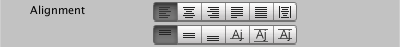

### Alignment

The horizontal and vertical alignment options control how text is placed in the display area.

|Property:||Function:|
|---------|-|---------|
|**[Horizontal Alignment Options]**||
||Left, Center, Right|Position the text horizontally in the display area, without changing the text itself.|
||Justified, Flush|Stretch the text to fill the width of the display area by increasing the distance between words and characters.    The  **Wrap Mix** option controls the balance between word and character spacing.    **Justified** mode does not stretch the last lines of paragraphs, while **Flush** mode does.|
||Geometry Center| Centers the text based on the mesh rather than the text metrics.    The difference is not always noticeable, but in some cases this mode yields better looking results than regular Center alignment.|
|**[Vertical Alignment Options]**|||
||Top, Middle, Bottom| Position the text vertically in the display area, without changing the text itself.|
||Baseline| Position the text so the baseline of the line is aligned with the middle of the display area.    This is useful when working with a single line of text. |
||Midline|  Use this as an alternative to Middle alignnment.    This option determine vertical placement using the bounds of the text mesh, rather than [line metrics](FontAssets.md#LineMetrics). This is useful in tight spaces when ascenders and descenders might otherwise extend too far. |
||Capline| Position the text so the middle of the first the line is aligned with the middle of the display area.|
|**Wrap Mix (W <-> C)**||Adjust the balance between  extra word spacing and extra character spacing when horizontal alignment is set to **Justified** or **Flush**.|