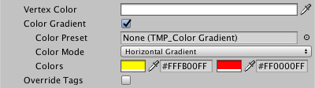

### Color
TextMesh Pro uses vertex colors to tint the text. You can apply a uniform color as well a [gradient](ColorGradients.md) of up to four colors.

|Property:||Function:|
|---------|-|---------|
|**Vertex Color**||Choose the main color for the text.    Any colors and textures defined in the TextMesh Pro GameObject or its material ar multiplied with this color. |
|**Color Gradient**||Enable this option to apply a [color gradient](ColorGradients.md) to each character sprite.    You can then set the gradient’s type and colors, or apply a [color gradient preset](ColorGradientsPresets.md).    Gradient colors are multiplied with the **Vertex Color**. If **Vertex Color** is set to white you see only the gradient colors. If it’s set to black you don’t see the gradient colors at all.|
|**Color Preset**||Choose a [color gradient preset](ColorGradientsPresets.md).    When you apply a preset its **Color Mode** and **Colors** replace the text's local properties in the Inspector.    Editing these properties modifies the preset, which affects every TextMesh Pro GameObject that uses it.    Set this property to **None** to revert to the text’s local gradient properties.|
|**Color Mode**||Choose the type of color gradient to apply.    TextMesh Pro applies gradients to each character individually.|
||Single|A uniform color that modifies the base **Vertex Color**.|
||Horizontal Gradient|A two-color gradient with each color emanating from one side of the character.|
||Vertical Gradient|A two-color gradient with one color emanating from the top of the character, and the other from the bottom.|
||Four Corners Gradient|A four-color gradient with each color emanating from a different corner of the character.|
|**Colors**||Choose each gradient color.    The number of available colors depends on the type of gradient, and the color fields are arranged to match the position of each color in the gradient (left and right, top and bottom, 2 rows of 2 for four-corner gradients).    You can set the color in any of the following ways:   **Swatch:** Click to open a color picker.    **Eyedropper:** Click to choose a color from any part of the screen.    **Hex Value:** Enter the RGBA hex value directly.|
|**Override Tags**||Enable this option to ignore any [rich text tags](RichText.md) that change text color.|