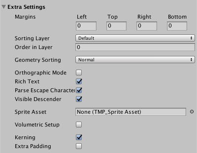

### Extra Settings
This section contains assorted options for further controlling the appearance and behavior of text.

|Property:||Function:|
|---------|-|---------|
|**Margins**||Set positive values to increase the distance between the text and the boundaries of the text container.    Set negative values to make the text extend beyond the boundaries of the text container.    You set the  **Left**, **Top**, **Right**, and **Bottom** margins separately.    You can also adjust the margins by dragging the handles of the text container Widget (yellow rectangle) in the Scene view.|
|**Sorting Layer**   |   |   |
|**Order in Layer**   |   |   |
|**Geometry Sorting**||Each character is contained in a quad. **Geometry Sorting** controls how TextMesh Pro sorts these quads. This determines which character appears on top when two quads overlap.|
||Normal| TextMesh Pro draws quads in the order that they appear in the mesh. When two quads overlap, the "later" quad appears on top of the "earlier" one.|
||Reverse| TextMesh Pro draws quads in reverse order. When two quads overlap, the "earlier" quad appears on top of the "later" one.|
|**Othographic Mode**   |   |  Enable this option when creating camera-aligned text with an orthographic camera.    It prevents the TextMesh Pro shader from using perspective correction.|
|**Rich Text**||Enable this option to turn off rich text support for the TextMesh Pro GameObject.    When rich text support is disabled, tags are not parsed and are rendered as plain text.|
|**Parse Escape Characters**||Enable this option to make TextMesh Pro interpret backslash-escaped characters as special characters.    For example `\n` is interpreted as a newline, `\t` as a tab, and so on.    **Note:** This applies to rendered text. In code, escaped characters are already parsed by the compiler.|
|**Visible Descender**|| Use this option when using a script to slowly reveal text.    Enable it to reveal the text at the bottom and move up as new lines are revealed.    Disable it to reveal the text from top to bottom.    To set up this type of text reveal, you must also set the vertical alignment to Bottom.|
| **Sprite Asset** |||
| **Kerning**||Enable this option to toggle kerning on for this TextMesh Pro GameObject.    If new objects use a font with no kerning data, enabling this setting has no effect.|
|**Extra Padding**|| Enable this option to add extra padding to character sprites.    TextMesh Pro creates sprites to fit the visible text, but the results isn't always perfect. This setting reduces the chances that glyphs are cut off at the boundaries of their sprites.|
