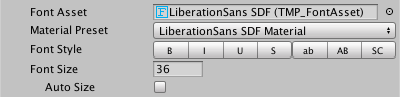

### Font
The fonts settings panel is where you choose a font for your text, and customize the font style.

|Property:||Function:|
|---------|-|---------|
|**Font Asset**||Choose a [font Asset](FontAssets.md) for the TextMesh Pro GameObject to use.    TextMesh Pro ships with several font assets, and you can create others from standard font files such as truetype (ttf) fonts.    **Note:** You can set the default font Asset for new text objects in the [TextMesh Pro settings](Settings.md).|
|**Material Preset**|| Choose a material for your font.    Each font Asset has a default material, but you can also create customized materials for it.    This preset list includes all materials whose names contain the font Asset's name, and use the corresponding font atlas texture.|
|**Font Style**|| Enable standard text styling options.    You can use these options in any combination, except for the casing options (lowercase, uppercase, and small caps), which are mutually exclusive. |
||B|Bold the text.    The appearance of bold text is defined in the font Asset properties.|
||I|Italicize the text.    The appearance of italicized text is defined in the font Asset properties.|
||U| Underline the text.    This renders an extra line below the baseline.|
||S|Add a strikethrough line to the text.    This renders an extra line above the baseline.|
||ab| Convert the text to lowercase before rendering.    This does not change text casing in the **Text** field.|
||AB|Convert the text to uppercase before rendering.    This does not change text casing in the **Text** field. |
||SC|Use small caps.    The text is displayed in all uppercase, but letters you actually entered in uppercase are larger.|
|**Font Size**||Specify the text display size, in points.|
|**Auto Size**||Enable this option to set the font size automatically, based on the **Auto Size Options**.    When this option is enabled, TextMesh Pro lays out the text multiple times to find a good fit. This is a resource intensive process, so avoid auto-sizing dynamic text that changes frequently.    **Tip:** For static text, you can enable **Auto Size**, note the calculated font size (displayed  in the Font Size field), then disable Auto Size and apply the calculated size manually.
|**Auto Size Options**||Define the basic rules for auto-sizing text.|
||Min|Specify the smallest acceptable font size, in points.|
||Max|Specify the largest acceptable font size, in points.|
||WD%|Specify the maximum acceptable amount to reduce character width when sizing the text.    TextMesh Pro squeezes characters to make them taller. This is usually only acceptable for digits.|
||Line|Adjust the line height.    This is useful for fitting a larger font into a given space.|