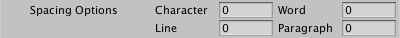

### Spacing
These options control spacing between characters, words, lines and, paragraphs.  You can use them to fine-tune the text for individual TextMesh Pro GameObjects, without adjusting their [font assets](FontAssets.md).

To control spacing within a single TextMesh Pro GameObject, use [rich text tags](RichText.md).

|Property:||Function:|
|---------|-|---------|
|Character||Set the spacing between characters for this TextMesh Pro GameObject.|
|Word||Set the spacing between words for this TextMesh Pro GameObject.|
|Line||Set the spacing between lines for this TextMesh Pro GameObject.|
|Paragraph||Set the spacing between paragraphs for this TextMesh Pro GameObject.    Paragraphs are defined by explicit line breaks.|