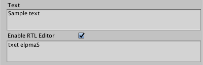

## Text Input

The text section is where you enter the text to display, and optionally customize it using [rich text markup](RichText.md).

|Property:| |Function:|
|---------|-|---------|
|**Text**||The input field for text to display.|
|**Enable RTL Editor**||Enable this option to display text right-to-left instead of left-to-right.   The Inspector displays an additional input field where you can view the reversed text and edit it directly.   The text is reversed before it is displayed on screen or rendered.|