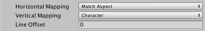

### UV Mapping
Some [TextMesh Pro shaders](Shaders.md) allow you to apply one or more image textures to text. These options control how those textures stretch to fit the text.

You can also edit shader-specific texturing options in the shaders themselves. The available options depend on the shader you use.

When texturing text,  make sure that your texture assets have their **Wrap Mode** set to **Repeat**. Otherwise the texture is likely to be heavily distorted when applied to the text. See the [Render Texture documentation](https://docs.unity3d.com/Manual/class-RenderTexture.html) in the Unity Manual for more information.

|Property:||Function:|
|---------|-|---------|
|**Horizontal Mapping**||Specify how textures map to text horizontally when you use a shader that supports textures.|
||Character|Stretches the texture horizontally across each character's sprite.|
||Line|Stretches the texture horizontally across the entire width of each line.|
||Paragraph|Stretches the texture horizontally across the entire text.|
||Match Aspect|Scales the texture horizontally so it maintains its aspect ratio, and is not deformed.    When you use this horizontal mapping mode, the **Vertical Mapping** setting determines how the texture is mapped to the text, and must be set to something other than **Match Aspect**.|
|**Vertical Mapping**||Specify how textures map to text vertically when you use a shader that supports textures.|
||Character|Stretches the texture vertically across each character's sprite.|
||Line|Stretches the texture vertically across the entire width of each line.|
||Paragraph|Stretches the texture vertically across the entire text.|
||Match Aspect|Scales the texture vertically so it maintains its aspect ratio, and is not deformed.    When you use this vertical mapping mode, the **Horizontal Mapping** setting determines how the texture is mapped to the text, and must be set to something other than **Match Aspect**.|
|**Line Offset**||When Horizontal Mapping is set to Line, **Paragraph**, or **Match Aspect**, set this value to add a horizontal texture offset to each successive line.    This value is added to the **Offset X** value you specify in the shader.|