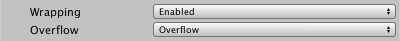

### Wrapping and Overflow
Wrapping splits lines of text to ensure that they don't get wider than the display area. Lines are normally wrapped at word boundaries, but words that are longer than an entire line are split as well. Overflow controls what happens when the text doesn't fit inside the display area.

Some overflow options supersede wrapping. For example, if Overflow is set to truncate, the text is truncated when it reaches the edge of the display area, irrespective of whether Wrapping is enabled.

|Property:||Function:|
|---------|-|---------|
|**Wrapping**||**Enable** or **Disable** word wrapping. |
|**Overflow**||Specify what happens when the text doesn't fit inside the display area.|
||Overflow|Extends the text beyond the bounds of the display area, but still wraps it if **Wrapping** is enabled.|
||Ellipsis|Cuts off the text and inserts an ellipsis (…) to indicate that some of the text is omitted.|
||Masking|Like **Overflow**, but the shader hides everything outside of the display area.|
||Truncate|Cuts off the text when it no longer fits.|
||Scroll Rect|A legacy mode that’s similar to **Masking**. This option is available strictly for compatibility with older TextMesh Pro projects. For new projects, use Masking mode instead.|
||Page|Cuts the text into several pages that each fit inside the display area.    You can choose which page to display. You can also use rich text to manually insert page breaks.    **Note:** The vertical alignment options work on a per-page basis.|
||Linked|Extends the text into another TextMesh Pro GameObject that you select.    This is useful for creating multi-column text.|