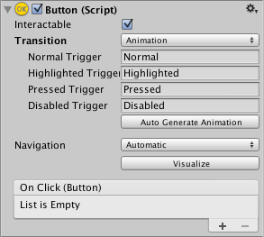
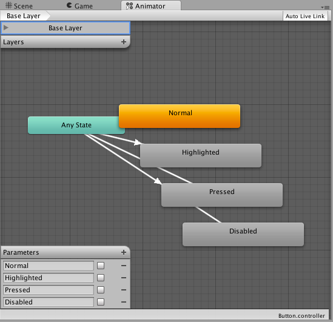
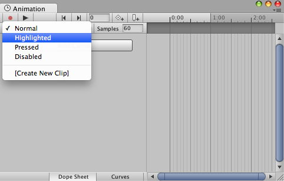

# Animation Integration

Animation allows for each transition between control states to be fully animated using Unity's animation system.  This is the most powerful of the transition modes due to the number of properties that can be animated simultaneously.

To use the Animation transition mode, an Animator Component needs to be attached to the controller element. This can be done automatically by clicking "Auto Generate Animation".  This also generates an Animator Controller with states already set up, which will need to be saved.

The new Animator controller is ready to use straight away. Unlike most Animator Controllers, this controller also stores the animations for the controller's transitions and these can be customised, if desired.

For example, if a Button element with an Animator controller attached is selected, the animations for each of the button's states can be edited by opening the Animation window (**Window&gt;Animation**).

There is an Animation Clip pop-up menu to select the desired clip. Choose from "Normal", "Highlighted", "Pressed" and "Disabled".

The Normal State is set by the values on button element itself and can be left empty. On all other states, the most common configuration is a single keyframe at the start of the timeline. The transition animation between states will be handled by the Animator.

As an example, the width of the button in the Highlighted State could be changed by selecting the Highlighted state from the Animation Clip pop up menu and with the playhead at the start of the time line:

* Select the record Button
* Change the width of the Button in the inspector
* Exit the record mode.

Change to play mode to see how the button grows when highlighted.

Any number of properties can have their parameters set in this one keyframe.

Several buttons can share the same behaviour by sharing Animator Controllers.

**The UI Animation transition mode is not compatible with Unity's legacy animation system.** You should only use the *Animator* Component.
