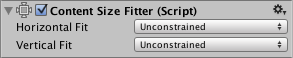
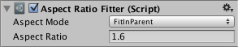

# Auto Layout

The Rect Transform layout system is flexible enough to handle a lot of different types of layouts and it also allows placing elements in a complete freeform fashion. However, sometimes something a bit more structured can be needed.

The auto layout system provides ways to place elements in nested layout groups such as horizontal groups, vertical groups, or grids. It also allows elements to automatically be sized according to the contained content. For example a button can be dynamically resized to exactly fit its text content plus some padding.

The auto layout system is a system built on top of the basic Rect Transform layout system. It can optionally be used on some or all elements.

## Understanding Layout Elements

The auto layout system is based on a concept of **layout elements** and **layout controllers**. A layout element is an Game Object with a Rect Transform and optionally other components as well. The layout element has certain knowledge about which size it should have. Layout elements don't directly set their own size, but other components that function as layout controllers can use the information they provide in order to calculate a size to use for them.

A layout element has properties that defines its own:

* Minimum width
* Minimum height
* Preferred width
* Preferred height
* Flexible width
* Flexible height

Examples of layout controller components that use the information provided by layout elements are **Content Size Fitter** and the various **Layout Group** components. The basic principles for how layout elements in a layout group are sized is as follows:

* First minimum sizes are allocated.
* If there is sufficient available space, preferred sizes are allocated.
* If there is additional available space, flexible size is allocated.

Any Game Object with a Rect Transform on it can function as a layout element. They will by default have minimum, preferred, and flexible sizes of 0. Certain components will change these layout properties when added to the Game Object.

The Image and Text components are two examples of components that provide layout element properties. They change the preferred width and height to match the sprite or text content.

### Layout Element Component

If you want to override the minimum, preferred, or flexible size, you can do that by adding a Layout Element component to the Game Object.

The Layout Element component lets you override the values for one or more of the layout properties. Enable the checkbox for a property you want to override and then specify the value you want to override with.

See the reference page for [Layout Element](script-LayoutElement.md) for more information.

## Understanding Layout Controllers

Layout controllers are components that control the sizes and possibly positions of one or more layout elements, meaning Game Objects with Rect Transforms on. A layout controller may control its **own layout element** (the same Game Object it is on itself) or it may control **child layout elements**.

A component that functions as a layout controller may also itself function as a layout element at the same time.

### Content Size Fitter

The Content Size Fitter functions as a layout controller that controls the size of its own layout element. The simplest way to see the auto layout system in action is to add a Content Size Fitter component to a Game Object with a Text component.

If you set either the Horizontal Fit or Vertical Fit to Preferred, the Rect Transform will adjust its width and/or height to fit the Text content.

See the reference page for [Content Size Fitter](script-ContentSizeFitter.md) for more information.

### Aspect Ratio Fitter

The Aspect Ratio Fitter functions as a layout controller that controls the size of its own layout element.

It can adjust the height to fit the width or vice versa, or it can make the element fit inside its parent or envelope its parent. The Aspect Ratio Fitter does not take layout information into account such as minimum size and preferred size.

See the reference page for [Aspect Ratio Fitter](script-AspectRatioFitter.md) for more information.

### Layout Groups

A layout group functions as a layout controller that controls the sizes and positions of its child layout elements. For example, a Horizontal Layout Group places its children next to each other, and a Grid Layout Group places its children in a grid.

A layout group doesn't control its own size. Instead it functions as a layout element itself which may be controlled by other layout controllers or be set manually.

Whatever size a layout group is allocated, it will in most cases try to allocate an appropriate amount of space for each of its child layout elements based on the minimum, preferred, and flexible sizes they reported. Layout groups can also be nested arbitrarily this way.

See the reference pages for [Horizontal Layout Group](script-HorizontalLayoutGroup.md), [Vertical Layout Group](script-VerticalLayoutGroup.md) and [Grid Layout Group](script-GridLayoutGroup.md) for more information.

### Driven Rect Transform properties

Since a layout controller in the auto layout system can automatically control the sizes and placement of certain UI elements, those sizes and positions should not be manually edited at the same time through the Inspector or Scene View. Such changed values would just get reset by the layout controller on the next layout calculation anyway.

The Rect Transform has a concept of **driven properties** to address this. For example, a Content Size Fitter which has the Horizontal Fit property set to Minimum or Preferred will drive the width of the Rect Transform on the same Game Object. The width will appear as read-only and a small info box at the top of the Rect Transform will inform that one or more properties are driven by Conten Size Fitter.

The driven Rect Transforms properties have other reasons beside preventing manual editing. A layout can be changed just by changing the resolution or size of the Game View. This in turn can change the size or placement of layout elements, which changes the values of driven properties. But it wouldn't be desirable that the Scene is marked as having unsaved changes just because the Game View was resized. To prevent this, the values of driven properties are not saved as part of the Scene and changes to them do not mark the scene as changed.

## Technical Details

The auto layout system comes with certain components built-in, but it is also possible to create new components that controls layouts in custom ways. This is done by having a component implement specific interfaces which are recognized by the auto layout system.

### Layout Interfaces
A component is treated as a layout element by the auto layout system if it implements the interface **ILayoutElement**.

A component is expected to drive the Rect Transforms of its children if it implements the interface **ILayoutGroup**.

A component is expected to drive its own RectTransform if it implements the interface **ILayoutSelfController**.

### Layout Calculations

The auto layout system evaluates and executes layouts in the following order:

1. The minimum, preferred, and flexible widths of layout elements are calculated by calling CalculateLayoutInputHorizontal on ILayoutElement components. This is performed in bottom-up order, where children are calculated before their parents, such that the parents may take the information in their children into account in their own calculations.
2. The effective widths of layout elements are calculated and set by calling SetLayoutHorizontal on ILayoutController components. This is performed in top-down order, where children are calculated after their parents, since allocation of child widths needs to be based on the full width available in the parent. After this step the Rect Transforms of the layout elements have their new widths.
3. The minimum, preferred, and flexible heights of layout elements are calculated by calling CalculateLayoutInputVertical on ILayoutElement components. This is performed in bottom-up order, where children are calculated before their parents, such that the parents may take the information in their children into account in their own calculations.
4. The effective heights of layout elements are calculated and set by calling SetLayoutVertical on ILayoutController components. This is performed in top-down order, where children are calculated after their parents, since allocation of child heights needs to be based on the full height available in the parent. After this step the Rect Transforms of the layout elements have their new heights.

As can be seen from the above, the auto layout system evaluates widths first and then evaluates heights afterwards. Thus, calculated heights may depend on widths, but calculated widths can never depend on heights.

### Triggering Layout Rebuild

When a property on a component changes which can cause the current layout to no longer be valid, a layout recalculation is needed. This can be triggered using the call:

LayoutRebuilder.MarkLayoutForRebuild (transform as RectTransform);

The rebuild will not happen immediately, but at the end of the current frame, just before rendering happens. The reason it is not immediate is that this would cause layouts to be potentially rebuild many times during the same frame, which would be bad for performance.

Guidelines for when a rebuild should be triggered:

* In setters for properties that can change the layout.
* In these callbacks:
  * OnEnable
  * OnDisable
  * OnRectTransformDimensionsChange
  * OnValidate (only needed in the editor, not at runtime)
  * OnDidApplyAnimationProperties
