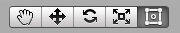
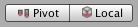
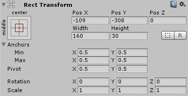
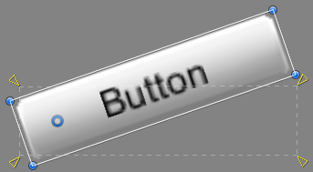
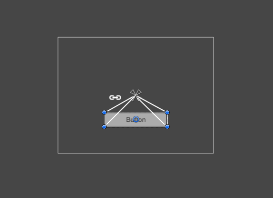
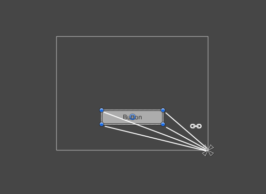
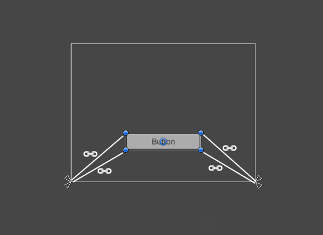
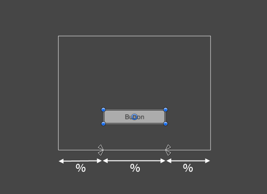
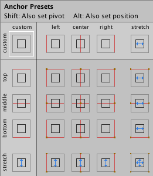

# Basic Layout

In this section we'll look at how you can position UI elements relative to the Canvas and each other. If you want to test yourself while reading, you can create an Image using the menu **GameObject -> UI -> Image**.

## The Rect Tool
Every UI element is represented as a rectangle for layout purposes. This rectangle can be manipulated in the Scene View using the **Rect Tool** in the toolbar. The Rect Tool is used both for Unity's 2D features and for UI, and in fact can be used even for 3D objects as well.

The Rect Tool can be used to move, resize and rotate UI elements. Once you have selected a UI element, you can move it by clicking anywhere inside the rectangle and dragging. You can resize it by clicking on the edges or corners and dragging. The element can be rotated by hovering the cursor slightly away from the corners until the mouse cursor looks like a rotation symbol. You can then click and drag in either direction to rotate.

Just like the other tools, the Rect Tool uses the current pivot mode and space, set in the toolbar. When working with UI it's usually a good idea to keep those set to **Pivot** and **Local**.

## Rect Transform
The **Rect Transform** is a new transform component that is used for all UI elements instead of the regular **Transform** component.

Rect Transforms have position, rotation, and scale just like regular Transforms, but it also has a width and height, used to specify the dimensions of the rectangle.

### Resizing Versus Scaling
When the Rect Tool is used to change the size of an object, normally for Sprites in the 2D system and for 3D objects it will change the local _scale_ of the object. However, when it's used on an object with a Rect Transform on it, it will instead change the width and the height, keeping the local scale unchanged. This resizing will not affect font sizes, border on sliced images, and so on.

### Pivot
Rotations, size, and scale modifications occur around the pivot so the position of the pivot affects the outcome of a rotation, resizing, or scaling. When the toolbar Pivot button is set to Pivot mode, the pivot of a Rect Transform can be moved in the Scene View.

### Anchors
Rect Transforms include a layout concept called **anchors**. Anchors are shown as four small triangular handles in the Scene View and anchor information is also shown in the Inspector.

If the parent of a Rect Transform is also a Rect Transform, the child Rect Transform can be anchored to the parent Rect Transform in various ways. For example, the child can be anchored to the center of the parent, or to one of the corners.

The anchoring also allows the child to stretch together with the width or height of the parent. Each corner of the rectangle has a fixed offset to its corresponding anchor, i.e. the top left corner of the rectangle has a fixed offset to the top left anchor, etc. This way the different corners of the rectangle can be anchored to different points in the parent rectangle.

The positions of the anchors are defined in fractions (or percentages) of the parent rectangle width and height. 0.0 (0%) corresponds to the left or bottom side, 0.5 (50%) to the middle, and 1.0 (100%) to the right or top side. But anchors are not limited to the sides and middle; they can be anchored to any point within the parent rectangle.

You can drag each of the anchors individually, or if they are together, you can drag them together by clicking in the middle in between them and dragging. If you hold down **Shift** key while dragging an anchor, the corresponding corner of the rectangle will move together with the anchor.

A useful feature of the anchor handles is that they automatically snap to the anchors of sibling rectangles to allow for precise positioning.

### Anchor presets

In the Inspector, the **Anchor Preset** button can be found in the upper left corner of the Rect Transform component. Clicking the button brings up the Anchor Presets dropdown. From here you can quickly select from some of the most common anchoring options. You can anchor the UI element to the sides or middle of the parent, or stretch together with the parent size. The horizontal and vertical anchoring is independent.

The Anchor Presets buttons displays the currently selected preset option if there is one. If the anchors on either the horizontal or vertical axis are set to different positions than any of the presets, the custom options is shown.

### Anchor and position fields in the Inspector

You can click the Anchors expansion arrow to reveal the anchor number fields if they are not already visible. **Anchor Min** corresponds to the lower left anchor handle in the Scene View, and **Anchor Max** corresponds to the upper right handle.

The position fields of rectangle are shown differently depending on whether the anchors are together (which produces a fixed width and height) or separated (which causes the rectangle to stretch together with the parent rectangle).

When all the anchor handles are together the fields displayed are Pos X, Pos Y, Width and Height. The Pos X and Pos Y values indicate the position of the pivot relative to the anchors.

When the anchors are separated the fields can change partially or completely to Left, Right, Top and Bottom. These fields define the padding inside the rectangle defined by the anchors. The Left and Right fields are used if the anchors are separated horizontally and the Top and Bottom fields are used if they are separated vertically.

Note that changing the values in the anchor or pivot fields will normally counter-adjust the positioning values in order to make the rectangle stay in place. In cases where this is not desired, enable **Raw edit mode** by clicking the **R** button in the Inspector. This causes the anchor and pivot value to be able to be changed without any other values changing as a result. This will likely cause the rectangle to be visually moved or resized, since its position and size is dependent on the anchor and pivot values.
