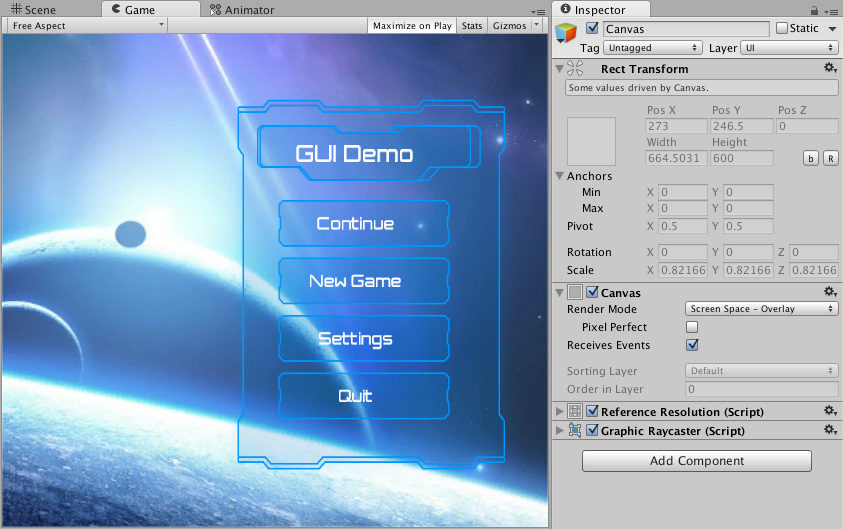
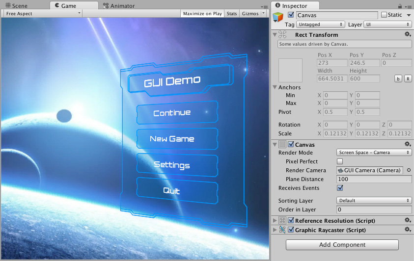
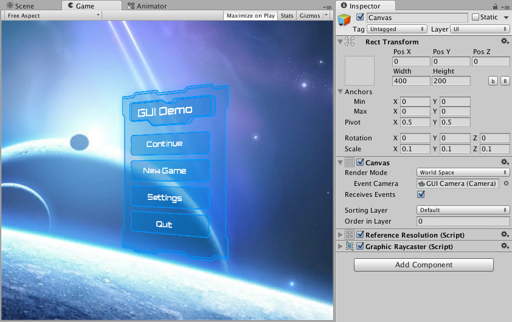

# Canvas

The **Canvas** is the area that all UI elements should be inside. The Canvas is a Game Object with a Canvas component on it, and all UI elements must be children of such a Canvas.

Creating a new UI element, such as an Image using the menu **GameObject > UI (Canvas) > Image**, automatically creates a Canvas, if there isn't already a Canvas in the scene. The UI element is created as a child to this Canvas.

The Canvas area is shown as a rectangle in the Scene View. This makes it easy to position UI elements without needing to have the Game View visible at all times.

**Canvas** uses the EventSystem object to help the Messaging System.

## Draw order of elements

UI elements in the Canvas are drawn in the same order they appear in the Hierarchy. The first child is drawn first, the second child next, and so on. If two UI elements overlap, the later one will appear on top of the earlier one.

To change which element appear on top of other elements, simply reorder the elements in the Hierarchy by dragging them. The order can also be controlled from scripting by using these methods on the Transform component: SetAsFirstSibling, SetAsLastSibling, and SetSiblingIndex.

## Render Modes

The Canvas has a **Render Mode** setting which can be used to make it render in screen space or world space.

### Screen Space - Overlay
This render mode places UI elements on the screen rendered on top of the scene. If the screen is resized or changes resolution, the Canvas will automatically change size to match this.

### Screen Space - Camera
This is similar to **Screen Space - Overlay**, but in this render mode the Canvas is placed a given distance in front of a specified **Camera**. The UI elements are rendered by this camera, which means that the Camera settings affect the appearance of the UI. If the Camera is set to **Perspective**, the UI elements will be rendered with perspective, and the amount of perspective distortion can be controlled by the Camera **Field of View**. If the screen is resized, changes resolution, or the camera frustum changes, the Canvas will automatically change size to match as well.

### World Space
In this render mode, the Canvas will behave as any other object in the scene. The size of the Canvas can be set manually using its Rect Transform, and UI elements will render in front of or behind other objects in the scene based on 3D placement. This is useful for UIs that are meant to be a part of the world. This is also known as a "diegetic interface".

## Additional shader channels

When the Canvas generates mesh geometry for rendering, it always includes **Position**, **Color**, and **UV0** vertex attributes. For **Screen Space - Camera** and **World Space** render modes, **Normal** and **Tangent** are also included by default to support lighting.

The **Additional Shader Channels** property lets you include extra vertex attributes beyond these defaults. This is useful when your UI shaders sample additional UV sets, or when you need per-vertex normal and tangent data in overlay canvases.

The available channels are:

| Channel | Description |
|---------|-------------|
| **None** | No additional attributes. Only the defaults are included. |
| **TexCoord1** | Adds a second UV set (UV1) to each vertex. |
| **TexCoord2** | Adds a third UV set (UV2) to each vertex. |
| **TexCoord3** | Adds a fourth UV set (UV3) to each vertex. |
| **Normal** | Adds a per-vertex normal (Vector3). Required for lighting effects on UI geometry.|
| **Tangent** | Adds a per-vertex tangent (Vector4). Required for normal-mapped shaders.|

> [!NOTE]
> **Screen Space - Overlay** canvases are not affected by standard scene lighting, so **Normal** and **Tangent** have no visible effect in typical cases. However, specialized shaders, such as those used by TextMeshPro, can still use this data.

### Reflection probes

When **Use Reflection Probes** is enabled on the Canvas, the **Normal** channel is automatically included in the mesh regardless of the Additional Shader Channels setting.

## Vertex color always in gamma color space

In a linear color space project, Unity normally converts UI vertex colors from gamma to linear space during mesh generation, before the colors reach the shader. This conversion loses detail, particularly for darker colors, where gamma encoding provides the most precision.

**Vertex Color Always in Gamma Color Space** defers that conversion to the shader instead. When enabled, vertex colors are written to the mesh in gamma space and the UI shader performs the gamma-to-linear conversion in floating-point, preserving more precision throughout. This improves the accuracy of dark-color tones and subtle gradients in linear color space workflows.

The precision gain is only relevant when the project's color space is set to **Linear** in ***Project Settings** > **Player**. In gamma color space projects, the setting has no effect.

### Custom UI shader

Built-in UI shaders already include the gamma-to-linear conversion that this feature relies on. If you use a custom UI shader, you must handle this conversion manually when the setting is enabled. Otherwise, vertex colors can appear too bright.
