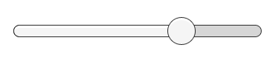

# Interaction Components

This section covers components in the UI system that handles interaction, such as mouse or touch events and interaction using a keyboard or controller.

The interaction components are not visible on their own, and must be combined with one or more [visual components](UIVisualComponents.md) in order to work correctly.

## Common Functionality

Most of the interaction components have some things in common. They are selectables, which means they have shared built-in functionality for visualising transitions between states (normal, highlighted, pressed, disabled), and for navigation to other selectables using keyboard or controller. This shared functionality is described on the [Selectable](script-Selectable.md) page.

The interaction components have at least one UnityEvent that is invoked when user interacts with the component in specific way. The UI system catches and logs any exceptions that propagate out of code attached to UnityEvent.

## Button

A Button has an **OnClick** UnityEvent to define what it will do when clicked.

See the [Button](script-Button.md) page for details on using the Button component.

## Toggle

A Toggle has an **Is On** checkbox that determines whether the Toggle is currently on or off. This value is flipped when the user clicks the Toggle, and a visual checkmark can be turned on or off accordingly. It also has an **OnValueChanged** UnityEvent to define what it will do when the value is changed.

See the [Toggle](script-Toggle.md) page for details on using the Toggle component.

## Toggle Group

A Toggle Group can be used to group a set of [Toggles](script-Toggle.md) that are mutually exclusive. Toggles that belong to the same group are constrained so that only one of them can be selected at a time - selecting one of them automatically deselects all the others.

See the [Toggle Group](script-ToggleGroup.md) page for details on using the Toggle Group component.

## Slider

A Slider has a decimal number **Value** that the user can drag between a minimum and maximum value. It can be either horizontal or vertical. It also has a **OnValueChanged** UnityEvent to define what it will do when the value is changed.

See the [Slider](script-Slider.md) page for details on using the Slider component.

## Scrollbar

A Scrollbar has a decimal number **Value** between 0 and 1. When the user drags the scrollbar, the value changes accordingly.

Scrollbars are often used together with a [Scroll Rect](script-ScrollRect.md) and a [Mask](script-Mask.md) to create a scroll view. The Scrollbar has a **Size** value between 0 and 1 that determines how big the handle is as a fraction of the entire scrollbar length. This is often controlled from another component to indicate how big a proportion of the content in a scroll view is visible. The Scroll Rect component can automatically do this.

The Scrollbar can be either horizontal or vertical. It also has a **OnValueChanged** UnityEvent to define what it will do when the value is changed.

See the [Scrollbar](script-Scrollbar.md) page for details on using the Scrollbar component.

## Dropdown

A Dropdown has a list of options to choose from. A text string and optionally an image can be specified for each option, and can be set either in the Inspector or dynamically from code. It has a **OnValueChanged** UnityEvent to define what it will do when the currently chosen option is changed.

See the [Dropdown](script-Dropdown.md) page for details on using the Dropdown component.

## Input Field

An Input Field is used to make the text of a [Text Element](script-Text.md) editable by the user. It has a UnityEvent to define what it will do when the text content is changed, and an another to define what it will do when the user has finished editing it.

See the [Input Field](script-InputField.md) page for details on using the Input Field component.

## Scroll Rect (Scroll View)

A Scroll Rect can be used when content that takes up a lot of space needs to be displayed in a small area. The Scroll Rect provides functionality to scroll over this content.

Usually a Scroll Rect is combined with a [Mask](script-Mask.md) in order to create a scroll view, where only the scrollable content inside the Scroll Rect is visible. It can also additionally be combined with one or two [Scrollbars](script-Scrollbar.md) that can be dragged to scroll horizontally or vertically.

See the [Scroll Rect](script-ScrollRect.md) page for details on using the Scroll Rect component.
