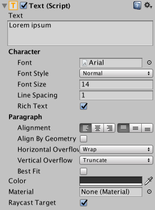
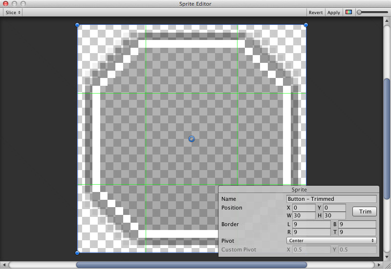

# Visual Components

With the introduction of the UI system, new Components have been added that will help you create GUI specific functionality. This section will cover the basics of the new Components that can be created.

## Text

The **Text** component, which is also known as a Label, has a Text area for entering the text that will be displayed. It is possible to set the font, font style, font size and whether or not the text has rich text capability.

There are options to set the alignment of the text, settings for horizontal and vertical overflow which control what happens if the text is larger than the width or height of the rectangle, and a Best Fit option that makes the text resize to fit the available space.

## Image

An Image has a Rect Transform component and an **Image** component. A sprite can be applied to the Image component under the Target Graphic field, and its colour can be set in the Color field. A material can also be applied to the Image component. The Image Type field defines how the applied sprite will appear, the options are:

* **Simple** - Scales the whole sprite equally.

* **Sliced** - Utilises the 3x3 sprite division so that resizing does not distort corners and only the center part is stretched.

* **Tiled** - Similar to Sliced, but tiles (repeats) the center part rather than stretching it. For sprites with no borders at all, the entire sprite is tiled.

* **Filled** - Shows the sprite in the same way as Simple does except that it fills in the sprite from an origin in a defined direction, method and amount.

The option to Set Native Size, which is shown when Simple or Filled is selected, resets the image to the original sprite size.

Images can be imported as **UI sprites** by selecting Sprite( 2D / UI) from the 'Texture Type' settings. Sprites have extra import settings compared to the old GUI sprites, the biggest difference is the addition of the sprite editor. The sprite editor provides the option of **9-slicing** the image, this splits the image into 9 areas so that if the sprite is resized the corners are not stretched or distorted.

## Raw Image

The Image component takes a sprite but **Raw Image** takes a texture (no borders etc). Raw Image should only be used if necessary otherwise Image will be suitable in the majority of cases.

## Mask

A Mask is not a visible UI control but rather a way to modify the appearance of a control’s child elements. The mask restricts (ie, “masks”) the child elements to the shape of the parent. So, if the child is larger than the parent then only the part of the child that fits within the parent will be visible.

## Effects

Visual components can also have various simple effects applied, such as a simple drop shadow or outline. See the [UI Effects](comp-UIEffects.md) reference page for more information.
