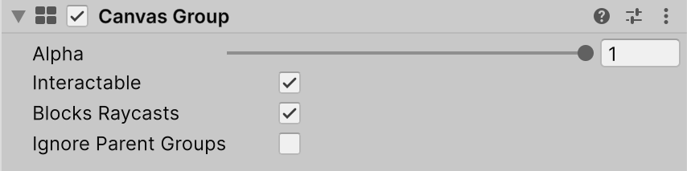

# Canvas Group

Canvas Group is a component that allows you to control the visibility, interactability, and alpha transparency of UI elements within a Canvas. It provides a way to easily manage the properties of multiple UI elements together.

Typical uses of Canvas Group:

* Fading UI: Attach a Canvas Group to a window's GameObject and control its Alpha property to fade the entire window in or out.
* Disabling Interaction: Make a group of UI controls non-interactable by adding a Canvas Group to their parent GameObject and setting the Interactable property to false.
* Ignoring Raycasts: Prevent certain UI elements from blocking mouse events by placing a Canvas Group on the element or its parent and setting Block Raycasts to false.

## Properties

The following table describes the properties of the Canvas Group component:

|**Property:** |**Function:** |
|:---|:---|
|**Alpha** | The opacity of the UI elements in this group. The value is between 0 and 1 where 0 is fully transparent and 1 is fully opaque. Note that elements retain their own transparency as well, so the Canvas Group alpha and the alpha values of the individual UI elements are multiplied with each other. |
|**Interactable** | Determines if this component will accept input. When it is set to false interaction is disabled. |
|**Block Raycasts** | Will this component act as a collider for Raycasts? You will need to call the RayCast function on the graphic raycaster attached to the Canvas.  This does _not_ apply to **Physics.Raycast**. |
|**Ignore Parent Groups** | Will this group also be affected by the settings in Canvas Group components further up in the GameObject hierarchy, or will it ignore those and hence override them? |