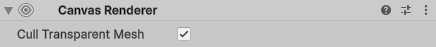

# Canvas Renderer

The **Canvas Renderer** component renders a graphical UI object contained within a [Canvas](class-Canvas.md).

## Properties

The following table describes the properties of the Canvas Renderer component:

|**Property:** |**Function:** |
|:---|:---|
|**Cull Transparent Mesh** | Whether to ignore this renderer when the mesh is transparent. If true, geometry emitted by this renderer will be ignored when the mesh is transparent.|

## Details

The standard UI objects available from the menu (**GameObject &gt; Create UI**) all have Canvas Renderers attached wherever they are required but you may need to add this component manually for custom UI objects. Although there are no properties exposed in the inspector, a few properties and function can be accessed from scripts - see the [CanvasRenderer](https://docs.unity3d.com/ScriptReference/CanvasRenderer.html) page in the Script Reference for full details.
