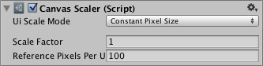

# Canvas Scaler

The Canvas Scaler component is used for controlling the overall scale and pixel density of UI elements in the Canvas. This scaling affects everything under the Canvas, including font sizes and image borders.

## Properties

|**Property:** |**Function:** |
|:---|:---|
|**UI Scale Mode** |Determines how UI elements in the Canvas are scaled. |
|&#160;&#160;&#160;&#160;&#160;&#160;&#160;&#160;**Constant Pixel Size** |Makes UI elements retain the same size in pixels regardless of screen size. |
|&#160;&#160;&#160;&#160;&#160;&#160;&#160;&#160;**Scale With Screen Size** |Makes UI elements bigger the bigger the screen is. |
|&#160;&#160;&#160;&#160;&#160;&#160;&#160;&#160;**Constant Physical Size** |Makes UI elements retain the same physical size regardless of screen size and resolution. |

Settings for Constant Pixel Size:

|**Property:** |**Function:** |
|:---|:---|
|**Scale Factor** |Scales all UI elements in the Canvas by this factor. |
|**Reference Pixels Per Unit** |If a sprite has this 'Pixels Per Unit' setting, then one pixel in the sprite will cover one unit in the UI. |

Settings for Scale With Screen Size:

|**Property:** |**Function:** |
|:---|:---|
|**Reference Resolution** |The resolution the UI layout is designed for. If the screen resolution is larger, the UI will be scaled up, and if it's smaller, the UI will be scaled down. |
|**Screen Match Mode** |A mode used to scale the canvas area if the aspect ratio of the current resolution doesn't fit the reference resolution. |
|&#160;&#160;&#160;&#160;&#160;&#160;&#160;&#160;**Match Width or Height** |Scale the canvas area with the width as reference, the height as reference, or something in between. |
|&#160;&#160;&#160;&#160;&#160;&#160;&#160;&#160;**Expand** |Expand the canvas area either horizontally or vertically, so the size of the canvas will never be smaller than the reference. |
|&#160;&#160;&#160;&#160;&#160;&#160;&#160;&#160;**Shrink** |Crop the canvas area either horizontally or vertically, so the size of the canvas will never be larger than the reference. |
|**Match** |Determines if the scaling is using the width or height as reference, or a mix in between. |
|**Reference Pixels Per Unit** |If a sprite has this 'Pixels Per Unit' setting, then one pixel in the sprite will cover one unit in the UI. |

Settings for Constant Physical Size:

|**Property:** |**Function:** |
|:---|:---|
|**Physical Unit** |The physical unit to specify positions and sizes in. |
|**Fallback Screen DPI** |The DPI to assume if the screen DPI is not known. |
|**Default Sprite DPI** |The pixels per inch to use for sprites that have a 'Pixels Per Unit' setting that matches the 'Reference Pixels Per Unit' setting. |
|**Reference Pixels Per Unit** |If a sprite has this 'Pixels Per Unit' setting, then its DPI will match the 'Default Sprite DPI' setting. |

Settings for World Space Canvas (shown when Canvas component is set to World Space):

|**Property:** |**Function:** |
|:---|:---|
|**Dynamic Pixels Per Unit** |The amount of pixels per unit to use for dynamically created bitmaps in the UI, such as Text. |
|**Reference Pixels Per Unit** |If a sprite has this 'Pixels Per Unit' setting, then one pixel in the sprite will cover one unit in the world. If the 'Reference Pixels Per Unit' is set to 1, then the 'Pixels Per Unit' setting in the sprite will be used as-is. |

## Details

For a Canvas set to 'Screen Space - Overlay' or 'Screen Space - Camera', the Canvas Scaler UI Scale Mode can be set to Constant Pixel Size, Scale With Screen Size, or Constant Physical Size.

### Constant Pixel Size
Using the Constant Pixel Size mode, positions and sizes of UI elements are specified in pixels on the screen. This is also the default functionality of the Canvas when no Canvas Scaler is attached. However, With the Scale Factor setting in the Canvas Scaler, a constant scaling can be applied to all UI elements in the Canvas.

### Scale With Screen Size
Using the Scale With Screen Size mode, positions and sizes can be specified according to the pixels of a specified reference resolution. If the current screen resolution is larger than the reference resolution, the Canvas will keep having only the resolution of the reference resolution, but will scale up in order to fit the screen. If the current screen resolution is smaller than the reference resolution, the Canvas will similarly be scaled down to fit.

If the current screen resolution has a different aspect ratio than the reference resolution, scaling each axis individually to fit the screen would result in non-uniform scaling, which is generally undesirable. Instead of this, the ReferenceResolution component will make the Canvas resolution deviate from the reference resolution in order to respect the aspect ratio of the screen. It is possible to control how this deviation should behave using the Screen Match Mode setting.

### Constant Physical Size
Using the Constant Physical Size mode, positions and sizes of UI elements are specified in physical units, such as millimeters, points, or picas. This mode relies on the device reporting its screen DPI correctly. You can specify a fallback DPI to use for devices that do not report a DPI.

### World Space
For a Canvas set to 'World Space' the Canvas Scaler can be used to control the pixel density of UI elements in the Canvas.

## Hints
* See the page [Designing UI for Multiple Resolutions](HOWTO-UIMultiResolution.md) for a step by step explanation of how Rect Transform anchoring and Canvas Scaler can be used in conjunction to make UI layouts that adapt to different resolutions and aspect ratios.
