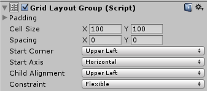

# Grid Layout Group

The Grid Layout Group component places its child layout elements in a grid.

## Properties

|**Property:** |**Function:** |
|:---|:---|
|**Padding** |The padding inside the edges of the layout group. |
|**Cell Size** |The size to use for each layout element in the group. |
|**Spacing** |The spacing between the layout elements. |
|**Start Corner** |The corner where the first element is located. |
|**Start Axis** |Which primary axis to place elements along. Horizontal will fill an entire row before a new row is started. Vertical will fill an entire column before a new column is started. |
|**Child Alignment** |The alignment to use for the layout elements if they don't fill out all the available space. |
|**Constraint** |Constraint the grid to a fixed number of rows or columns to aid the auto layout system. |

## Description

Unlike other layout groups, the Grid Layout Group ignores the minimum, preferred, and flexible size properties of its contained layout elements and instead assigns a fixed size to all of them which is defined with the Cell Size property of the Grid Layout Group itself.

### Grid Layout Group and auto layout

There are special considerations to be aware of when using the Grid Layout Group as part of an auto layout setup, such as using it with a [Content Size Fitter](script-ContentSizeFitter.md).

The auto layout system calculates the horizontal and vertical sizes independently. This can be at odds with the Grid Layout Group, where the number of rows depends on the number of columns and vice versa.

For any given number of cells, there are different combinations of row count and column count that can make the grid fit its content. In order to aid the layout system, you can specify that you intent the table to have a fixed number of columns or rows by using the Constraint property.

Here are suggested ways of using the Layout System with a Content Size Fitter:

#### Flexible width and fixed height

To setup a grid with a flexible width and fixed height, where the grid expands horizontally as more elements are added, you can set these properties as follows:

* Grid Layout Group Constraint: Fixed Row Count
* Content Size Fitter Horizontal Fit: Preferred Size
* Content Size Fitter Vertical Fit: Preferred Size or Unconstrained

If unconstrained Vertical Fit is used, it's up to you to give the grid a height that is big enough to fit the specified row count of cells.

#### Fixed width and flexible height

To setup a grid with a fixed width and flexible height, where the grid expands vertically as more elements are added, you can set these properties as follows:

* Grid Layout Group Constraint: Fixed Column Count
* Content Size Fitter Horizontal Fit: Preferred Size or Unconstrained
* Content Size Fitter Vertical Fit: Preferred Size

If unconstrained Horizontal Fit is used, it's up to you to give the grid a width that is big enough to fit the specified column count of cells.

#### Both flexible width and height

If you want a grid with both a flexible width and height you can do that, but you will have no control over the specific number of rows and columns. The grid will attempt to make the row and column count approximately the same. You can set these properties as follows:

* Grid Layout Group Constraint: Flexible
* Content Size Fitter Horizontal Fit: Preferred Size
* Content Size Fitter Vertical Fit: Preferred Size
