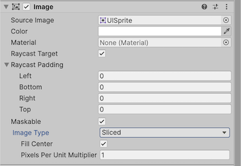

# Image

The **Image** control displays a non-interactive image to the user. You can use this for purposes such as decorations or icons, and you can change the image from a script to reflect changes in other controls. The control is similar to the [Raw Image](script-RawImage.md) control, but offers more options for animating the image and accurately filling the control rectangle. However, the Image control requires its Texture to be a [Sprite](https://docs.unity3d.com/Manual/class-TextureImporter.html), while the Raw Image can accept any Texture.

## Properties

|**Property:** |**Function:** |
|:---|:---|
|**Source Image** | The Texture that represents the image to display (which must be imported as a [Sprite](https://docs.unity3d.com/Manual/class-TextureImporter.html)). |
|**Color** | The color to apply to the image. |
|**Material** | The [Material](https://docs.unity3d.com/Manual/class-Material.html) to use for rendering the image. |
|**Raycast Target** | Enable **Raycast Target** if you want Unity to consider the image a target for raycasting. |
|**Preserve Aspect** | Ensure the image retains its existing dimension.  |
|**Set Native Size** |  Set the dimensions of the image box to the original pixel size of the Texture. |

You must import the image to display as a [Sprite](https://docs.unity3d.com/Manual/class-TextureImporter.html) to work with the Image control.
