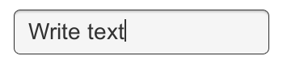
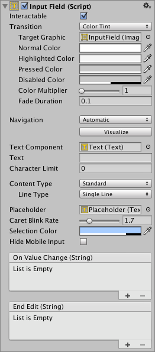

# Input Field

An **Input Field** is a way to make the text of a [Text Control](script-Text.md) editable. Like the other interaction controls, it's not a visible UI element in itself and must be combined with one or more visual UI elements in order to be visible.

## Properties

|**Property:**||**Function:** |
|:---|:---|:---|
|****Interactable**** ||A boolean that determines if the Input Field can be interacted with or not.|
|****Transition**** ||[Transitions](script-SelectableTransition.md) are used to set how the input field transitions when ***Normal***, ***Highlighted***, ***Pressed*** or ***Disabled***. |
|****Navigation**** || Properties that determine the sequence of controls. See [Navigation Options](script-SelectableNavigation.md).|
|****TextComponent**** ||A reference to the [Text](script-Text.md) element used as the contents of the _*Input Field*_|
|****Text**** ||Starting Value. The initial text placed in the field before editing begins. |
|****Character Limit**** ||The value of the maximum number of characters that can be entered into the input field.|
|****Content Type**** ||Define the type(s) of characters that your input field accepts|
| |**Standard** |Any character can be entered.|
| |**Autocorrected** |The autocorrection determines whether the input tracks unknown words and suggests a more suitable replacement candidate to the user, replacing the typed text automatically unless the user explicitly overrides the action.|
| |**Integer Number** |Allow only whole numbers to be entered.|
| |**Decimal Number** |Allow only numbers and a single decimal point to be entered.|
| |**Alphanumeric** |Allow both letters and numbers. Symbols cannot be entered.|
| |**Name** |Automatically capitalizes the first letter of each word. Note that the user can circumvent the capitalization rules using the **Delete** key.|
| |**Email Address** |Allows you to enter an Alphanumeric string consisting of a maximum of one @ sign. periods/baseline dots cannot be entered next to each other. |
| |**Password*** |Conceals the characters inputed with an asterisk. Allows symbols.|
| |**Pin** |Conceals the characters inputed with an asterisk. Only allows only whole numbers to be entered.|
| |**Custom** |Allows you to customise the Line Type, Input Type, Keyboard Type and Character Validation.|
|****Line Type**** ||Defines how text is formatted inside the text field.|
| |**Single Line** |Only allows text to be on a single line.|
| |**Multi Line Submit** |Allows text to use multiple lines. Only uses a new line when needed.|
| |**Multi Line Newline** |Allows text to use multiple lines. User can use a newline by pressing the return key.|
|****Placeholder**** ||This is an optional ‘empty’ [Graphic](xref:UnityEngine.UI.Graphic) to show that  the _*Input Field*_ is empty of text. Note that this ‘empty' graphic still displays even when the _*Input Field*_ is selected (that is; when there is focus on it). eg; "Enter text...".|
|****Caret Blink Rate**** ||Defines the blink rate for the mark placed on the line to indicate a proposed insertion of text.|
|****Selection Color**** ||The background color of the selected portion of text.|
|****Hide Mobile Input**** ||Hides the native input field attached to the onscreen keyboard on mobile devices. Note that this only works on iOS and Android devices.|

## Events

|**Property:** |**Function:** |
|:---|:---|
|**On Value Change** | A [UnityEvent](https://docs.unity3d.com/Manual/UnityEvents.html) that is invoked when the text content of the Input Field changes. The event can send the current text content as a `string` type dynamic argument. |
|**End Edit** | A [UnityEvent](https://docs.unity3d.com/Manual/UnityEvents.html) that is invoked when the user finishes editing the text content either by submitting or by clicking somewhere that removes the focus from the Input Field. The event can send the current text content as a `string` type dynamic argument. |

## Details

The Input Field script can be added to any existing Text control object from the menu (**Component &gt; UI &gt; Input Field**). Having done this, you should also drag the object to the Input Field's _Text_ property to enable editing.

The _Text_ property of the Text control itself will change as the user types and the value can be retrieved from a script after editing. Note that Rich Text is intentionally not supported for editable Text controls; the field will apply any Rich Text markup instantly when typed but the markup essentially "disappears" and there is no subsequent way to change or remove the styling.

## Hints

* To obtain the text of the Input Field, use the text property on the InputField component itself, not the text property of the Text component that displays the text. The text property of the Text component may be cropped or may consist of asterisks for passwords.

## Limitations

* On iOS when an external keyboard is connected, the onscreen keyboard will be hidden by the OS but the caret will not appear in the InputField. This is due to a lack of external keyboard support on iOS 13 and older.
