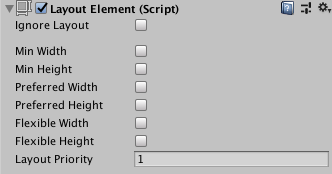

# Layout Element

If you want to override the minimum, preferred, or flexible size of a layout element, you can do that by adding a Layout Element component to the GameObject.

A layout controller allocates width or height to a layout element in the following order:

* First, the layout controller allocates the minimum size properties (**Min Width**, **Min Height**).
* If there is sufficient available space, the layout controller allocates the preferred size properties (**Preferred Width**, **Preferred Height**).
* If there is additional available space, the layout controller allocates the flexible size properties (**Flexible Width**, **Flexible Height**).

For more information about minimum, preferred, and flexible size, see documentation on [Auto Layout](UIAutoLayout.md).

## Properties

When you enable a width or height property, a value field appears next to it. Use this value field to enter the exact value for the width or height. **Min** and **Preferred** sizes are in regular units, while the **Flexible** sizes are in relative units.

|**Property:** |**Function:** |
|:---|:---|
|**Ignore Layout**| When enabled, the layout system ignores this layout element.|
|**Min Width** |The minimum width this layout element should have. |
|**Min Height** |The minimum height this layout element should have. |
|**Preferred Width** |The preferred width this layout element should have before additional available width is allocated. |
|**Preferred Height** |The preferred height this layout element should have before additional available height is allocated. |
|**Flexible Width** |The relative amount of additional available width this layout element should fill out relative to its siblings. |
|**Flexible Height** |The relative amount of additional available height this layout element should fill out relative to its siblings. |
|**Layout Priority**|The layout priority for this component.    If a GameObject has more than one component with layout properties (for example, an Image component and a LayoutElement component), the layout system uses the property values from the component with the highest **Layout Priority**.    If the components have the same **Layout Priority**, the layout system uses the highest value for each property, regardless of which component it comes from.|

## Description

The Layout Element component lets you override the values for one or more of the layout properties. Enable the checkbox for a property you want to override and then specify the value you want to override with.

Minimum and preferred sizes are defined in regular units, while the flexible sizes are defined in relative units. If any layout element has flexible size greater than zero, it means that all the available space will be filled out. The relative flexible size values of the siblings determines how big a proportion of the available space each sibling fills out. Most commonly, flexible width and height is set to just 0 or 1.

Specifying both a preferred size and a flexible size can make sense in certain cases. Flexible sizes are only allocated after all preferred sizes have been fully allocated. Thus, a layout element which has a flexible size specified but no preferred size will keep its minimum size until other layout elements have grown to their full preferred size, and only then begin to grow based on additional available space. By also specifying a flexible size, this can be avoided and the element can grow to its preferred size in tandem with the other layout elements that have preferred sizes, and then grow further once all flexible sizes have been allocated.
