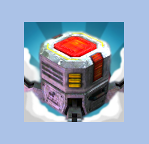
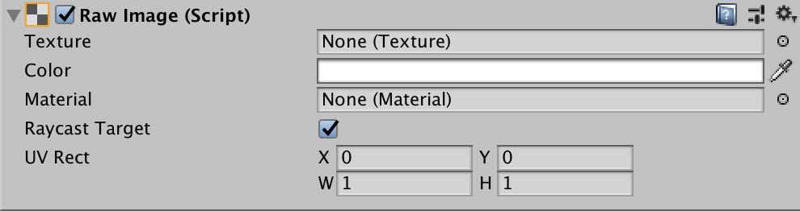

# Raw Image

The **Raw Image** control displays a non-interactive image to the user. You can use this for purposes such as decorations or icons, and you can change the image from a script to reflect changes in other controls. The control is similar to the [Image](script-Image.md) control, but offers more options for animating the image and accurately filling the control rectangle. However, the Image control requires its Texture to be a [Sprite](https://docs.unity3d.com/Manual/class-TextureImporter.html), while the Raw Image can accept any Texture.

## Properties

|**Property:** |**Function:** |
|:---|:---|
|**Texture** |The texture that represents the image to display.|
|**Color** |The color to apply to the image. |
|**Material** | The [Material](https://docs.unity3d.com/Manual/class-Material.html) to use for rendering the image. |
|**Raycast Target** | Enable **Raycast Target** if you want Unity to consider the image a target for raycasting. |
|**UV Rectangle** |The image's offset and size within the control rectangle, given in normalized coordinates (range 0.0 to 1.0). The edges of the image are stretched to fill the space around the UV rectangle. |

## Details

Since the Raw Image does not require a sprite texture, you can use it to display any texture available to the Unity player. For example, you might show an image downloaded from a URL using the [WWW](https://docs.unity3d.com/ScriptReference/WWW.html.md) class or a texture from an object in a game.

The _UV Rectangle_ properties allow you to display a small section of a larger image. The _X_ and _Y_ coordinates specify which part of the image is aligned with the bottom left corner of the control. For example, an X coordinate of 0.25 will cut off the leftmost quarter of the image. The _W_ and _H_ (ie, width and height) properties indicate the width and height of the section of image that will be scaled to fit the control rectangle. For example, a width and height of 0.5 will scale a quarter of the image area up to the control rectangle. By changing these properties, you can zoom and scale the image as desired (see also the [Scrollbar](script-Scrollbar.md) control).
